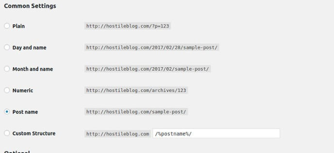

WordPress saves the permalink of the page/post in a database table. It doesn't generate them on the fly. Hence, you can change the structure of the post/page URL anytime.

You should avoid changing permalinks often because it complicates your site. When you change the URL structure, you'll have to redirect the old URL to the newer URL with a proper HTTP status code. If you don't implement the redirect correctly, your site's traffic from search engines will decline.

According to MOZ, when you 301 redirect URLs, 15% page rank is lost. Page rank is one of the most important search engine ranking signal. Hence, if your site was ranking on 1st page for a particular keyword, it might not rank at the same position for the new URL.

## What is the best permalink structure for WordPress?

Frankly speaking, unless you stuff the URL with keywords or use a character other than "-" in the permalink, your URL is SEO friendly.

While creating a permalink, make sure you separate the keywords by the character "-". If you're using an advanced content management system, the character will be automatically inserted between the words when you save the page/post content.

WordPress allows users to change the permalink structure through the Permalinks page, which you can find under the settings menu.

If you're a developer, you can use the page title as a permalink. To do so, lowercase the title and replace the blank space with the character "-".

As the search engine result page for a mobile and desktop site has a different width, Google displays permalinks differently on the desktop and mobile phones.

If you think your website permalinks are ugly and may affect the CTR, add breadcrumb functionality to the WordPress site. Google displays breadcrumbs only to a desktop user and it shows only the relevant part of the permalink for a mobile phone user.

For desktop users, it shows the full permalink. If an URL is too long, Google will truncate it.

### What is the ideal URL length?

According to John Mueller, a distinguished engineer at Google, it is a good practice to keep the length of URLs below 2000 characters. Follow the advice because John knows how Google handles websites better than all of us.

**Conclusion**: There's no such thing as SEO friendly URL. Established websites have lengthy permalinks and they rank well for the targetted keywords.

The sites rank high because of the high-quality content they offer to the readers. They also have tons of natural backlinks. Hence, focus on content rather than wasting your time in changing URL structures.
