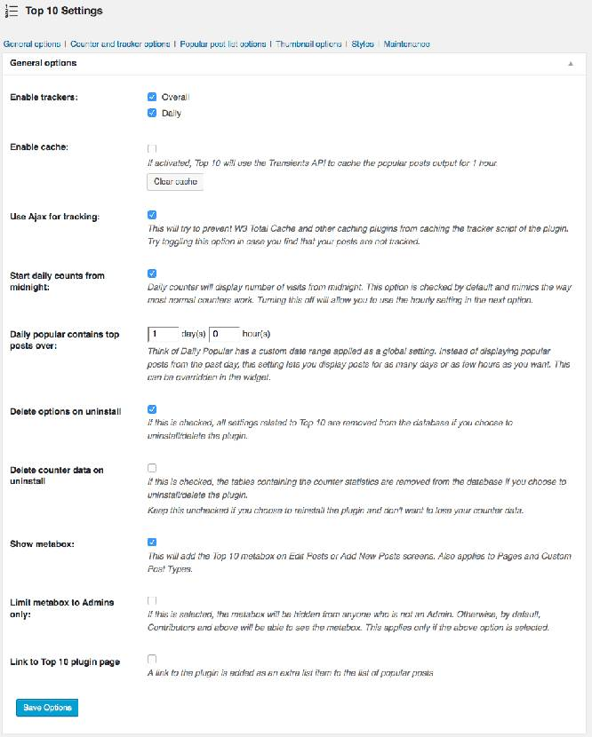

Displaying popular posts in blog sidebar is useful in many ways. As your top articles are posted, the link juice aka page rank will transfer to them which in turn will help your posts rank higher in search engines like Google, Bing, etc. Adding a widget for the same is a good way of strengthening the internal link structure of your website. If your top posts have affiliate links, displaying them in the sidebar will boost your income and conversions. There are a lot of popular post widgets and plugins but the one which I've shared today is what you're probably looking for.

The Top 10 popular posts plugin can be installed on all types of blogs. It works great with and without caching plugins. Thus if you're using WP-Super-Cache or W3TC, you should not face any issues.

The plugin has an internal counter and keeps the track of visitors for every post and page on your site. It is updated every hour. The WordPress popular posts are generated on the input provided by this counter. Some plugins use their scripts to track your visitors, and some make use of WordPress Admin Ajax. WPPP uses ajax to maintain a count of visitors. It comes with a caching system too.

 

If you want, you can configure this plugin to display posts only for a given period, i.e., trending posts in a week, month or a year. This is a great feature. You may have seen such widgets on top websites.

The plugin comes with the support for shortcodes. Thus you can add the widget generated by it to any location of your blog. In my perspective, the sidebar is the best position.

This plugin supports displaying of popular posts with thumbnails. It can automatically generate thumbnails if you set the ideal size for them in the settings page. If there are more than one pictures in your page, top 10 popular posts will automatically select the 1st image as a thumbnail.

The coolest feature of this free WordPress top articles/stories extension is that it allows you to display posts from specific categories. You can customize the appearance of the widget by adding your own CSS in the settings panel.
