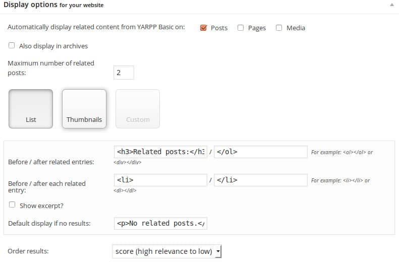

Related posts plugins on blogs are useful in many ways. All blogs powered with WordPress content management system use them. They improve the internal linking structure of your website. They also help in reducing bounce rate of a website.

These plugins can be configured to show related posts on the sidebar as a widget. They can show relevant posts above or below a blog post with or without shortcodes. I've been blogging since the year 2013, and I've used these below best Wordpress related posts plugins on my blogs.

## Best related posts plugin

**YARPP**: This plugin is used on many top websites. It has been built with a different and very powerful recommendation algorithm. Yarpp can display related posts in a bulleted list. If you want, you can configure Yarpp to display related posts with thumbnails.

Many bloggers believe that Yarpp affects the page load time of a website. I've used Yarpp on a site with 6000 UV per day and 800 posts. I didn't face any problems with it. My new WordPress Newspaper Theme comes with its own RP recommendation engine. Thus, I don't use Yarpp anymore. Configuring Yarpp is a tricky task. If not configured correctly, some blog posts won't be interlinked.

**Zemanta**: This plugin from Zemanta can display related posts in several formats. It is easy to setup. It works well on large websites with 1000's of posts.

Displaying related posts through Zemanta plugin doesn't require kind of configuration. This is one key reason why many bloggers use this plugin on their websites.

If you install any of the above two plugins, and if you don't see any thumbnails with related posts, you should run the thumbnail generator utility once on your blog.

**Outbrain**: Unlike the above two plugins, Outbrain doesn't use your web hosting resources. Thus, it doesn't affect the page load time of a website. To use Outbrain, you'll have to install the Outbrain WordPress plugin. You'll also have to create an account on Outbrain's website.

Once you do this, the settings page of Outbrain will prompt you to enter an API key. You can get this key from your Outbrain account dashboard. The panel shows some interesting statistics of your blog posts. It displays CTR, page views, etc.

**LinkWithin**: This is yet anther very popular WordPress related post plugin. It is used on some top websites with millions of pageviews per month. Its setup and working processes are the same as Outbrain. If you're using Blogger platform, you should install LinkWithin.

**JetPack** **related posts**: The latest version of Jetpack has blog posts recommendation engine. The plugin displays highly relevant Nofollow related posts when you configure it to display RP. JetPack has the option to show related articles with and without thumbnails. The plugin shows RP below blog posts by default. If you want to display them somewhere else, use the shortcode.

**CRP****\-related posts**: It is yet another widely used internal linking plugin for WordPress. CRP aka contextual related posts comes with its caching system which caches the results generated by the SQL query for returning RPs. CRP allows you to insert RP in simple text format as well as with thumbnails. It has the option to avoid displaying of related posts from certain categories.

**Inline related posts**: IRP is a powerful plugin that adds stylish related posts within the content. The plugin enables you to specify a background and border color for the RP block. If you don't want to waste your time in customizing the RP, you can choose one of the inbuilt styles for the related posts.

**R4WP**: This plugin analyzes your site's content and generates related posts based on the keywords used in the title and post content. R4WP caches the related posts so that your site doesn't slow down. By default, R4WP inserts RP below post content. You can add the RPs manually by editing the single.php file of your WordPress theme and placing the code manually.

**Conclusion**: Internal link building should be practiced by bloggers as they make website navigation easier for the search bots. It helps visitors in discovering new blog posts.
