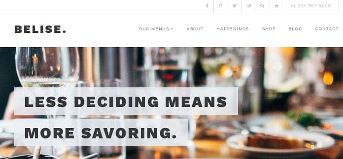
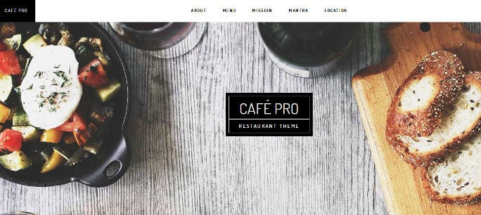
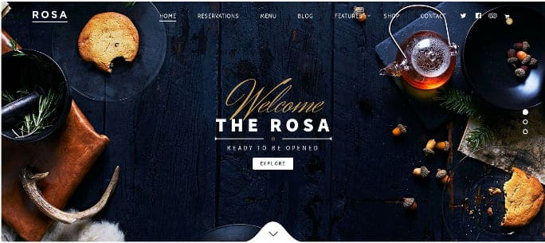
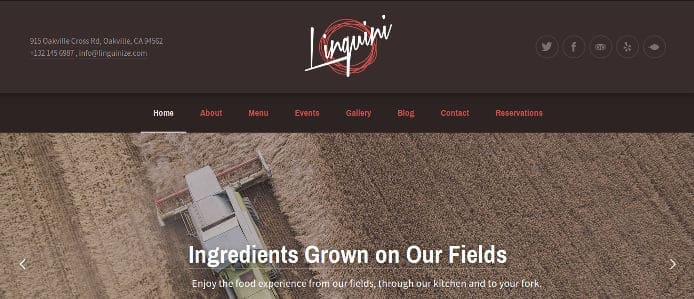
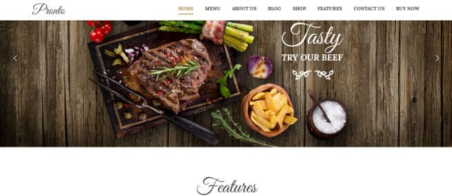
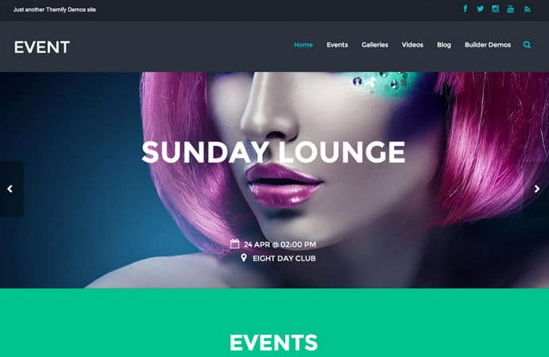
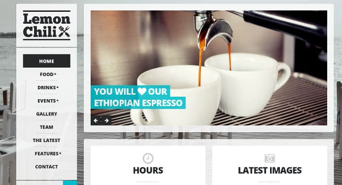
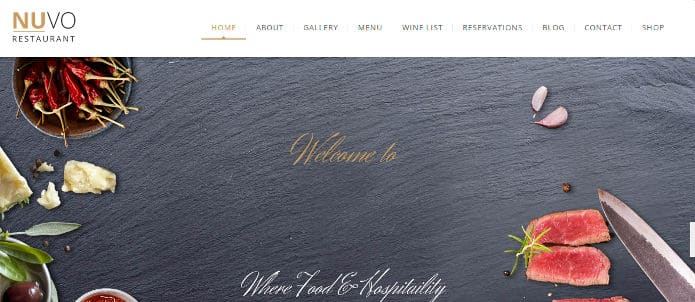

There are plenty of free website builder tools with which you can launch a restaurant site within an hour. The site builders have limited features. Furthermore, they don't allow you to add maps, reservation forms, etc.

If you're serious about your restaurant business, you must use the WordPress CMS. WP allows you to create an incredibly powerful restaurant website within 50 to 55 minutes.

To launch your restaurant site, you must download one of below top WordPress restaurant themes.

## Best restaurant themes for WordPress

### Belise

Belise features a live customizer tool which allows users to make changes to their restaurant site quickly. The theme allows you to add complex mega menus to your site with ease. Belise supports several full page caching and SEO plugins.

Belise enables you to set video, picture or a slideshow as a background. It supports RTL and translation. Belise has a responsive design. It allows you to import the demo content so that you can launch your site within few minutes. The theme is compatible with WooCommerce. It has a powerful settings panel, food menu page creator, and a neat design.

The theme includes an online reservation system.

Download Belise

### Café Pro

Café Pro is a responsive WordPress restaurant theme that supports parallax effect. It allows you to customize the homepage with various widgets, stylish images, etc.

Café Pro is SEO friendly restaurant theme that supports unlimited colors. It has a header section which you can customize as per your requirements. The theme enables you to add up to 3 widgets on the footer section. It also lets you place links to your restaurant's Facebook, Google+ and Twitter profiles.

Café Pro is a powerful Genesis child theme and a part of StudioPress Pro Plus package.

Download Cafe Pro

### ROSA

ROSA is a powerful restaurant theme enabled with the parallax effect. It ships with the visual composer plugin, with which you can create attractive homepages.

The theme allows you to setup online reservation system. It has the option to create stylish food menus. ROSA supports the WooCommerce plugin. Hence, you can take your restaurant business online with a few clicks. Once you launch your shop, you can sell food items that you make in the restaurant online. When the customer registers an order, all you have to do is make your employee deliver the item on time.

Download ROSA

### Linguini

Linguini is a search engine friendly WP restaurant theme that provides live customization tool. The theme enables users to add your restaurant's telephone number and official email address in the header section.

Linguini features a reservation system through which customers can book a table in your restaurant. The theme supports translation. It lets you create and manage events, slideshows, etc.

Linguini includes a contact form page. Hence, you don't have to use a contact form plugin with this theme.

Download Linguini

### Pronto

Pronto is a fully responsive restaurant theme that provides a powerful settings panel. It allows you to create powerful mega menus.  Apart from the mega-menu, Pronto provides 5 unique menu styles. The theme gives you access to 45+ page builder elements and 400+ icons, which you can use to decorate your menus or widgets.

Pronto theme provides an option to embed Google Maps on your restaurant site. It supports WooCommerce platform and has a great design. Like other themes, Pronto enables you to add a reservation form to your site. If you buy this theme, you'll get $79 worth premium plugins for free.

Download Pronto

### Themify Event

The event template is 100% fluid responsive restaurant theme that allows you to create beautiful pages. It lets you create galleries of various types. Event theme enables you to create video posts. It has the option to enable post sharing buttons and statistics on or off.

The Event theme from Themify packs the powerful Themify Builder tool through which you can customize your restaurant site to a great extent. The theme allows you to display upcoming events on the homepage. It supports various color styles.

The template is SEO friendly and fast.

Download Event

### LemonChili

LemonChili is a top-rated restaurant theme with many unique features. The theme supports Internet Explorer 7+, Chrome, and many other browsers.

You can configure the theme to show your phone number or address in the header section. To see the restaurant's location on the Google Map, the visitor must tap on the address. Similarly, to contact the restaurant, the user must tap on the telephone number.

LemonChili offers 7 unique homepage templates which you can customize as per your requirements. It also includes 5+ custom widgets. The theme lets you change fonts, theme color, logos, etc.

Download LemonChili

### Nuvo

Nuvo is a beautiful theme that supports the parallax scrolling effect. It provides an easy to use reservation and events management system. The theme lets users set up their shop with the WooCommerce plugin. It ships with the premium Essential Grid and Visual Composer page builder plugins.

Nuvo is a translation ready restaurant theme that supports Google Fonts. It provides the theme's Photoshop files so that make changes to the graphical elements on the site with ease. The theme supports Contact Form 7 and many other popular plugins.

Download Nuvo

If you're searching for a cost effective way of launching a restaurant website, buy a hosting plan, install WordPress. Finally, download and install one of the themes we've mentioned above.
