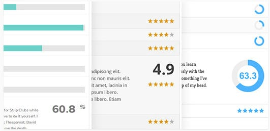
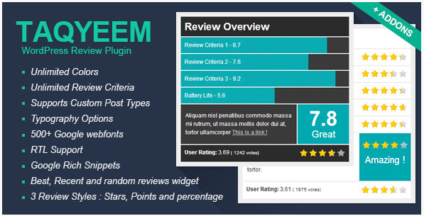
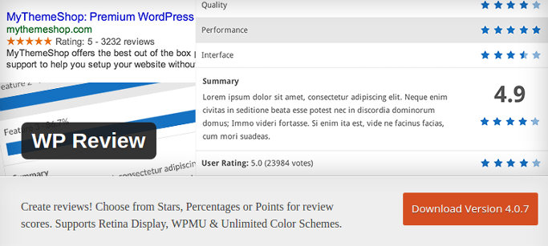

Most people use the internet to read reviews of products before they buy them. You may have seen top search engines such as Google or Bing showing star ratings in the search results of its pages. Google doesn't show the ratings for all websites. It shows ratings only for the portals having schema markups and in-depth content.

Writing the content is up to the user, but one can easily add schema codes to their site by referring the official guidelines. Modern content management systems provide extensions to add review boxes to their site and add the Schema markup code for the same.

If you're a WordPress user, you can easily add rating schema markup to your website or blog with the following plugins:

## Best review plugins for WordPress

### MyThemeShop WP Review Pro

MyThemeShop is a renowned brand. The firm's one of the successful product is the WP Review Pro plugin. WPRP costs $27 and it's worth the money. Once you buy the plugin and install it, you'll see the option to add reviews below the blog post editor.

WPRP lets users place the review box that features the author's product description, ratings/points, product name at the top or bottom of the blog post.

Having been developed by experienced programmers, WP Review Pro plugin for WordPress has valid schema code. Hence, the ratings will appear along with the meta description and title when Google indexes your post.

MTS WPRP provides more than two rating systems. You can rate the item in percentage or set points for it. It allows users to post their ratings.

The plugin supports customization of colors for the review box, title, border, etc. It has an intuitive options panel that allows you to do the same.

Once review gets published, the plugin will show the ratings on thumbnail images. The plugin works with all premium and free WordPress responsive themes. It has a mobile friendly design. It packs a tabbed widget module to show latest reviews on sidebar. WPRP supports shortcodes and has plenty of other features.

Download WP Review Pro plugin

### Reviewer plugin

Reviewer is a premium plugin that allows users to create search engine friendly reviews and comparison tables. The plugin is powerful. To place reviews, all you have to do its open the Reviewer plugin page from the WordPress dashboard, enter the information you want to provide in the review box and place the shortcode provided by the plugin in the blog post.

The review WordPres plugin comes with detailed admin settings, through which users can easily control privileges, comparison tables, etc. It provides a dedicated WordPress widget for displaying user or latest review published on a website.

The plugin lets its user upload pictures and rate products. It comes with Google ReCapctha system to keep review spammers away from your website.

Download Reviewer plugin.

### Taqyeem plugin

Taqyeem is powering over 1000 WordPress sites. It is one of the top rated review plugins on the CodeCanyon marketplace. It is an user-friendly WP plugin that supports the below three formats of reviews:

1. Percentage.
2. Stars.
3. Points.

The plugin comes with RTL support and offers unlimited color customization. It supports translation to local languages as PO and MO are shipped along with Taqyeem.

Like WPRP, the WordPress review plugin lets users rate the products and has valid schema markup codes. It offers options to change typography of the content in the review box.

Download Taqyeem plugin.

The above plugins are premium. In other words, they are not free. If you're searching for a free WP review plugin, consider downloading the below plugin:

### WP Review

WPR is a toned down version of the 1st plugin we've mentioned. It has been developed and launched by MyThemeShop. It has over 80000 active users and a decent rating of 3.7 by the WP community.

WPR has limited, but the necessary options to show a basic review box below or above post content. It is fast, responsive, and supports localization. The plugin lets users place the review box in any part of the web page with the wp-review shortcode. It is WordPress multisite ready and supports unlimited colors.

Download WPR plugin.

**Conclusion**: As a blogger, you should know that the use of schema markups can bring huge traffic to your site. The fancy rating that you see in search engine result pages improve CTR. The above plugins increase the chances of Google showing ratings for your articles in its pages.

Also see: WP CUSTOMER REVIEWS PLUGIN ALLOWS USERS TO RATE PRODUCT OR BUSINESS
