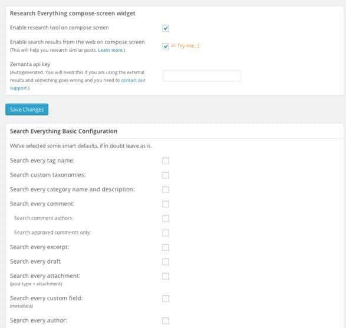

The default WordPress search module is useful, but not the best. No matter what keyword or term you search for, you'll not be satisfied with the results generated by it.

This module is critical because people use it to find relevant information on your site. It can also reduce the bounce rate.

Although the WordPress content management system supports hierarchical pages (categories, tags, authors, attachment pages) that make navigation easy for the visitor, it is always a good decision to add a powerful search function to your blog. Thankfully, we don't have to write PHP code for the same. There are a lot of free WordPress search plugins available for download. But the below two plugins are the best and most powerful among them.

### Search Everything

This is a lightweight plugin with crucial features. When the webmaster installs SE on their WordPress blogs, it will not make changes to his website's template, nor it will modify any line of code. This WordPress search plugin can be configured to ignore certain posts and pages. It has a new Research everything feature that allows you to add internal links to your blog posts. SE supports keyword highlighting. It will not work for password protected posts and pages.

download link

### Relevanssi

This plugin uses fuzzy logic to match words for generating search results. It sorts post by keyword relevance. When matched keywords will be highlighted in the result page.

Relevanssi allows you to track the queries user types in the search box. It includes filters option that allows visitors to find the most relevant information on your blog. Relevanssi is available in 2 options, free and premium. The premium version of this free search plugin supports WordPress multisite.

download plugin

### Search and filter

SAF is a powerful WordPress search plugin that employs WordPress ajax function to display search results in real-time. It enables you to search on a site by category, tag, post type, etc.

The SAF plugin has a Jquery slider module so that users can filter search results. It provides date picker utility through which user can search for a post that was published between the user-specified date range.

The plugin is compatible with the WPML plugin. It has user-friendly features and a smart drag and drop editing tool. Search and Filter WP plugin lets users order search results by comment count, name, publish date, etc.

Download the plugin

**Additional tips:**

Sometimes the WordPress search plugin or the page may result in a soft 404 error. Consider a scenario in which you have deleted a tag that had just a single post. If Google tries to crawl the page, the poorly designed theme might not throw a 404 error. Google will assume that the page lacks content. To make the webmaster aware of this problem, Google will update the crawl errors report with a soft 404 error.

You should thus prevent Google from accessing the search page of your website. To do this, open the robots.txt file and add the below two crawling rules to it:

`Disallow: /?s= Disallow: /search`

If you hate the default WordPress search function, replace it with GCSE. Google crawls each and every page of your site, and it will rank them accurately for a particular keyword or term. The coolest feature of Google CSE is that you're allowed to choose a layout that suits your blog/website.

If you use Adsense, you can earn extra money online by adding this module to your site. The CSE will display highly relevant results. Thus users will be happy with your website.

**Conclusion**: Adding a powerful search box is highly recommended to bloggers. If your theme doesn't have it, install any of the plugins we've suggested in the above paragraphs.
