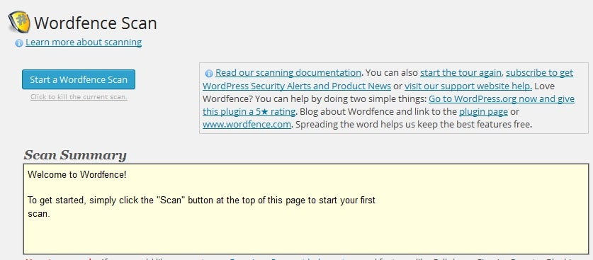
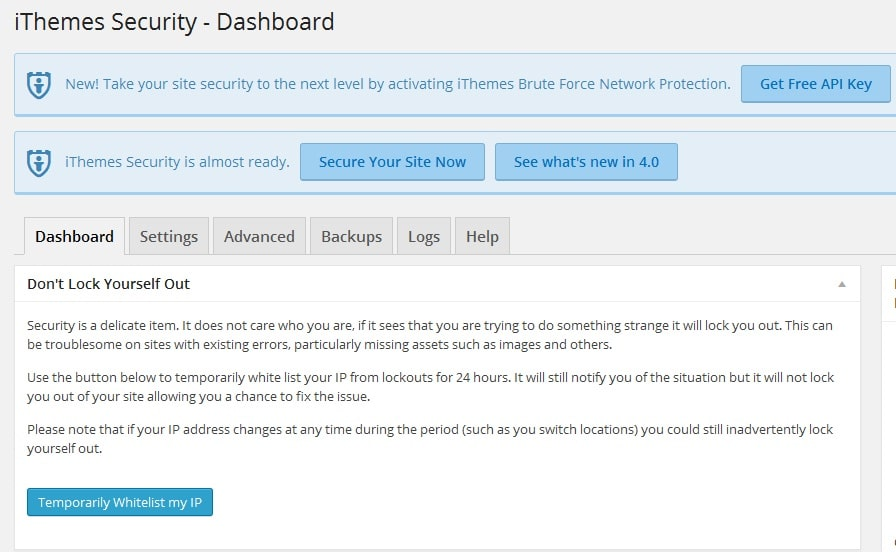
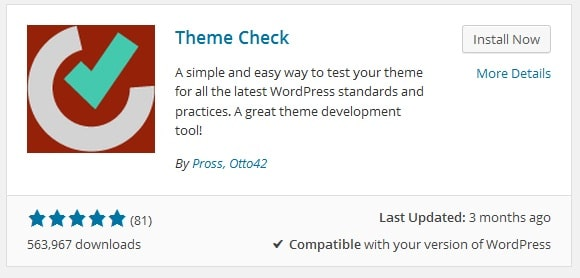
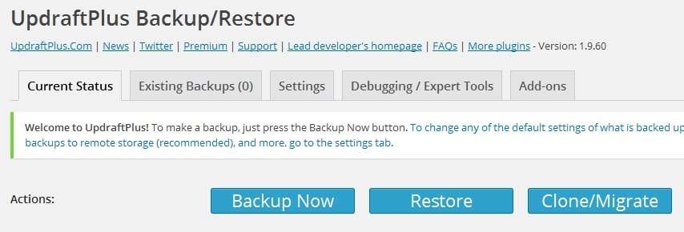
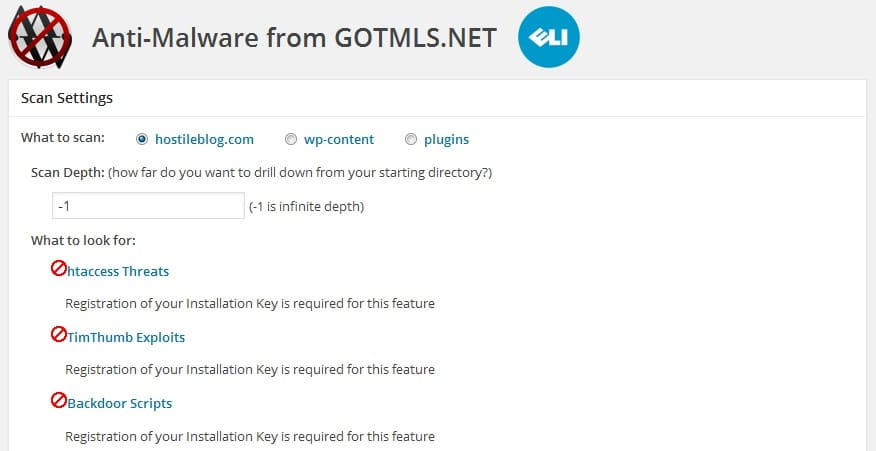

WordPress CMS has been prone to many online threats ever since Matt Mullenweg and the team officially launched it. The content management system is impressive, but you can’t stop hackers from attacking websites powered by WP. Attacks can be prevented by installing a WordPress security plugin. If the internet is the only source of your income, you shouldn't risk your site. There are a lot of useful web tools that can keep your website safe. The best ones are listed below:

**Wordfence:** This plugin comes with an inbuilt theme scanner that can search for viruses and malware for all types of WordPress themes. The users can schedule this scanner. With Wordfence, you can block any IP address or fake crawlers whose only objective is to eat the bandwidth of your site. Wordfence has a live traffic viewer. Thus, you can check visitors to your website/blog in real-time.

**Ithemes Security:** This is WordFence alternative that comes with several security options. It was earlier known as Better WP Security. IS comes with a malware scanner, IP blocker. It can generate a backup of your blog. This plugin can change your default WordPress login URL. Ithemes Security can automatically block IP addresses that are repeatedly requesting access to your site. Users can go through the blocked addresses as IS plugin maintains a log file which is updated every time an action is taken.

**Theme Authenticity Checker:** If you've installed a free Wordpress theme, you can use TAC to check if the theme is authentic or not. TAC also checks if a template is conforming the latest WP standards or not. Theme Authenticity plugin might not be the most rated plugin, nor it may have millions of downloads. But WordPress plugin page will recommend you to install it.

**Updraft Plugin:** This plugin can create your website database, theme and images backup on daily basis. You can configure it to send backups to your official email address of a folder on your website host. If you have installed this plugin, the risk of permanently losing a site/blog is reduced to 90% as you'll have a backup copy of all important files.

**Anti-Malware and Brute-Force Security by ELI:** This plugin has a perfect 5.0 rating in the WordPress directory. Anti-malware by ELI functions like an antivirus software. It gets latest virus definitions and saves it to your website hosting directory. The definitions are updated on a monthly basis, and the inbuilt scanner of this plugin will refer this database to hunt latest malware or viruses. This plugin has helped many website owners to remove irrelevant JS codes from their sites.

**Sucuri Online Scanner:** When you open the official sucurii website, enter your blog address in the text box and click on the scan button. Sucuri will analyze the HTML code of your site.When it detects any unrelated code, virus or malware, it will make you aware of it. Sucuri can be used to check if Google has blacklisted your site. It is a good alternative to the above 3 WordPress plugins.

**Google webmaster tools:** If Virus infects your site, Google webmaster tools will make you aware of it. So make sure that you visit the security issues tool of GWT daily.
