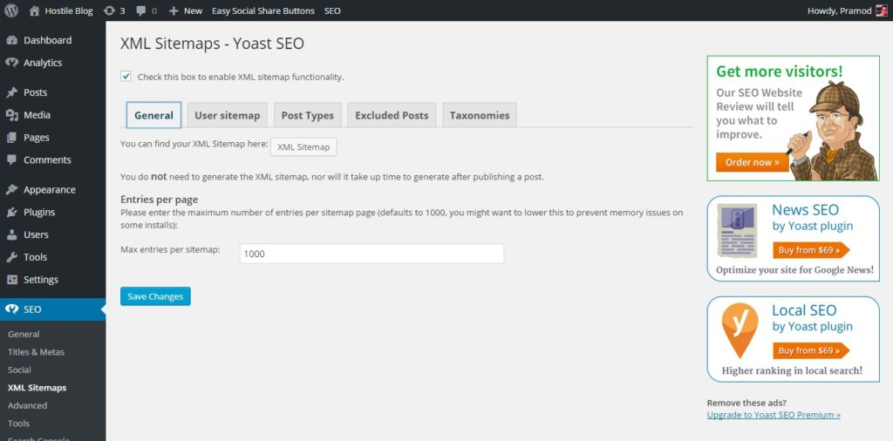
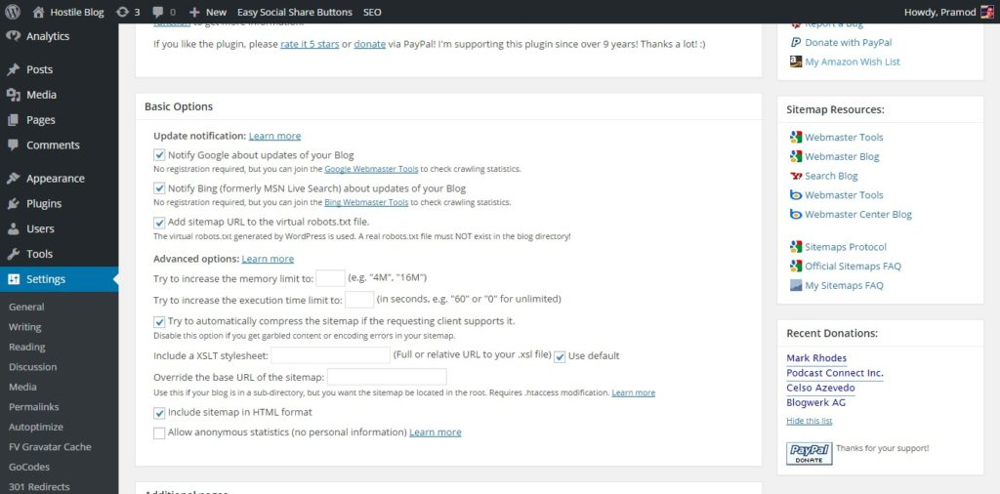
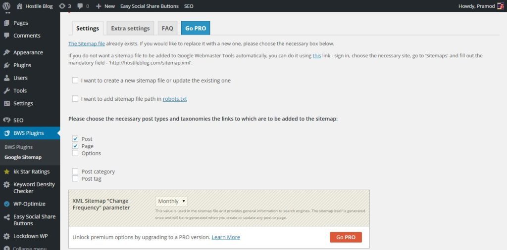
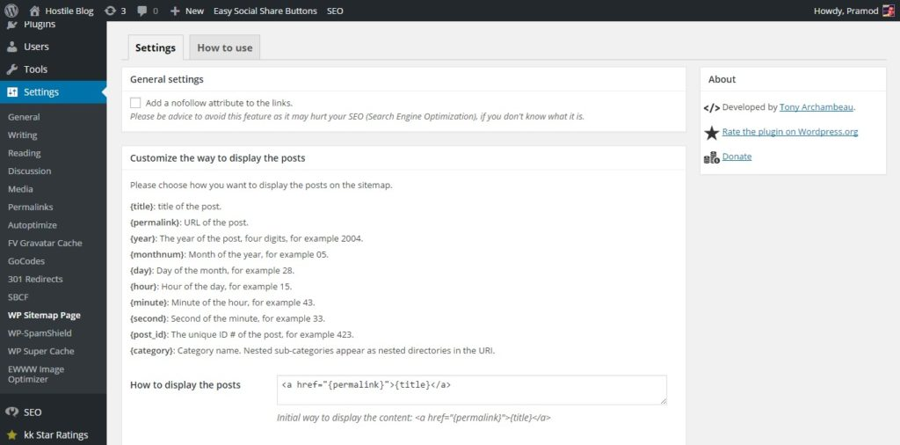

A sitemap is one of the most important elements of a website. It is nothing but an XML document that features all the pages and post of your blog. It should be defined in a correct way. Failing to do so will confuse search engines and the users.

When users start a new blog, they should immediately create a sitemap and submit it to Google and Bing.

Frankly Speaking, these two search engines are smart, and they can determine the structure of your site without a sitemap. But you should add this document to your site as it will be useful for the users (in case they're  looking for it).

If you're using WordPress platform, you can create this document easily with a plugin. The plugin will take care of updating sitemap with new URLs, and it will make sure that this XML document is available everytime Google, Bing or any other search engine visits your site.

WordPress sitemap plugins are easy to use. They work without affecting the performance of the hosting servers. No matter, how many pages, posts, categories and tags your blog has, the below best sitemap plugins will work flawlessly.

## Best WordPress sitemap plugins of 2017

### Yoast

WordPress SEO aka Yoast plugin is better than All in one SEO because of its wide range of features and powerful settings.

Yoast includes a sitemap utility that can be located under Yoast menu. The configuration page for sitemap generated with Yoast has five tabs. In the 1st tab, you define a number of URLs i.e., entries per page.

The 2nd allows you to create user site. This feature is useful for muti-author blogs. The 3rd tab gives you the option to select the entries for the sitemap i.e., post, pages, pages, media, and option. If you want to exclude some post from this document, enter their IDs in the 4th tab. For including categories and tags in the sitemap, navigate to the last tab.

Download Yoast

## Google XML Sitemap plugin (GSP)

This is one of the most widely used plugins, and it includes a lot of options. It has the option to Add sitemap URL to the robots.txt file. You can set memory limit and max execution time for this plugin (if it is generating server related issues).

If your sitemap is large (has 1000s of entries), you can enable compression for it with the GSP. This option promises better load time for the sitemap. This plugin has an option to add or remove last modified time.

You can exclude individual categories and post from the sitemap. You can also change their priority. GSP can ping search engines for faster crawling and indexing of your articles.

Download GSP

### BestWebSoft sitemap generator

Using Google or Bing webmaster tools to submit a sitemap is not a difficult thing to do. If you think that GWT is a sophisticated tool and if you avoid using it, this plugin can make things easy for you as its supports integration with the GWT. This feature will take care of submitting your sitemap to Google search.

BestWebsoft has published a lot of plugins for the WordPress platform. But this sitemap generator has limited features. For better features, you've to upgrade to the Pro version by paying 21 dollars.

Download BestWebsoft sitemap generator

### WP Sitemap Page

You may have seen HTML sitemaps on many websites. Such type of documents is useful for the visitors as they can find information on your blog quickly. Such feature can be added to WordPress sites easily with this plugin. WP sitemap page supports nofollow links and shortcodes. It is easy to use.

Download WSP

**Final thoughts:** Sitemaps are critical as search engines often visit them. Use any of the above plugins and keep your blog friendly to the user and Google, Bing, and Yahoo.
