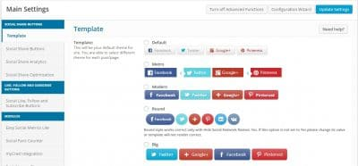
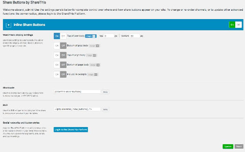
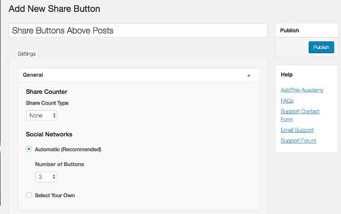
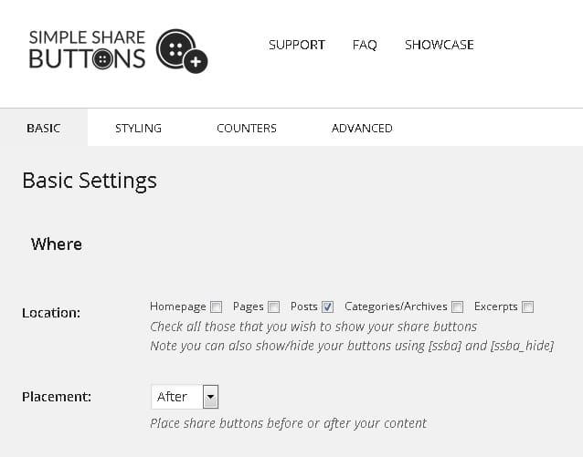
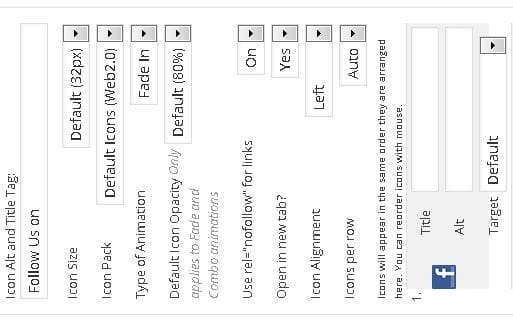
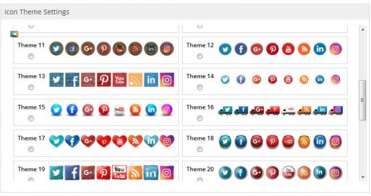
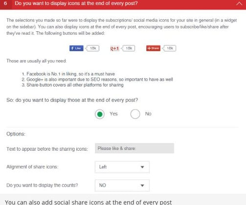

There was a time when search engines like MSN, Bing, Yahoo, and Google were considered as the only source of website traffic. Now things have changed a lot. Social network sites like FB, Twitter, Google+ are used by billions of people across the world. When you have a good audience on sites like Twitter, Facebook, Google Plus, Instagram, you don't have to depend on search engines for website traffic. Blogs are probably incomplete without a social media plugin. These plugins make sharing of blog posts easier for visitors. Almost all websites (excluding social network sites) have such plugins installed on their website. Below are the three main advantages of these plugins:

**Improves referral traffic**: If users see social network buttons on your site, they might click on it and share your blog posts on popular social networks Facebook, Twitter, StumbleUpon, etc. Although backlinks from social network sites are Nofollow, some search engines consider them as a ranking signal. Thus, your blog post rankings will increase automatically.

**Easy to add**: Adding the Facebook Like Box, Twitter widget requires you to edit your WordPress theme code. If you're not comfortable in modifying codes, you can use a WordPress social media plugin to automate this task.

**Customizable**: Best WordPress social media plugins will allow its users to change icons, fonts, and the position of social network buttons. They also allow you to add a Nofollow attribute to the links.

## Best WordPress social media plugins

### Easy Social Share buttons

ESSB is one of the most powerful WP plugins ever. It allows you to add social media buttons of various styles to the blog posts and pages. The plugin allows you to add an opt-in form to your site. It has the option to enable a smart share bar on mobile devices. Users can configure ESSB to disable or enable social media buttons on mobile, tablet or desktop.

The plugin keeps a track of the number of clicks the button it has added to your site has received. It provides an option to enable minified scripts. Easy Social Share Buttons is a premium WordPress plugin. It costs $19 on CodeCanyon.

### ShareThis

ShareThis is an impressive plugin with superb features. Users can use ShareThis to add social sharing buttons on homepage post excerpt, above or below individual posts, pages. They are allowed to choose buttons of various sizes. ShareThis loads JavaScript code from its own servers. Thus, it saves your website bandwidth. To use this plugin, users must create a ShareThis account. This plugin has a copy n share feature that adds a permalink to the copied blog post excerpt/text. This is a useful feature that can keep scrappers away. It also ensures that your site is not prone to Google's duplicate content penalty.

\[themify\_button bgcolor="red" link="https://wordpress.org/plugins/share-this/" target="\_blank"\]Download ShareThis\[/themify\_button\]

### AddThis

AddThis is a free plugin that has similar features as ShareThis. Along with its ability to add FB, twitter, Google plus sharing buttons, AddThis can add social media follow buttons to your blog's sidebar. Along with the major social networks, AddThis supports post sharing on 150+ popular websites.

The plugin has been updated on regular basis. Because of its brilliant design, it looks beautiful on any type of site. AddThis doesn't ask users to create an account. It's easy to setup on a website or blog.

\[themify\_button bgcolor="red" link="https://wordpress.org/plugins/addthis/" target="\_blank"\]Download AddThis\[/themify\_button\]

### Simple share buttons adder

SSBA is a lightweight WordPress plugin. It has a settings page that allows you to set social sharing buttons location on posts, excerpts, pages, archives, etc. Users are allowed to add a title to the social network buttons. The font, color, size, border color, the width of the title text is changeable. Social share button plugin offers eight attractive image sets. It allows you to set button size, padding, alignment. This plugin can maintain a count of shared posts.

\[themify\_button bgcolor="red" link="https://wordpress.org/plugins/simple-share-buttons-adder/" target="\_blank"\]Download SSBA\[/themify\_button\]

### Social Media Widget

When installed, this plugin will automatically generate a fully customizable sidebar widget. The widget has options to change icon size, pack, alignment, animation, opacity. You can configure SMW plugin to open sharing links in new window. You can add a custom alt tag and title to social buttons.

\[themify\_button bgcolor="red" link="https://wordpress.org/plugins/social-media-widget/" target="\_blank"\]Download SMW\[/themify\_button\]

### Social media Flying Buttons

SMFB is yet another popular WordPress plugin. It ships with 30 icon themes and supports shortcodes. Unlike many other plugins, the plugin loads the code of buttons you've enabled. SMFB allows users to disable the floating behavior of the buttons. It includes stylish flat icons and supports post sharing on Instagram. The plugin lets you specify an icon size. It has an easy to use settings panel.

\[themify\_button bgcolor="red" link="https://wordpress.org/plugins/floating-social-media-icon/" target="\_blank"\]Download SMFB\[/themify\_button\]

### Monarch

Monarch is one of the most powerful WP social media plugins. It has been developed by Elegant Themes, a renowned name in the world of WordPress. Like ESSB, Monarch is a premium plugin.

Monarch provides social media icons of 3 shapes. It allows you to specify the position where you want the plugin to display the social media icons. It has the option to change the background, hover, and icon color of the buttons. Monarch can display the number of times a post was shared.

Monarch plugin has many customization options. It costs $89.

### Ultimately Social

Ultimately Social is a top-rated WP plugin with many features. It supports every major social network you might be aware of. The plugin lets you specify different social media buttons for mobile devices and desktops. Users can enable or disable the plugin for specific pages/posts.

Ultimately Social can display social media icons in a popup that trigger at a certain time. It enables to add social media buttons at the top, bottom, right, or left side of blog posts or page. You can configure this plugin to display the post/page share count.

\[themify\_button bgcolor="red" link="https://wordpress.org/plugins/ultimate-social-media-icons/" target="\_blank"\]Download Ultimately Social\[/themify\_button\]
