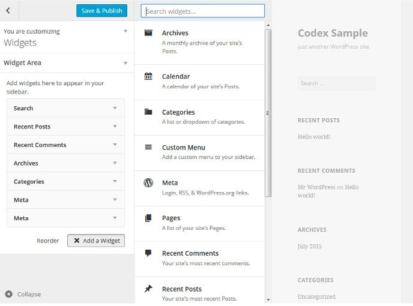

Widgets are one of the most impressive and powerful features of the WordPress content management system. They make your website look attractive and user-friendly.

Once you install WordPress, the CMS will add up to 10 different widgets to your blog or website. These widgets have limited functionality. Furthermore, they're not customizable.

Free themes may not add new widgets to your WP site. To add a new widget, you'll have to install a new WP plugin. As a blogger, you should know that too many plugins may slow down your website. If the plugin is badly programmed, it will lead to high server resource consumption.

Premium WordPress templates provide several interesting and customizable widgets. Hence, you consider upgrading from a free to a premium theme.

For the best experience of the visitors, you should keep the widget area look clutter free. You should also avoid using too many WordPress plugins.

It doesn't matter what theme you are using, you should consider placing the below best WordPress widgets to the sidebar.

## Best WordPress widget that your blog should have

### Latest post with thumbnails

Images make blog posts look attractive. They also grab the attention of the visitors. If you add the latest post widget with thumbnails, the likelihood of visitors going through the new articles will increase.

### Trending or popular posts

These two widgets give exposure to the popular articles on your WordPress blog or website. If you've added affiliate links to these posts, the popular post widget will boost conversion.

### Recent comments

Comments are excellent signs of user engagement. Search engines index comments and they may rank your web page for the keywords in the comment. To keep the comment form on your site busy, consider placing this WordPress widget on the sidebar.

### Social network icons

These icons will allow visitors to find your social profiles. If you add FB, Twitter, or LinkedIn social media icon widget to the sidebar, people will follow you on social networks.

### Search box

This widget helps visitors in finding the posts on your website. If Google has indexed all the posts on your website, add the Google Custom Search engine code in a text widget and add the widget to the sidebar.

### Newsletter or opt-in forms

One of the most powerful methods to increase conversion rate and get regular visitors is to place a newsletter subscription widget to the site. Once visitors subscribes to your newsletter, you can send new posts to their inbox on regular basis manually or automatically with services such as MailChimp, Aweber, GetResponse, etc.

## WordPress widgets that you shouldn't use

### Twitter and Facebook

To add the Facebook Like box or twitter stream, you’ll have to add code provided by FB or twitter. The code will increase the size of your pages and make them slow. FB and Twitter might be using CDN service, but JS or CSS code that renders their widget should be still downloaded on visitors device.

### Random post

Google transfers link juice of one page to another. If you add the Random Post WordPress widget, Google will not be able to identify your internal link structure. Furthermore, visitors will be confused if they don't find the content on your site.

Here's an example for the same:

I've added the random post widget to this site. Currently, the plugin is showing the list of the following posts:

- How to start a blog and make money online?
- WordPress vs Wix vs blogger (Blogspot)
- Best Blogging Platform: Blogger Vs Wordpress Comparision

Google indexes the page that shows the above posts in the sidebar. A visitor finds this search engine for the query "start a blog" and visits the indexed page. As the WordPress widget is configured to show random posts, the above list of articles will be replaced with a new one. Hence, the visitor will not find the page he was looking for.

### Image gallery and slideshows

If you are having a personal blog, you can go ahead and add image gallery widget. Sites of other niches such as technology, news websites, etc should avoid using a standalone image widget.

Frankly speaking, the slideshows or image gallery looks terrible on web pages other than the homepage. Consider adding these two widgets only on the homepage.

**Conclusion**: If used wisely, the WordPress widgets feature can make your site search engine bots and user-friendly. If you place plenty of unnecessary widgets, visitors will find your site annoying.

For better results, consider using the WP widgets we've mentioned above.
