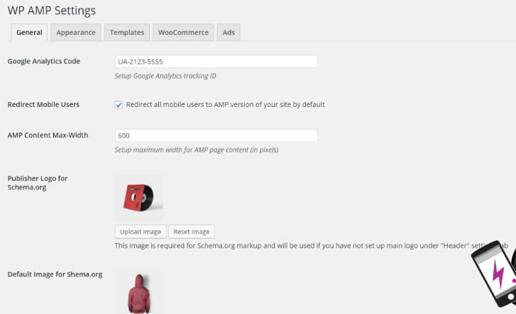

People spend more time on mobile phones than computers. Google Engineers realized this a few years back and they made several changes to core Algorithm. They introduced a mobile-friendly testing tool for webmasters and launched page layout algorithm which affects rankings of ad-heavy desktop/mobile sites. In 2016, Google launched a new concept called Accelerated Mobile Pages. After testing AMP on a bunch of top news website, Google now allows all websites to use AMP.

## AMP Pages SEO benefits

### AMP makes website blazing fast

Posts and pages built based on AMP coding standards open instantly in the browser. Google considers website loading speed as an important factor in ranking websites. If your site loads under 1.5 seconds (or much quicker), the search engine will rank AMP pages higher than non-AMP pages.

### Bounce rate

AMP pages support swipe pagination. Users have to simply swipe left or right to read the next or previous post. This new pagination technique is much better than numbered pagination. Because of great speed and nice carousel style pagination, people will explore more pages on your site reducing your website bounce rate.

## Best WordPress AMP plugin

I spent half an hour exploring the WordPress repo to find a good Accelerated Pages Mobile plugin for WP. Team Automatiic has published its official AMP plugin (link) which adds support for the new AMP standards to WordPress.

Once you install and activate the plugin, all pages on your site will have their AMP versions. Google will index the new pages once it finds them. The plugin offers basic features and limited support. If you are serious about adding AMP functionality to your website, you should use the WP AMP plugin.

I found the WP AMP plugin on ThemeForest which offers superb features after exploring the web for few more minutes. The plugin provides a neat settings page where you have to:

- Manage mobile redirects.
- Set max content width for your pages.
- Add publisher company logo for generating Schema.org friendly pages.
- Configure appearance of your AMP page header, footer, fonts, and post metadata.
- Configure default post, 404 page, search, blog page, archive templates.

The WP AMP supports Wocommerce, Yoast, All In One SEO pack, Google AdSense, and more. It boosts your website's SEO and makes Google an ardent lover of your website.

See live demo here

**Conclusion**: WP AMP is a WordPress Premium plugin which costs $18 on CodeCanyon. It is a great plugin to add Accelerated Mobile Pages feature to your site and enable mobile redirects for it.
