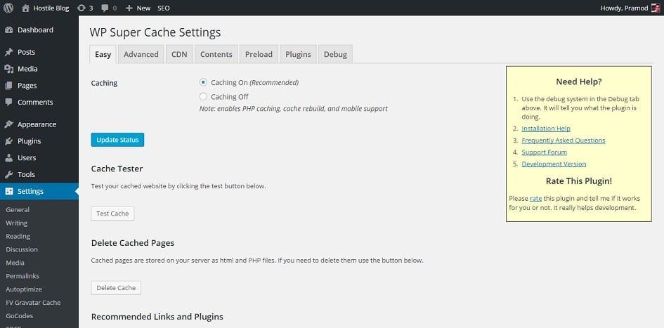
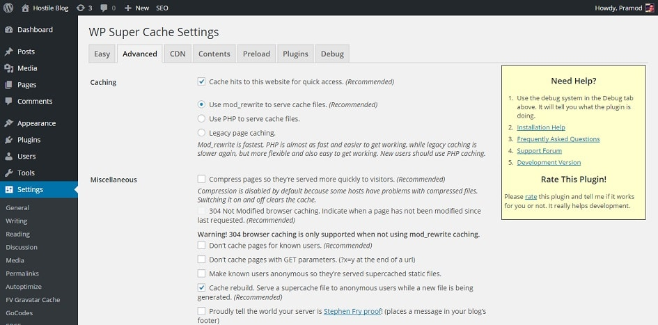
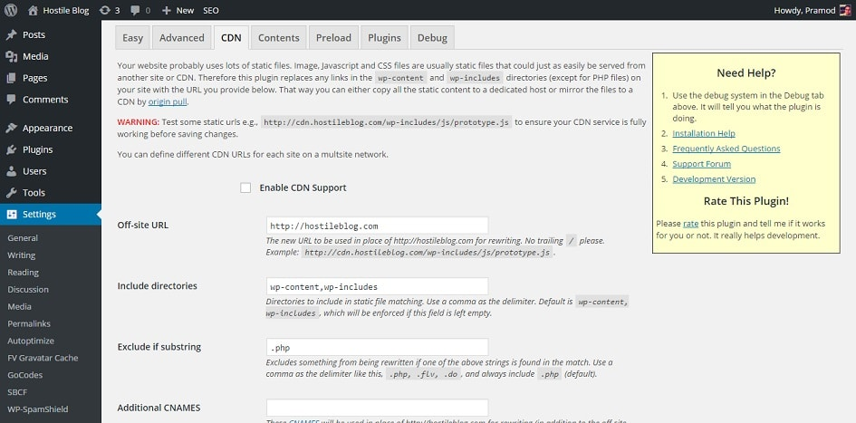
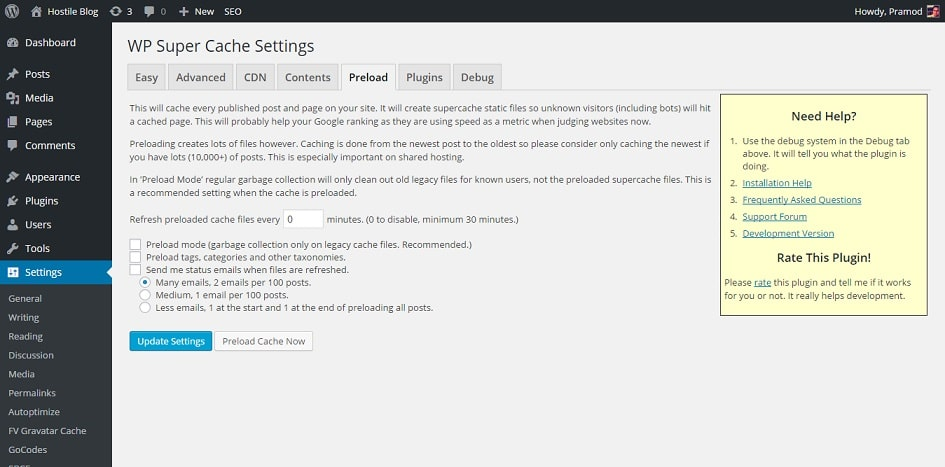

WordPress is my favorite CMS as you can start any site with it. I have seen classified, job posting, eCommerce, forum sites that employ WordPress content management system. As a webmaster, you must take care of your site as if it is your old dad or newborn child. To improve the performance and user experience, you should first consider improving the page load time. On WordPress site, you can easily do this by installing a caching plugin.

There over ten free caching plugins in the WordPress directory and only 2 of them are downloaded over a million times. Well, I'm talking about WP Super Cache and W3TC. WP fastest cache is growing rapidly. It is expected to reach a million downloads by the end of this year.

W3TC breaks my site when I activate its minification system. You can configure this plugin to minify files automatically. You can also change the minification settings manually. The 2nd option is confusing, and you can't trust the 1st one. W3TC settings page has a lot of tabs. Unless you are an advanced user, you don't have to navigate to the tabs.

I use and trust WP Super cache because it is easy to use. If you want to use this plugin, follow the below steps and instructions.

1. Open Plugins page in your WordPress dashboard and click on Add new plugin.
2. Enter WP-Super cache and hit the enter key.
3. Click on the install button
4. Now open WP Super cache settings.

**Easy**: This page allows you to enable caching on a WordPress site. When you see this page, select caching on the option and hit the status update button. Now press the test button. If WP-Super cache is working, you'll see green colored text containing information on the test files and their timestamp. Scroll this page down and you'll find a link to Use Google Libraries plugin. If your WordPress theme is using Jquery, Google fonts, and external JS libraries, this plugin will check if these JS files are stored on your blog hosting provider's servers or not. If it finds the files, Use google libraries will make your site load the JS libraries from Google servers. Thus the load time of your WordPress blog's post and pages will improve.

**Advanced settings**: This is the most relevant page of this plugin. Configure the settings on this page as shown in the below image.

As you can see above, I am using the mod\_rewrite module to serve cached files. WP Super cache will add some rules in htaccess file to improve page load time. The htaccess is the first file that a bot visits (or called when the user tries to access a page). Hence, this option is an excellent addition to the plugin by the developers. While activating this option, WP super cache will display some rules. You'll have to click on update mod\_rewrite rules to update the htacces file with these rules.

Activating compress pages option will allow this plugin to serve to gzip compressed files to the visitor. Files of lower size are transferred much faster than large files. So make sure that you enable this option.

**CDN**: If you're using CloudFlare, MaxCDN or any other content delivery network, this page will make your site compatible with the plugin as well as with CDN service

To flush all cached files, visit the contents tab of WP Super Cache.

**Preload**: If you own a big blog that has over 10000 posts, activating this feature will improve your organic rankings as these pages will be saved as a static file instead of firing SQL queries to get content. As static files will be served, the page speed score will improve dramatically. Google considers page load time as a ranking signal. Thus your old post will get a SERP ranking boost.

**Conclusion:** This plugin is the best caching solution for WordPress. Use it and improve the loading time of your blog.
