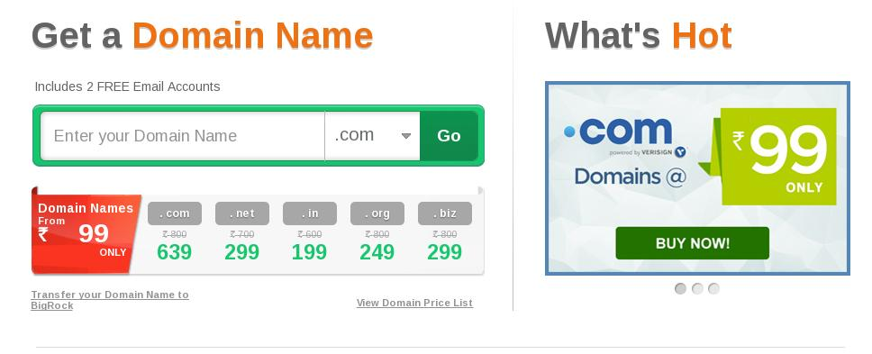
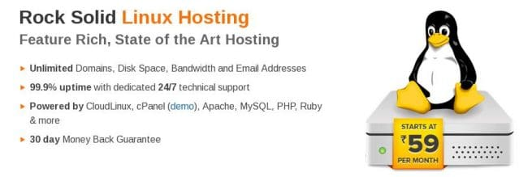
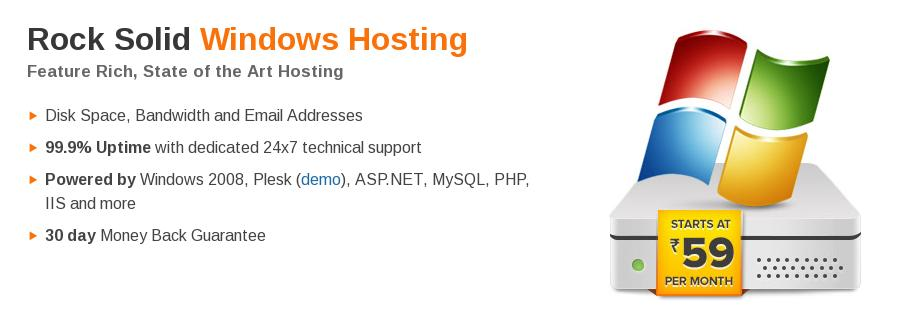
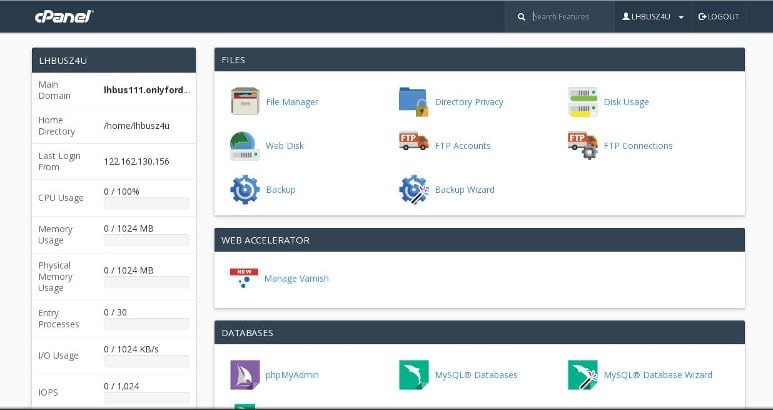

BigRock is an India web hosting and domain name registration company owned by Directi, a company with excellent infrastructure and revenue more than 300 MN USD. It is one of the best hosting companies in India.

Bigrock is the first choice for people who have just begun their online careers by launching a website., thanks to the cheap web hosting plans. Around million users use it.

Bigrock is ideal for hosting websites that target Indian audiences and for registering domain names at a cheap rate. It offers customer support with highly talented staff members.

This company is selling .com domain names for just Rs 99. Apart from the .com DN, you can register .net, .in, .biz, .online, .me, .asia, .co.in, .inco, .club domain names easily on Bigrock.in.

When you get a BigRock hosting plan, you can easily host as many domains as you want on their servers. There's no limit on the number of subdomains a user creates. This is not it! BIgbrock offers unlimited disk space as well as mail support. No matter how big your site is, you'll never face storage related problems with Bigrock.

This web hosting company claims to offer 99.9 percent uptime which is great. It also ensures that your website will be operational all the time.

Bigrock allows you to host websites written in modern languages like PHP, Python, CGI, and Perl. These four languages are supported on a Linux server based hosting plan. If your website has been developed in ASP, you'll be happy to know that BIgrock has cheap windows hosting plans.

Bigrock India can host MYSQL database servers. Its machines are powered by high-performance quad-core Intel XEON series processors. To make sure that your website is ready to serve the users all the time, Bigrock has packed its servers with large 24GB RAM.

Bigrock Hosting offers several starter plans for Linux and Windows environments. Below is the price table and features for the same.

### BigRock Linux Shared Hosting Plans

| **Plan Name** | **Subscription Amount** | **Link** |
| --: | :-- | :-- |
| **Starter** | **99 Rs per month** | More Details |
| **Advanced** | **Rs 179 PM** | More Details |
| **Business** | **Rs 319 PM** | More Details |
| **Pro** | **Rupees 399 PM** | More Details |

### BigRock Windows Shared Hosting Plans

| **Plan Name** | **Subscription Amount** | **Link** |
| --: | :-- | :-- |
| **Essential** | **109 Rs PM** | More Details |
| **Premium** | **Rs 299 PM** | More Details |
| **Business** | **Rs 499 PM** | More Details |
| **Pro** | **Rupees 599 PM** | More Details |

The above BIgrock hosting plans are CPanel and Plesk ready (demo). They support DNS management and domain forwarding. Like other service providers, Bigrock allows domain masking (a feature you'll find while starting a blog on blogger) and path forwarding.

In Basic or Starter plans, Bigrock offers 2GB space for email storage. HTML email and email tracking is supported in all the plans. For making contacts management easier, users are provided online Address book.

A web server should be protected from DDOS, hacking attacks using antiviruses and firewall. Bigrock ensures maximum protection to your website. It uses the latest security products to keep hacking attempts at the bay.

Bigrock Hosting allows you to start a WordPress blog quickly. You are authorized to install Yoast or All in ONE SEO, W3TC or WP Super Cache and any other plugin of your choice. It also supports b2evolution platform. Users are allowed to host Drupal, Joomla, 4images gallery as well.

This hosting company lets you launch poll, and e-commerce sites. It supports various popular shopping carts.

If you want to start an online forum, Bigrock allows you to install PHPBB framework on its servers. Setting up customer management portal is easy with this hosting provider, thanks to the support got SugarCRM framework.

In Linux shared hosting plans, the user's site will be powered by Apache webserver and Centos OS. Advanced tools like Cron Jobs, CURL, Zend Optimizer, zlib will be provided to the user.

For Windows hosting plans, Bigrock offers MS SQL Server, IIS 7.0, Crystal reports, MVC framework and Plesk Panel.

Most people use Google Analytics to check visitor data. If you don't use it, you can check AWSTATS program from your Cpanel to know the most popular pages on your website and other traffic details.

Bigrock Hosting users are allowed to check bandwidth reports so that they can optimize their websites further. They can create as any FTP accounts as they want. Each page request made by the visit is logged in the raw access log file.

Bigrock Hosting comes with the support for custom error pages. PHPMyAdmin module access is given to the user so that they can manage their databases efficiently.

### Bigrock VPS review

The company has very cheap VPS hosting plans. The VPS servers are hosted in the United States.

The cheapest plan i.e. V1 can be purchased for Rs 799. In this plan, you get one free IP address, and your website will be allocated 500 GB bandwidth, 20 GB storage memory, 0.8 GHz processor and 512 MB RAM.

BigRock V3 VPS hosting plan, the subscription cost per month is 1999 Rs. In this plan, your website will be hosted on a server with 1GB RAM, 40GB HDD, and a 1.47 GHz CPU will handle the code. You'll also be offered with a free IP.

If your website is large, BigRock's V5 and V7 plans should be your preference. Priced at Rs 3299 PM, V5 plan offers 2.4 GHz CPU, 2GB RAM, 1500 GB bandwidth and 80 GB Storage whereas the V7 plan provides a server with a powerful configuration which includes 4.4 GHz processor, 4.5 GB RAM, 3000 GB bandwidth limit. Its subscription cost is Rs 6300 PM.

Visit Bigrock.in for full details on plans mentioned above or to buy one for your website.

What's more? In Bigrock VPS plans, the customer is allowed to specify his configuration. He can decide the OS, CPanel, billing panel before making the payments.

### Bigrock Coupon Code 2016

Use the **discount code BRTWZ** and get 10% off on domain registration or 20% discount type on any shared, dedicated, VPS, reseller hosting and SSL certificates. Open Bigrock.In website and apply the coupon during the checkout process to avail this great discount.

**Conclusion**: As you can see above, the user can quickly start a WordPress or eCommerce website because of the various frameworks supported by Bigrock. If you can't afford Hostgator or Bluehost, buy hosting from this company.
