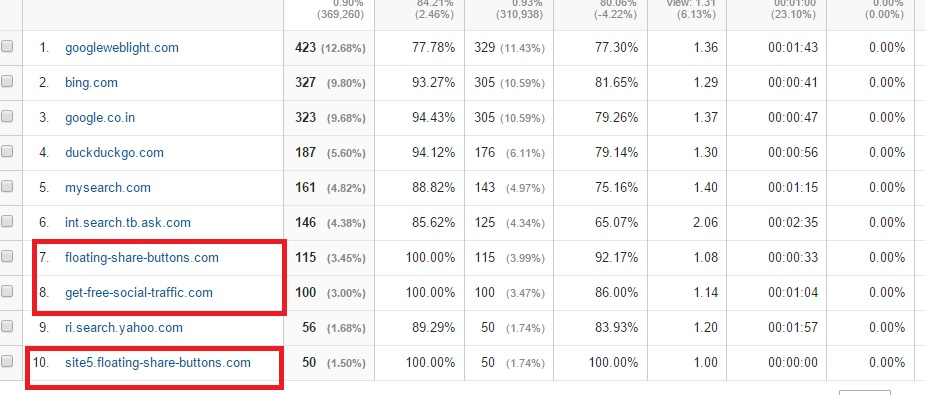

In the last few months, my Google Analytics account has started showing a lot of referrer spam sites like SexyAli, free-social\-buttons, Semalt, etc. The spammers are screwing up my GA reports. I have some websites. Tho site with 1000s of visitors is not affected but for my new portals, the referrers are causing high bounce rate which makes the report data confusing.

Some referrers seem to be attacking WordPress sites as the real-time reports show 30+ visitors (from spam sites) from various parts of the world.

I tried blocking spam referrers IP address from the hosting account control panel, but sometimes, this didn't work. I searched for some tutorials for the same on Google.com, and I found a solution in the form of Google Analytics filter.

The filters are powerful, and they support limited sites at a time. For example, each filter will have a domain, characters limit.

I think, the filter will exclude the reports from m showing them, but they're stored in your account records. If you accidentally delete it, you'll have to setup the filters again.

This best possible way to stop referral spam would be using the htaccess file. The 1st file that any spam bot will access is the htaccess. Thus you can use it to block sites like SexyAli, free-floating-buttons, quality market zone from accessing your blog and appearing in GA reports.

This list on GitHub has a full list of referrer spam sites along with htaccess rules to block them. You just have to open your CPanel, access root directory of your site and paste it at the bottom or top of the htaccess file to get rid of ghost spam.

You don't have to use any WordPress plugin, nor you have to purchase premium security services to get rid of Analytics referral spams. Simply bookmark the GitHub link we've shared above and do visit the URL once or twice a week to get updated list of spam websites.

Must Read: Best free WordPress spam blocker plugins (2016)

The result will be instant. Your GA reports will be clean, and only valid visitors (from search engines, direct and social networks) will be shown.
