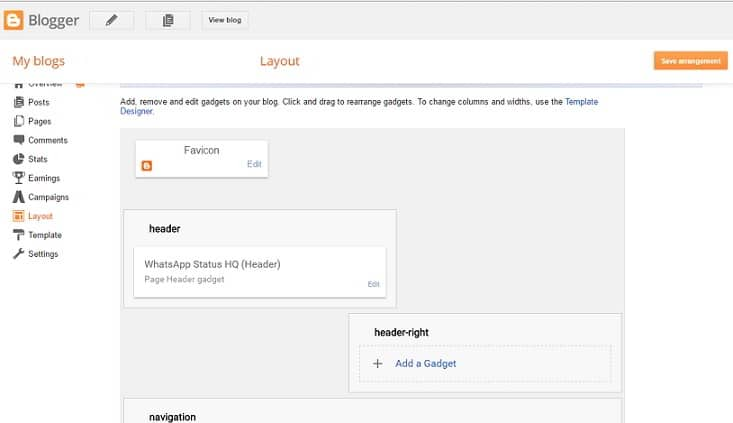

Blogspot and blogger are the two faces of the same coin. Blogger was known as Blogspot but when Google bought it, people started calling the site Blogger. Google hasn't destroyed Blogspot. Sites that are hosted on it are identified by the following domain name:

`site_name.blogspot.com`

### Is BlogSpot safe?

As Google owns Blogger, it is a much safer website than a self-hosted WP blog. If you enable two-factor authentication, it will be impossible for a hacker to take over your site because blogger asks users to enter their Gmail password to log into their profile. All websites powered by Google are secure. Have you ever heard that Gmail or Google got hacked?

Google has been killing its popular products when it finds them unprofitable. If you are using the internet for 10 to 12 years, you may know that Google has shut down its popular GReader app, social networking site Orkut, and many other portals.

Owners of Blogger accounts get AdSense approval quickly. Maybe, the site is making money for Google. Hence, the search engine giant hasn't abolished it. But we can't say that it wouldn't do this in the future. Everyday 1000s of sites vanish from the web. Blogger might be the next one to disappear. Who knows? If you worked hard on your BGSPT blog, and if Google kills it, your career will be over.

Migrating from Blogger to WordPress is not an easy task. In the past, I have lost 90% of my site's 1st-page ranking because of a failed migration. If you don't want this to happen to you, make sure that you buy a domain name and cheap website hosting to start a self-hosted WordPress blog.

### Is BlogSpot better than WordPress

No, because of the following reasons:

Blogspot is a platform that doesn't provide as many features as WordPress. If you know PHP, HTML, and CSS, you can easily customize your WP site. If you don't know it, there are tons of free and premium WordPress templates that you can use. Blogger provides limited themes. It is difficult to customize them.

You can make a Blogger site SEO friendly iff you understand the template's code. This is not the case with WordPress. If you install Yoast or All in One SEO plugin and configure them correctly, search engines will like your site.

You cannot change the permalink structure of a Blogspot blog. WordPress lets you change the same in a minute.

Please go through our WordPress vs Blogger article to read more disadvantages of Blogspot.

**Conclusion**: WP is 100 times better blogging platform than BGSPT. I hope our article has cleared your confusion. If not, please post your query as a comment. I'll answer it.
