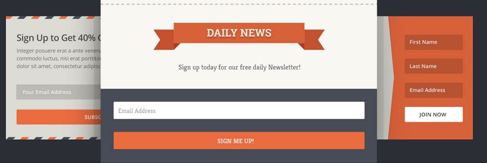
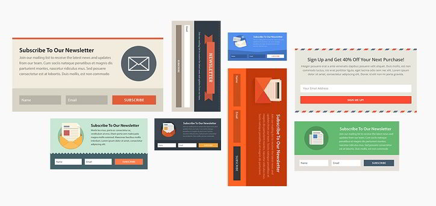
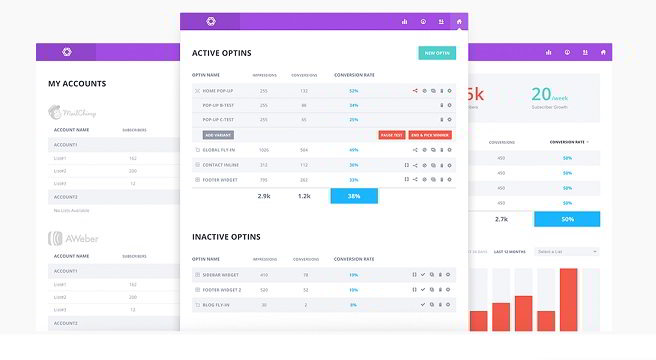
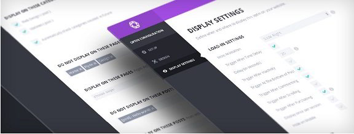

Email Optin forms are useful because they attract visitor's attention. When a visitor signs up with the form, the website will have a new loyal reader.

Newsletters will bring referral traffic to your blog. If your site is not ranked in search engines, you can still get free traffic provided that you send a newsletter to an email address or share blog posts on social media networks or the best bookmarking websites.

The task of Sending newsletters can be easily accomplished with Mailchimp. All you have to do is add an email optin form to your website and wait for the visitors to sign up for updates. But wait! Things are not as easy at it seems to be.

Adding a newsletter form to the sidebar will not guarantee new subscribers.

If you're planning to use a free email opt-in plugin, then you're wasting your time. Plugins of this type have very limited features. They're not CPU and RAM friendly, and you can have issues with your hosting provider. Free email opt-in form generators have limited options. They generate forms of 1 or two styles and prompt you to buy a premium version of their junk.

The plugins support sidebars. They won't allow you to add opt-in forms to the hottest position of your website.

If you're a developer like Me, you can develop your subscription form and add it to any position of your choice. If you're not a developer, you've to be smart in choosing a WordPress plugin that generates newsletter aka email opt-in subscription forms.

To make sure that your time is not wasted and the count of loyal email subscribers increases in an arithmetic progression, you should download and install Bloom plugin from Elegant Themes.

### Why should you download and use Bloom?

Bloom plugin is a useful tool for new as well as established blogs. It is a compelling product from Elegant Themes, the developer of over 85 premium, responsive themes and the stylish Monarch social sharing plugin. Many popular blogs use the Bloom plugin, and their owners are happy with it.

ET Bloom is one of the best email opt-in plugins for WordPress. It generates beautiful and unique forms that will increase your newsletter subscriber count from 0 to 100 within a few days time.

The website layout is different for all sites. To make sure that Bloom adapts to your theme, the developers of this plugin have packed six different display styles in Bloom. Each style is unique, and it supports all types of devices. Whether it's a mobile device or a large screen, the newsletter form will look great.

Check plugin demo here

### Stylish Popups

Popups can be annoying, but they are important. This is the reason why many browsers still support them. Bloom email opt-in plugin allows you to increase your email subscribers by letting you configure a popup that will be displayed when the user scrolls down the page.

The popups are beautiful, and they have a close button so that the visitor can get rid of it.

Bloom allows the user to configure a trigger for the popup. For example, if the user keeps your website's page open for a particular duration, the popup will be displayed.

Download Bloom plugin here

**Other powerful triggers supported by the Bloom plugin are as follows:**

**Post button**: When the visitor has scrolled down to the bottom of blog posts, Bloom will load its newsletter form (in a popup).

**Timed Delay**: This feature will use JavaScript to detect the time for which the user has been browsing or reading your article. The plugin will ask you to set a value after which it will display a fly in or a popup.

**After Commenting**: Visitors who comment on a website are considered loyal. They will visit your site to check if someone has replied to the comment or not.

If you want to give the visitor the opportunity of subscribing daily updates from your blog, you can configure Bloom plugin to load a popup or a fly in immediately after the visitor drops a comment on your website. This is one of the top features of the ET Bloom plugin for WordPress.

Bloom from Elegant Themes can be integrated with WordPress CMS based **eCommerce websites**. When a user has a purchased an object from your site, you can request him to join your mailing list with Bloom.

### Positions that converts

One of the best features of the Elegant themes Bloom plugin is that the user can add a subscription form to any part of the blog. This is because of the fact that Bloom supports shortcodes.

On many top websites, you'll find an email opt-in form below post content. Our favorite plugin, i.e., Bloom supports this feature.

The Elegant Themes Bloom plugin can generate responsive opt-in forms for the sidebars as well as the footer. The form will be dynamically resized whenever the resolution of the display changes.

Creating Locked Content Optin forms are easy with Bloom plugin. If you want to force users to subscribe to your mailing list, this feature will be useful or you.

Check demo or download Bloom here.

### Supported Platforms

Bloom supports all the key platforms for email marketing. Whether it's Aweber, Mailchimp, GetResponse or iContact, you can easily configure bloom with any of the existing marketing services that you are using.

### Stylish and SEO friendly Templates

Bloom WordPress plugin packs with more than 99 templates. It supports all types of responsive themes. It allows you to particular orientation for the images as well the forms. To make your forms look compelling, you can use the plugin's inbuilt feature to customize edges and borders of a form. Bloom allows users to change the color of the optin forms, fly ins and popups generated with it.

You can create as many forms as you want in the Bloom plugin from Elegant Themes.

As you can see above, Elegant themes have designed Bloom to perfection. Although its plugin is packed with many features, you find Bloom difficult to use. The UI is simple, and it is sever resource friendly.

Download Link

### Statistics

The plugin comes with a statistics dashboard to make users aware whether that list of their email subscribers is growing or not. The panel shows the below details to the user:

- Optin name.
- Impressions.
- Conversion.
- Conversion rate.

The plugin allows users to track their email marketing accounts. You can quickly switch from one website hosting service provider to another.

Bloom WordPress plugin comes with a utility to backup settings and import them when required. If you're switching to another hosting provider or if you're changing the theme, this feature will make sure that your changes and settings are intact.

**other useful features in Bloom:**

- Option to perform A/B testing.
- Settings to control display as well as animations.
- Option to add a custom image that should be displayed along with the form.
- Option for the webmaster for Manual selection of email list.

#### My verdict:

Bloom is a plugin that you will fall in love with. Its code is clean and easy to understand. The plugin works great on shared as well as VPS servers. Because of its unique templates, Bloom makes you site attractive without impact page load time. Unfortunately, the plugin is not free. You can buy it online only from Elegant Themes website for 89 USD. It is not very expensive as you'll have access to plenty of premium resources developed by the talented engineers at Elegant Themes.
