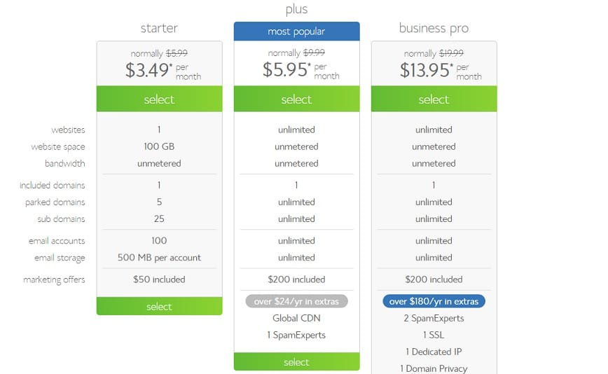
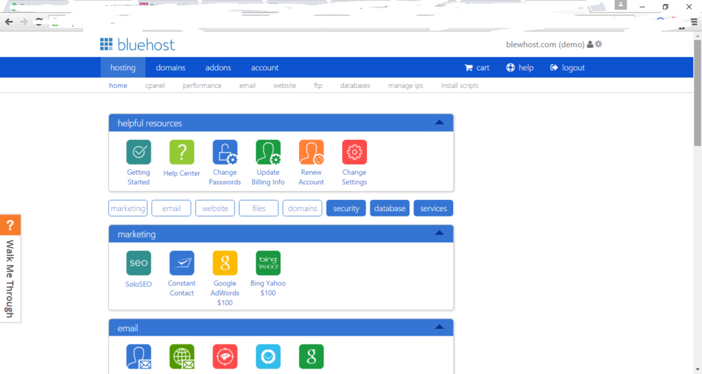

Many website hosting providers offer better features and more free add-ons but if budget is not a problem for you, choose a product on the basis of its quality, not quantity. Frankly speaking, the best hosting companies in the world are Hostgator and Bluehost.

Hostgator is a superb platform for hosting websites, but if your site has been banned for high resource utilization or some other reasons, you should consider signing up with Bluehost as it offers similar features.

This company has been active since 1996/1997. It is older than HostGator, GoDaddy, etc. If people did not like its services, Bluehost would have exited the business within a few years. This service powers over 2 million websites, and it offers high-quality customer support.

If you are planning to be a customer of Bluehost, your decision is right. Read the below review to know why we are recommending Bluehost to our readers.

We've also shared a detailed comparison of Hostgator and Bluehost plans and services. Thus, we've made it easier for you to decide which hosting service and plan is suitable for your site.

### Installing WordPress on Bluehost

Like many other providers, Bluehost comes with one click installer. Open this utility from the CPanel and install the CMS on the server. Once you install WordPress, you should login to your dashboard and setup Yoast SEO plugin and your theme.

### Free Domain name

Want a .com domain name for free? **Sign up for any of the below Bluehost plans**.

### Bluehost Plans

Bluehost offers three plans, i.e., starter, business and business pro. The 1st plan is for owners of a single website and the others are suitable for webmasters who want to host several domains.

### Single website

**Starter plan of Bluehost** offers 100GB free space along with 100 free email accounts. You'll also get a 50$ credit for PPC campaign on a reputed site. The starter plan costs within 3.95 to 5.95 dollars.

If you use this special link to signup for Bluehost, you will get .50/per month discount, i.e., Hosting for just 3.45 dollars/month. Hostgator Hatchling plan is a bit expensive (pricing starts at 5.5 dollars). It has no disk space usage limit. Apart from this, you'll get a free shared SSL certificate.

### Multiple websites

Both these providers support addon domains, i.e., hosting several domains on a single account. Bluehost plus comes with excellent benefits that include unlimited hosting, disk space, bandwidth, etc. It has a usage policy where the action might be taken on webmasters whose blog's DB size exceeds 3GB. It also offers global CDN, i.e., CloudFlare (a content delivery network for improving website speed).

Bluehost plus plan starts at $6.95 for three years (you can get it for just 5.95 dollars with this link). For a single year, you'll have to pay 8.95 dollars.

Hostgator's Baby Plan includes the same features. But its plans are not affordable for beginners. You can signup for the baby plan on payment of 6.36 to 8 dollars. Gator supports integration with CloudFlare. There's an add-on for controlling the CDN. There's no DB size limit in Hostgator. You can buy hosting for max three years, i.e., 36 months. There's no monthly plan available with this provider.

**Sign up for the above plans here.**

### Uptime

If your site stops working for more than 20/30 minutes, move to Bluehost because it has a record of offering 99.9/99.8% uptime.

### Moneyback

Bluehost promises excellent support, powerful servers and best speed to your blog. In case you are unhappy with the service, you can request your money back.

### Free SSL

Bluehost enables users to make their site safer for browsing by proving an option to enable SSL certificate. You don't have to edit any web server configuration files to place the code that enables HTTPS protocol on your site. Simply open the control panel and navigate to the WordPress tools page. Now, click on the security option on the page and click on the toggle button beside the Free SSL Certificate option.

### Other features

Bluehost has separate servers for hosting WordPress site. These servers are powerful, and they can handle complex plugins and themes. They can easily manage sites that have 15000 to 20000 unique visitors per day.

If you signup for Bluehost, make sure that you keep an eye on the CPU throttling utility in the Cpanel. If your site is causing problems for another site by using a lot of system resources, Bluehost will limit your site's CPU usage. You can get information on this in the throttling section.

### Customer support

Bluehost has hired and trained many technical professionals. If you are facing some problems with your blog, just contact the support team and wait for the issue to get resolved. Some hosting services take up to 48 hours to reply to and handle the service ticket. This is not the case with Bluehost as your problem as the support team will fix your problem within 30 to 45 minutes.

**Conclusion**: Bluehost is no doubt a top class hosting company. Millions of people trust and use it to power their websites. The plans are good, and the features are impressive. Whether it is a small or a high traffic blog, Bluehost can handle any site. **Sign up for this hosting** and forget about frequent downtimes.
