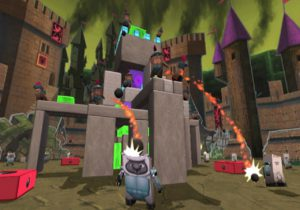
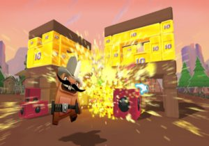

We don’t have to introduce you Steven Spielberg, the great director who marked his entire generation of cult films such as Jaws, ET, Close Encounters of the Third Kind, Jurassik Park, Indiana Jones or The Saving Private Ryan. In the last 25 years, this genius of the cinema has become one of the greatest filmmakers of all time and has amassed a colossal fortune that he invested to produce new films and support educational organizations. Not happy enough with having conquered Hollywood, Spielberg is tackling now the gaming arena with the prestigious publisher Electronic Arts. So that logically could be expected in a project supported by a more than great realization, the concept of Boom Blox is very basic. And the most surprising is that it works wonderfully!

With the help of the Wiimote, we demolish or change 3D environments consisting of blocks. According to the tables, the player can launch projectiles towards the various elements or directly manipulate them. The controls are simple: we keep the A button to aim and makes gestures to interact with the scenery. The camera can be oriented as desired by pressing the B button. Ergonomic and treated very quickly (even for your oldest uncle), these controls are also remarkably accurate. For once, the magnitude and speed of movement are very well transcribed to the screen. It’s a demonstration, if necessary, that the Wiimote can do miracles in good hands.

The game modes are many and varied. In solo, the player may play on the Challenges Exploration mode. After selecting a type of test, for example he will drop precious stones placed on buildings, blowing bombs or chains garnering maximum points in three shots. Adventure mode takes place in four environments divided into three parts, introduced to various screenplay elements illustrated by kinematics. Here, it is a mother gorilla in distress seeking help to clear a path to his offspring. The player then moves the blocks hindering its passage. There, it is an army of sheep that must repel an invasion of barbarians. It draws on the opponents. It does not fly very high, it is rather basic, but in fact we can have as much fun as kids. The physics of the game is impeccable and the cubic design of animals is absolutely cracking. Furthermore, the missions are many and they have the merit of proposing changes in brighter gameplay. Thus, one must often use the special characteristics of blocks (ice, bomb, chemical, etc ...) to solve puzzles or have a maximum damage. Whatever form they take, the challenges are generally easy to rise but for the gold medal prize you will need an outstanding performance.

Although the graphical environments and blocks do not break a three-legged duck, the character design is cute and visibility is excellent. The menus are however a few drafts. Receiving copies of checks, Boom Blox is quickly taken over and remains accessible to neophytes. The events are varied and fun is almost always there. Furthermore, the physics of collisions and the effect of gravity are perfectly simulated.

Hundreds of levels are playable as you grow and a very comprehensive editor allows you to build your own levels and trade them online. The many multiplayer modes promise wild nights with the family. The cheerful music fit perfectly into the game. There is no scenario itself, but small stories illustrate the adventure however.

Original and devilishly addictive, Boom Blox offers great gaming moments alone or with friends. Served by controls as accurate as thought out, this friendly game signed Spielberg clearly demonstrates that the Wii still has a unique potential for fun.
