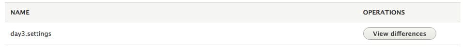

In Day 3 we are starting to accelerate in terms of skills developed by the cards. This card has us create our first Drupal 8 module, learn about Drupal 8 Form API and learn about the Configuration API. The card starts off with directing you to several Drupal.org documentation pages including Creating a Custom Page,  Defining and using your own configuration in Drupal 8, Providing Default configuration, and Simple Configuration API. Except for the Creating a Custom Page document, everything else here is focused on giving you a solid overview of the configuration system within Drupal 8.

## Building our First Drupal 8 Module

Creating a Custom Page walks through the process of setting up a custom module with Drupal 8 that outputs simple 'Hello World' output. It introduces you to the basic structure of a Drupal 8 module as well as the use of .yml files, which become an integral part of module development. Each module has at a minimum an info.yml file defining the module name, type, description, package and core version. This is excluded in the 'Creating a Custom Page' doc as it is assumed you already know this. The routing.yml file essentially defines routes (url paths) linked to controller actions. For me this was quite a familiar concept as I come from an ASP.NET MVC background. For Drupal 7 developers, the routing.yml is a replacement for hook\_menu. Finally, the controller file is the heart of the logic that happens within the module and controls responses to user inputs either via a Twig view page or Drupal form.

## Drupal 8 Controllers (ControllerBase vs FormBase)

Another important resource posted in Day 3 was a blog post called Creating a custom Form. This post helped solidify some of the knowledge I already had gleaned from the cards as well as my own personal experience. It walks you through creating a basic Form that extends the FormBase controller class. Now this is where I got a little confused. In the earlier 'Creating a Custom Page' documentation, the controller code inherits from ControllerBase and ControllerBase is what I have been using currently on some custom modules at work. After doing a little research it appears that there are several base controller classes and they can be used for different things. If you are just outputting data from Drupal, you can use the ControllerBase. If, however you need to tap into the new Drupal 8 Form API, you must inherit from FormBase. I found this a little confusing as I have been used to having the same base controller class in C# regardless of using a form or not, however I guess this is just something I'll get used to. One other major difference between using the standard ControllerBase vs FormBase is the location of src files which typically reside in /src/Form for form API code and /src/Controllers for regular ControllerBase controllers.

## ConfigFormBase

Now that I had got my head around ControllerBase vs FormBase, I quickly realized I needed to understand a third controller base class called ConfigFormBase if I wanted to generate a form that would allow me to write configuration settings. Luckily enough I came across a very helpful post on Drupal.org titled Working with configuration forms. In order to create a form that also allows you to write configuration settings, you must inherit from ConfigFormBase instead of FormBase and then you must add a method called getEditableConfigNames, which grabs a editable object we can store our new settings to.

```php
protected function getEditableConfigNames() {
    return [
        'example.settings',
    ];
}
```

This would loosly equate to **$config = Drupal::service('config.factory')->getEditable('system.performance');** outlined in the Simple Configuration API document (however in this case we are grabbing settings to write to Drupal core, not our individual module settings.

## Putting it all together

After spending quite a bit of time with all the resources outlined above, I was able to finally come up with a working example form built inside a module called 'day3' that allows the user to update local configuration settings defined within the module. This can be confirmed by visiting /admin/config/development/configuration/ and looking for changes applied to day3.settings:



The file structure of my day3 module includes:

- day3/day3.info.yml (Our module's info file)
- day3/day3.routing.yml (Routing for our Form)
- day3/config/install/day3.settings.yml (Our local module configuration settings)
- day3/src/Form/ConfigurationForm.php (Our Form controller inheriting from ConfigFormBase)

The source code for the above files is included below. This was definitely a more challenging card and I am only working on the third card in this series, however I can attest to the fact I am learning a lot from this process and strongly encourage you to visit d8cards.com.

### day3/day3.info.yml

```yaml
name: Day 3 Configuration
type: module
description: 'Creates a basic configuration form'
package: Custom
core: 8.x
```

### day3/day3.routing.yml

```yaml
day3form:
path: '/day3/config'
defaults:
_form: 'Drupalday3FormConfigurationForm'
_title: 'Configuration form'
requirements:
_permission: 'access content'
```

### day3/config/install/day3.settings.yml

```yaml
title: 'This is a test title'
video: 'test video url'
develop: 1
description: 'This is a long description'
```

### day3/src/Form/ConfigurationForm.php

```php
<?php
/**
* @file
* Contains Drupalday3FormConfigurationForm.
*/

namespace Drupalday3Form;
use DrupalCoreFormConfigFormBase;
use DrupalCoreFormFormStateInterface;
use DrupalComponentUtilityUrlHelper;

/**
* Contribute form.
*/
class ConfigurationForm extends ConfigFormBase {
/**
* {@inheritdoc}
*/
protected function getEditableConfigNames() {
return ['day3.settings'];
}

/**
* {@inheritdoc}
*/
public function getFormId() {
return 'configurationform';
}

/**
* {@inheritdoc}
*/
public function buildForm(array $form, FormStateInterface $form_state) {
$config = $this->config('day3.settings');

$form['title'] = array(
'#type' => 'textfield',
'#title' => t('Title'),
'#required' => TRUE,
'#default_value' => $config->get('title'),
);
$form['video'] = array(
'#type' => 'textfield',
'#title' => t('Youtube video'),
'#default_value' => $config->get('video')
);
$form['develop'] = array(
'#type' => 'checkbox',
'#title' => t('I would like to be involved in developing this material'),
'#default_value' => $config->get('develop'),
);
$form['description'] = array(
'#type' => 'textarea',
'#title' => t('Description'),
'#default_value' => $config->get('description'),
);
$form['submit'] = array(
'#type' => 'submit',
'#value' => t('Submit'),
);
return $form;
}

/**
* {@inheritdoc}
*/
public function validateForm(array &$form, FormStateInterface $form_state) {
// Validate video URL.
if (!UrlHelper::isValid($form_state->getValue('video'), TRUE)) {
$form_state->setErrorByName('video', $this->t("The video url '%url' is invalid.", array('%url' => $form_state->getValue('video'))));
}
}

/**
* {@inheritdoc}
*/
public function submitForm(array &$form, FormStateInterface $form_state) {
// Display result.
foreach ($form_state->getValues() as $key => $value) {
drupal_set_message($key . ': ' . $value);
}

// Save result in local module settings config
$this->config('day3.settings')
->set('title', $form_state->getValue('title'))
->set('video', $form_state->getValue('video'))
->set('develop', $form_state->getValue('develop'))
->set('description', $form_state->getValue('description'))
->save();
}
}
?>
```
