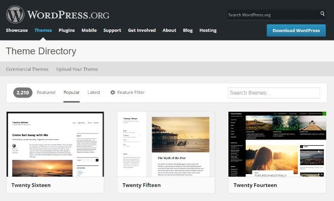

WordPress is a great content management system because it allows users to launch a new self-hosted blog or website within half an hour. Launching a site is easy but you'll not make money with it if the site doesn't get decent traffic from search engines. To make sure that the site is SEO friendly, you must write good quality content, buy a good hosting plan, and purchase a premium theme.

In one of the articles, I have shared the cons of free blog hosting companies. Go through it if you think buying a hosting from a reputed company is a waste of money.

You should have good command over the English language for writing good articles. Using the free Grammarly extension for correcting basic mistakes in WordPress posts would be a great decision for you.

Now, you must be wondering why I'm recommending our readers to buy a premium theme. Go through the following disadvantages of free WP themes to know why you should consider using a premium template.

### Support

Developers of free themes don't reply to user queries within a day or two. Sometimes, you must wait for several days until one of the community member posts reply to your question.

Premium WordPress templates are offer highest priority support. The developers ensure that their customers don't have to suffer because of their products. They publish a detailed documentation which explains various functions of the themes.

### Code issues

Most free templates available in the WordPress directory are not SEO friendly. I tried seven different free themes before buying MythemeShop Schema and TagDiv NewsPaper. The free WP templates which I used were not compatible with the popular plugins like Yoast SEO, Free page builder by site-origin, Google XML sitemap generator, etc.

A premium theme is more like to beat free themes in page speed tests. It will have schema markups which are parsed by search engines to understand the website.

### Customization

Some premium themes provide dedicated areas where you can place your favorite widget or module (example: opt-in form). They offer powerful page builder tools that support drag and drop feature. The tool provides plenty of responsive and SEO friendly components, with which you can place on any WP page of your choice.

### Updates

Free themes get updated once or twice in a year. Premium WP templates get updates on a regular basis. Developers roll out updates for their theme to make sure that it follows latest Google webmaster Guidelines and has social networks and SEO friendly code.

**Conclusion**: As you can see above, premium WP themes have plenty of advantages over free templates. If you still have any doubts, please me know about it.
