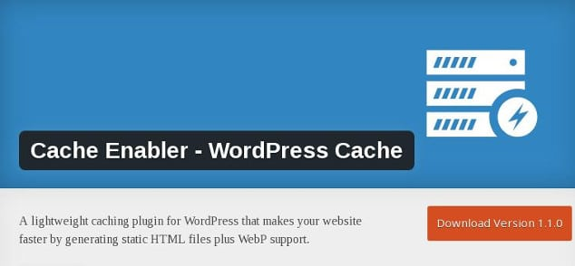
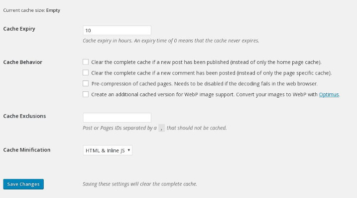

Caching of WordPress posts and pages are two of the best way to increase the page speed. While most of the WP users prefer using WPSC or W3TC, there are a lot of users who are always in search for different plugins. For such users, today we'll share a review on the Cache Enabler plugin.

The cache enabler is one of the lightest WordPress plugins. It has been developed by folks at the popular CDN service provider, KeyCDN.

The plugin was 1st published on wordpress.org repository seven months back. Its latest version (v 1.9) was introduced recently.

The CE is the 4th plugin that KeyCDN has launched for the WordPress plugin. Is the new version of the caching system from KeyCDN as efficient and robust as WP Super Cache or W3TC, let's find it out.

### How to use the Cache Enabler WordPress plugin?

The Cache Enabler is a free plugin. Installing it on your site is an easy task. Open the plugins page from the WordPress dashboard, search for Cache enabler and click on install button when you find the plugin in search results.

The plugin uses storage memory of the server to cache files. The plugin may have been designed specifically for shared hosting platform. The user will find the below options in the plugin's settings page:

### Cache Expiry

This option is vital because it forces the client browser to save static files such as images, JavaScript, Media files, CSS stylesheets on the hard disk drive. When the user visits your website again, the browser will load the saved static resources saved on the client PC instead of requesting the server to send each file again.

Select this option to set an expiration time for all static files of your website and to fix leverage browser caching error reported by the page speed tool.

The default value of this option is 0 which means that the file will never expire on the PC of the visitor.

### Cache Behavior:

Here, you can configure the plugin to clean (purge or delete) the saved cache files when a new blog post has been published or when the visitor has left a comment on your website.

The plugin has a unique feature to enable caching of WebP images. WebP is a new image format which is smaller than PNG and JPEG images. If you're inserting WebP pictures in your blog post, enable caching support is easy with this free plugin.

### Cache Exclusions

The plugin has the option to disable caching option for specific pages. You must enter the IDs of posts and pages that you don't want to plugin to cache.

### Minification

Like WordPress total cache, the CE plugin comes with a minification option. When enabled, this feature will inline JS code in the web page instead of combining multiple JS files into one. Cache Enabler supports HTML minification. Enabling this feature will fix to minify HTML error that you'll find on testing the website page with the Google page speed insights tool.

Unfortunately, the plugin doesn't support CSS minification. You can use Autoptimize plugin if you want to minify all the CSS files.

Well, these are the only options that you'll find in this plugin. To check cache status, or to purge the cache, navigate to the home section of the WordPress dashboard.

**Other features**:

The plugin supports HTTP/2 protocol, 304 Not Modified Header, WordPress Srcset function, and WordPress multisite setup.

**Pros**:

- Easy to set up.
- Supports HTML
- Includes JS minfier module.

**Conclusion**: The Cache Enabler plugin does its jobs well. It is one of the simplest and lightest caching plugins. There are not many options to configure. This saves time. If you're using a shared hosting plan, using Cache Enabler on your site will save server resources. It will also improve the loading time of your WordPress site.

\[themify\_button bgcolor="red" link="https://wordpress.org/plugins/cache-enabler/" target="\_blank"\]Download Cache Enabler\[/themify\_button\]
