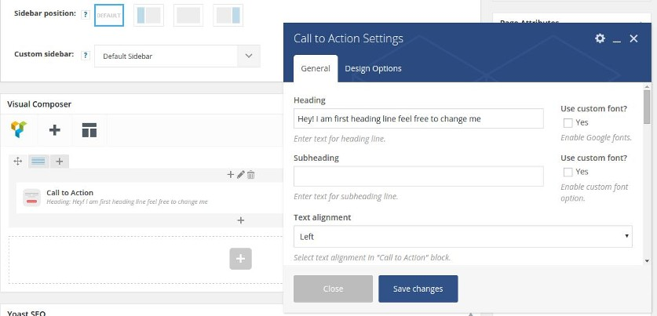

When it comes to website designing, the User Experience plays a crucial role. If a site is not user-friendly, the conversions and revenue will be flat unless most of your earnings come from Adsense or its alternative advertising platform. This applies to all websites.

A good way to make sure that your website is effectively generating revenue and the user visits more than one pages of your site, you should add the call to action buttons.

##### What is CTA?

CTA button is nothing but an HTML element which on clicked opens a new web page or triggers an action. You will find it on all types of established websites.

## 2 Genuine Call to action button examples:

**On E-commerce websites** ( example Amazon): You may have visited the shopping site Amazon many times. To add a product to your shopping cart, you click on the add to cart or buy now button. If the product listing page had a hyperlink, most of the customers would have ignored it.

Customers are already aware of the product details. They wouldn’t spend time in reading the description. If you insert links instead of buttons, the client will not waste his time in searching for it, and he'll visit some other website. But yes, the customers will go through the review sections. A buy now or ATC button will certainly grab their attention.

**On Blogs**: On many popular blogs, you’ll find a newsletter subscription form that asks you to enter your email address and sign up for the email list. The form has a fancy text that attracts the eyeballs of many. This tactic increases the number of email addresses in the subscription list.

Call to action buttons increases user engagement. If it is placed in the right position, they will increase the page views on a website and reduce the bounce rate.

### Plugins to Add CTA modules on WordPress

**Visual Composer**: This is a powerful plugin that lets you add and stylize CTA button with or without a shortcode. The Composer generates codes which are HTML 5 standards compliant. When you’ve created an element, just add it to a WordPress post or page with a shortcode by switching the backend editor of VC to the classic mode. Visual Composer comes with a lot of features.

Pros:

1. Understanding the features may take some time.
2. Easy to use once you become aware of the full features of the plugin.
3. Support for Shortcodes.

**Shortcodes Ultimate**: This is one of my favorite plugins. Unlike the Visual composer, SCU is free. It allows you to insert a call to action buttons in blog posts and pages. The plugin has been well designed. Thus, you can add a CTA module within a few seconds time.

**Bonus tips for CTA success:**

- Choose a button color wisely.
- Place the CTA button at a position that will increase conversion.
- Perform A/B testing (keep changing colors, fonts, texts, etc).
- Focus on the design so that user finds the module attractive.

Call to action buttons will prove to be useful when they're implemented correctly on a website. You can easily add them to your WordPress blog with the above two amazing plugins.
