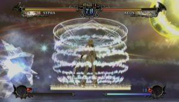
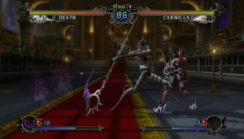

Konami let itself be drawn into the tendency to cross-over with Castlevania Judgment which marks the encounter of the most charismatic characters in the series. A radically different way from what Koji Igarashi used us since it is neither more nor less than a 100 % fighting game.

Within two decades, the Konami gothic saga took the time to make a name with players in a sprawling building on a large number of different media. Today, the series extends primarily on consoles, waiting to know what will happen in the next major opus announced on PS3 and Xbox 360. As with SoulCalibur Legends, the Wii will finally be entitled to an episode of this prestigious marginal saga, the one this is the subject of this overview. Designed for the most unconditional fans, Castlevania Judgment certainly does not have the aura that characterizes the other parts of the series, but it is still a good opportunity to unwind alongside the cult figures of the saga

First cross-over in the history of the Castlevania license, this game has to gather the most emblematic figures of the saga. Yet the range of playable characters does not even reach the half of what we expected and hardly explaines the absence of some players that would have richly deserved their place in this episode. The designers had to make choices to keep only the most essential characters according to them, mainly in digging among the founder episodes of the saga. Starting with Simon Belmont, who distinguished himself in the first two NES episodes and remains the most famous hero of the series although he is not the first keeper of the Vampire Killer in the timeline. Then four caraters from Castlevania III: Dracula's Curse. This is Trevor Belmont, Grant Danasty, Syph Belnades and Alucard, the half man half-vampire hero from Symphony of the Night, yet san and enemy of Dracula. Have not been forgotten either Maria Renard, discovered in Rondo of Blood with Richter Belmont, and Cornell, the werewolf, which had been added on the second version of the Nintendo 64 episode, Castlevania: Legacy of Darkness. Finally, Eric Lecarde, wielding the entrusted spear by Alucard, came without John Morris, his acolyte of Castlevania Bloodlines on Megadrive

Note that, by default, the game offers you to try handling both the Wiimote and the Nunchuk, and shake the remote every time you want to attack. Enough to have cramping wrist in just a few minutes before returning to reason and opt for a more efficient handling pad with a GameCube or Wii Classic Controller. Various bonuses will be made available easily if you connect the game to the last episode on DS, Castlevania: Order of Ecclesia. In addition to the Survival and versus modes, we note the possibility to participate in online battles via Wi-Fi, but also to see the available bonuses in the gallery. Finally, during the game, sometimes you unlock all sorts of accessories that you can equip on your characters to change their appearance. A pretty nice visual delirium which allows more or less to extend the life of the game, but does not compensate for the somewhat limited nature of the content and the boredom generated by the gameplay. It is clear that for a title that is a tribute to a series of such magnitude, Castlevania Judgment may unsettle fans who surely have a far more ambitious vision of a cross-over. Expected for the coming weeks, this title will still be welcome, IGA has not yet announced any alteration of the license on the very popular Nintendo console.
