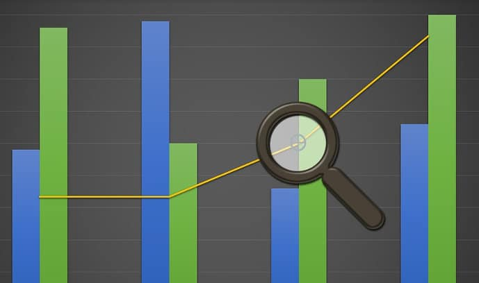

Guys, you may have seen the "Leverage browser caching" warning when you test your website's speed with the Google page speed insights tool.

After finding this message, you head over to Google and search methods to increase cache expiry time. After reading a tutorial on increasing expiry time for static content i.e. JavaSript, CSS files, you go ahead and modify the htaccess or Nginx configuration file.

Do you know that if you set an abnormal expiration value to the static files (say 30 days or more), you may be committing a big mistake!

Consider the following example:

A user named Sam has set cache expiry time of 30 days.

Google crawls his entire website and indexes his articles.

Scenario 1: After a few days, Sam notices a significant traffic drop because of an algorithm update, or a Government holiday. Being a newbie or unaware of Google webmaster guidelines, he doesn't use the Panguin tool to learn which algorithm has impacted his website.

Sam gets confused and believes that the site traffic dropped because of the WordPress theme he has employed. He changes the WordPress theme.

Scenario 2: (In case the search traffic is normal)

Sam finds a new premium or free theme that promises plenty of features.

He finds the theme impressive. He downloads and enables it on his website.

In both the above scenarios, the internal link structure of Sam's website changes with the change of theme. Google finds the changes Sam has made to his site and recrawls the website. Because of the change in link structure, the most important keyword of Sam's blog/portal tanks.

#### What you can learn from the above example?

Once Google indexes your content, it may not re-crawl the older pages unless you post articles on regular basis or have a website with good DA. If you don't post regularly on your website, Google may not visit your old pages up to 30 days (cache expiration time).

Because of the traffic drop, your website may lose ad or affiliate revenue.

## How to regain lost traffic after you change WordPress theme?

In case your site's search performance is impacted by an algorithm update, use the Baracuda Panguin tool to learn which algorithm penalty has struck your website.

If the website traffic dropped due to a public holiday, and you change WordPress theme, your rankings may have dropped further. In such case, restore the old theme, and use "Fetch as Googlebot" tool provided in Google search console and choose "submit linked pages" option.

Before changing WordPress theme, use website traffic estimator to learn whether rankings have changed recently. If the rankings are intact, don't change the theme.
