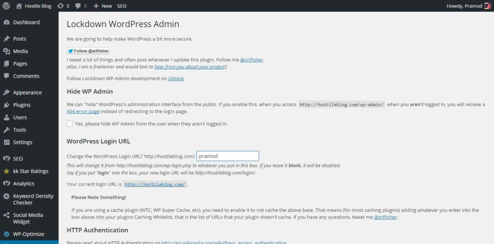

Every content management system has a login page, and dashboard that allows bloggers and webmasters to manage the data published on their site and WordPress is no exception. This page is relevant. Thus it will always be on the attack of website hackers that may/may not use automated program to gain access to your site's dashboard. The default slug to log in to your WordPress dashboard is wp-login.php, and every hacker and WordPress user knows it knows it. Thus if you're using the default password or if you're using weak login credentials, your site might get easily hacked (You can remove the default user i.e., admin through the users page in WP).

To prevent this, you must change wp-login URL with Lockdown WP Admin (LWA). This plugin will hide the most significant slug of your WordPress site. Thus reducing chances of getting your website hacked. LWA will not touch or modify the htaccess file. It will use PHP code. When this plugin has been configured correctly, when a visitor tries to access the login page, he'll see a 404 not found error.

**How to use this plugin?**

Enter into your website dashboard and navigate to the plugin installer page. Install lockdown WordPress Admin and go to its settings page. Now you'll see the below interface.

Tick the box that you'll find below the hide wp-admin to hide the login URL from all the users who haven't logged into their accounts.

Below the checkbox, there's WordPress login URL section. Enter the slug for the new URL in a text box, scroll down and click on save options button. Congratulations! The most important pages of your site are now secure. Before your log out of the dashboard, make sure that you note down or bookmark the changed login URL. If you forget to do this, you'll have to disable this plugin to regain access to the dashboard. To do this, open your hosting provider's CPanel page and login to your hosting account. Go to the plugins folder from the wp-content directory. Find the lockdown wp-admin plugin and change its name. Now you'll be able to access the dashboard with the old wp-login.php URL.

If you're using a caching plugin, configure the plugin to avoid caching the new login page/URL and flush all the cached files. Do this if you see a blank page.
