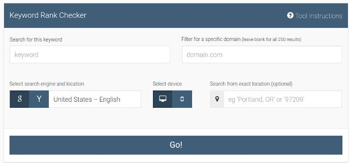
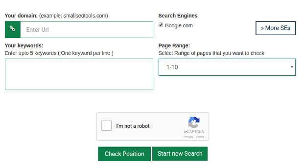
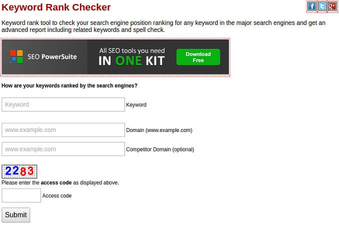

Once your website starts ranking in search engines, you should check its Google keyword rankings often. If you don't do so, competitors may steal your keywords and use them on their portals.

A website with high domain authority won't be affected by this. But if a site is new, competitor stealing your major keywords may have a negative impact on your website traffic.

Today, we'll share some of the best free tools to check website ranking in Google search engine. Most of the tools covered in this blog post won't ask you to create an account. Nor they'll ask you to enter credit or debit card details. Apart from free tools, we've also mentioned a powerful premium SEO tool that provides plenty of useful SEO tools.

If you have a blogger or self-hosted blog or any other site, make sure that you bookmark the tools we've shared below.

### Rank Tracker

RT is a reliable tool with which you can monitor the top ranking keywords of your site. This tool asks you to enter a keyword to track, domain name, search engine, and location.

Once you fill all text fields, click on the button named "Go". If you do so, the Rank tracker will analyze the results provided by the search engine. It will then show the website ranking for the keyword you have entered. RT is a free tool and has high accuracy.

Visit the website

### Small SEO tools

SS is yet another powerful tool that enables you to check Google keyword ranking of any website. The tool accepts up to five keywords at a time. It allows you to select search engines where your website ranks or you're targeting.

This tool has the option to select the range of web pages where your site may rank. It has captcha system. Hence, after entering keywords and selecting options of your choice, pass the captcha test. Then, click the enter button.

Open the tool.

### SEO Centro

Like other tools covered in this article, SEO Centro requests to enter a search term and your website name. It also provides the option to enter competitor domain name.

Once you click the submit button, the tool shows the rankings of the keywords and the websites. SEO Centro checks 1st three pages of Google search. It shows the list of top ranking portals.

Open the Centro tool.

### SEMRUSH

SemRush is one of the most widely used SEO tools. Once you open SR, enter your domain name (or your competitor's DN), and click on the search button.

SemRush provides a good UI, with which you can check website ranking country wise. It shows the following details of a domain:

- Keyword, position, volume.
- CPC, URL, traffic percentage, results.
- Search trends.

Visit SemRush here.

**Conclusion**: Opportunists are everywhere. Once a competitor finds your most important keywords, he'll try to kill your website's traffic. Outsmart your competitors. Use the tools we've suggested above and monitor your site's rankings in Google.
