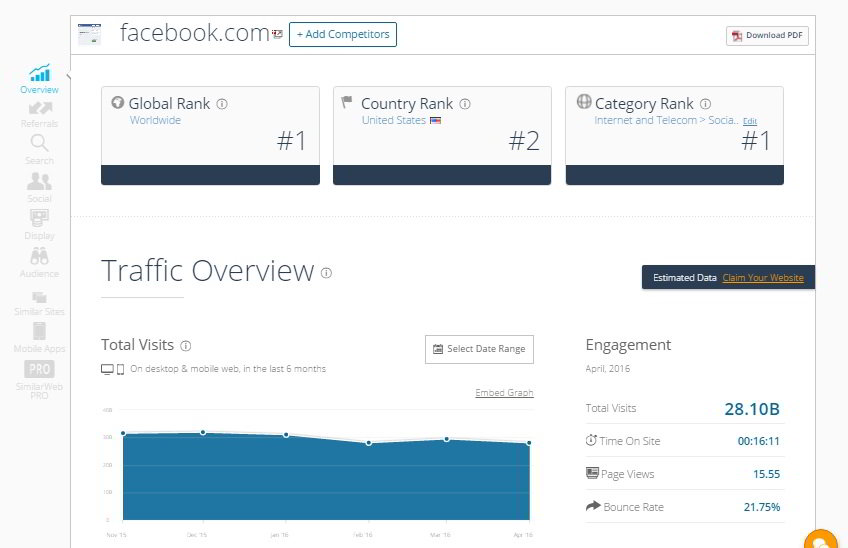
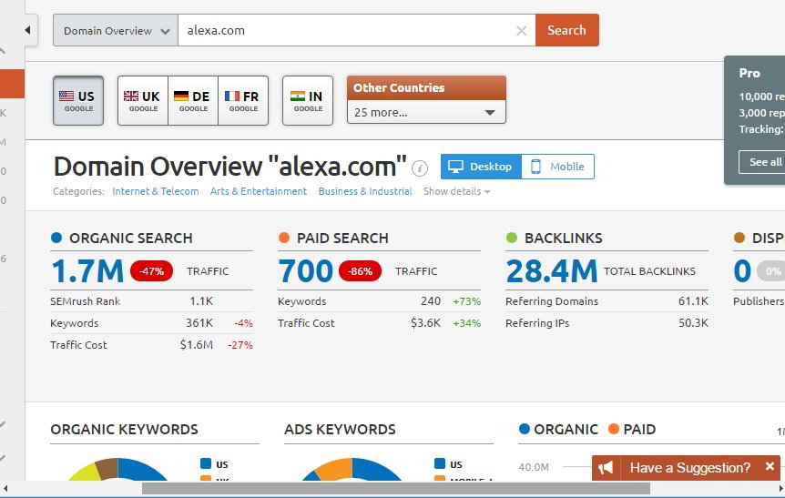
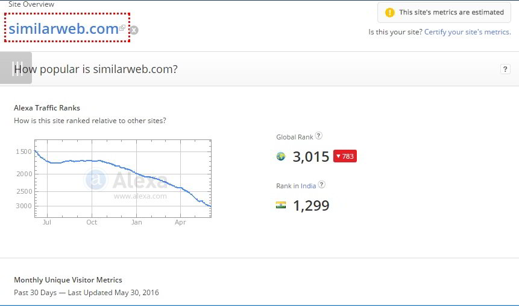

Almost every website visit you visit uses an analytics tool to track visitors and their activity. Only the organization that own its will have access to the tracking data. The company doesn't have any reason to make their data public unless they're generating advertising revenue from the website.

Many people using the internet are always curious to know how much traffic does their favorite website get. But as I've mentioned earlier, the real data is with the site's owner. Thus, no matter what tool you use, you cannot get the exact statistics of a website traffic unless the company decides to share it with the world.

For example, we know that Facebook, the biggest social-networking website has a 1.2 billion active users, and WhatsApp is used daily by around 1 BN users daily. Mark Zuckerberg himself shared these details.

There are free traffic estimation tools that use keywords data and their rankings to estimate the traffic. Today, we'll share details of such tools with you. These tools are widely used by advertisement agencies, webmasters, SEO gurus, marketing professional, etc. In case you're beginning your career in one of the fields I've mentioned above or if you want to know how much amount of traffic does a website get every day, month, year, use the below tools:

### SimilarWeb:

This is the best site to check website traffic. SimilarWeb displays how much traffic a site gets from search engines like Google, Microsoft Bing, etc. To get started with SW, open it. You'll find a text box. Once you enter its name in the search box and click on the search icon, SW will make you aware of the number of visitors the web portal gets every month. SimilarWeb lets users know about the bounce rate, top referrals, country rank, global rank, category rank of the website. It has the option to download traffic report as a PDF file.

### Semrush:

This is one of the most widely used SEO tools in the world. Semrush is primarily used for getting details on the top performing keywords of a competitor website. Moreover, you can check website traffic with this tool. Semrush allows you to filter traffic by country and device (mobile, desktop PC). It makes you aware of the number of keywords that a website is ranking for.

### Quantcast:

Quantcast is a good alternative to Compete and other tools we've shared here. To begin using Quantcast, click on explore option on the menu bar, enter the URL and hit the enter on your keyboard. You can check country wise traffic statistics of a website only if the site has been verified aka quantified.

### Alexa

Alexa might be a decade year tool, but it is still widely used. To get details of a website, visit Alexa, scroll down and enter its URL in the text box. Press enter and Alexa will open a new page, which displays the below details:

- Global Rank/Rank in the country where the website is most popular.
- Percent of users the portal gets from the country.
- Bounce rate, daily pageviews and time spent on the website.
- Top performing search keyboards.
- Upstream sites, backlink details.
- Page load time, description of a website and contact information.

### Why bloggers should not check traffic of other blogs?

Blogging has become quite popular since platforms like WordPress and Blogger were introduced. As these two content management systems are free, everyone using the internet can start a blog on Blogspot or wordpress.com website. Competition is very high among bloggers. According to this article, a blog is created very one or two seconds. So you can imagine how tough the competition is.

Many people start a blog with only one intention i.e. earn money online from the internet. While some hardworking bloggers work day and night to give users and search engine high-quality articles, there are a lot of lazy as\* people who want to become rich without putting in hard work. Google rewards people who work hard on their websites whereas blogs without a lot of content struggle to get traffic from Google.

As a blogger, I feel that checking traffic of other sites is a waste of time and induces jealousy. The web traffic of decade or 5 years old blog with 100s of original articles will always rank higher than articles published on a new blog.

**Conclusion**: Checking website traffic is a waste of time for people who are not into the SEO, Marketing field. The data revealed by the above-mentioned sites is not 100% accurate. The estimation is based on keyword rankings.
