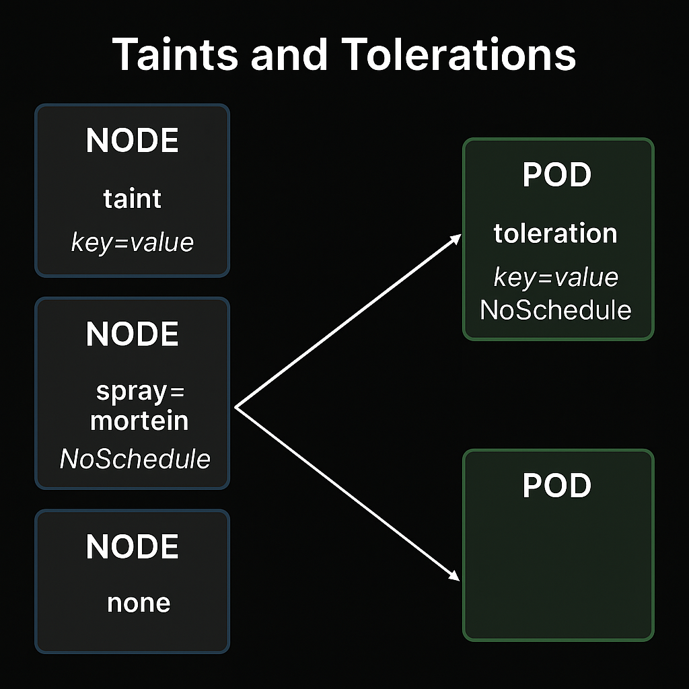
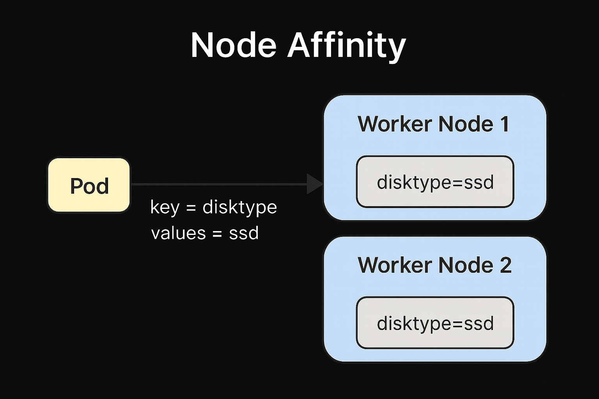

As I continue my prep for the Certified Kubernetes Administrator (CKA) exam, I’ve been diving into the Kubernetes scheduler so I can get a better understanding of how it works, how it can be influenced, and what tools are available to debug scheduling-related issues. This is a continuation of my [previous notes about kubectl basics](https://www.carnaghan.com/cka-study-notes-kubectl-basics/) and focuses on practical commands and concepts I found useful when learning about scheduling.

## What the Scheduler Does

TLDR - the Kubernetes scheduler is responsible for deciding **which node a pod should run on**. Once a pod is created without a node assignment, the scheduler steps in and tries to find the most suitable node for it, based on resource availability, constraints, taints, and other factors.

You can find a deeper dive into the internals in this [Kubernetes contributor doc](https://github.com/kubernetes/community/blob/master/contributors/devel/sig-scheduling/scheduling_code_hierarchy_overview.md) and this [great blog post by Julia Evans](https://jvns.ca/blog/2017/07/27/how-does-the-kubernetes-scheduler-work/). But for this post, I'm sticking to what is needed to know for day-to-day usage and exam prep.

## Helpful Commands for Scheduler Debugging

```bash
kubectl get all
kubectl get all --selector key=value
kubectl describe pod <pod-name>
```

Look for lines like `Taints`, `Node-Selectors`, and the `Events` section in kubectl describe to help determine why scheduling might have failed.

## Taints, Tolerations, and Labels

You can taint a node to repel certain pods unless they explicitly tolerate the taint:

```bash
kubectl taint nodes node1 spray=mortein:NoSchedule
kubectl taint nodes node1 spray-  # To remove the taint
```

If you have a pod like this:

```yaml
apiVersion: v1
kind: Pod
metadata:
  name: bee
  labels:
    run: bee
spec:
  containers:
  - name: bee
    image: nginx
  tolerations:
  - key: "spray"
    operator: "Equal"
    value: "mortein"
    effect: "NoSchedule"
```

…it will only be scheduled on nodes that are tainted with `spray=mortein:NoSchedule`, because it tolerates that taint.



## Manual Scheduling and Static Pods

Static pods bypass the scheduler altogether. You can view the kubelet’s configuration like so:

```bash
cat /var/lib/kubelet/config.yaml
```

You can also guide scheduling manually using:

- `nodeName`: Assign a pod to a specific node
- `nodeSelector`: Simple label-based selection
- `affinity`: More advanced matching rules

More info here: [Assigning Pods to Nodes](https://kubernetes.io/docs/concepts/scheduling-eviction/assign-pod-node/)

## Affinity Example

Node affinity allows finer control using operators like In, NotIn, and topology keys. Here's what it might look like:

```yaml
affinity:
  nodeAffinity:
    requiredDuringSchedulingIgnoredDuringExecution:
      nodeSelectorTerms:
      - matchExpressions:
        - key: disktype
          operator: In
          values:
          - ssd
```



## Events and Logs: The Scheduler’s Trail

```bash
kubectl get events --sort-by='.metadata.creationTimestamp'
kubectl logs <pod-name>
```

If a pod isn’t being scheduled, events often hold the clues—like “0/3 nodes available” errors or taint mismatch messages.

## ServiceAccount & Role Bindings

The scheduler runs as its own component in the cluster and has its own ServiceAccount. You can check that with:

```bash
kubectl get serviceaccount -n kube-system
kubectl get clusterrolebinding | grep scheduler
```

Again, probably not something you’ll modify directly, but useful for understanding permissions and troubleshooting.

## Custom Scheduling

While not usually needed for the CKA, Kubernetes does support custom schedulers. You can use a custom policy by loading it into a ConfigMap:

```bash
kubectl create configmap my-scheduler-config --from-file=/root/my-scheduler-config.yaml -n kube-system
```

Pods can be assigned to a custom scheduler using the `schedulerName` field.

## Final thoughts

Learning how the Kubernetes scheduler works has helped demystify a lot of pod placement behavior I used to take for granted. Whether you're using taints and tolerations or just checking pod events, the scheduler is central to understanding why things land where they do in your cluster.

For more detail, don’t forget to search directly in the [Kubernetes documentation](https://kubernetes.io/), especially around [node affinity](https://kubernetes.io/docs/tasks/configure-pod-container/assign-pods-nodes-using-node-affinity/) and scheduling policies.