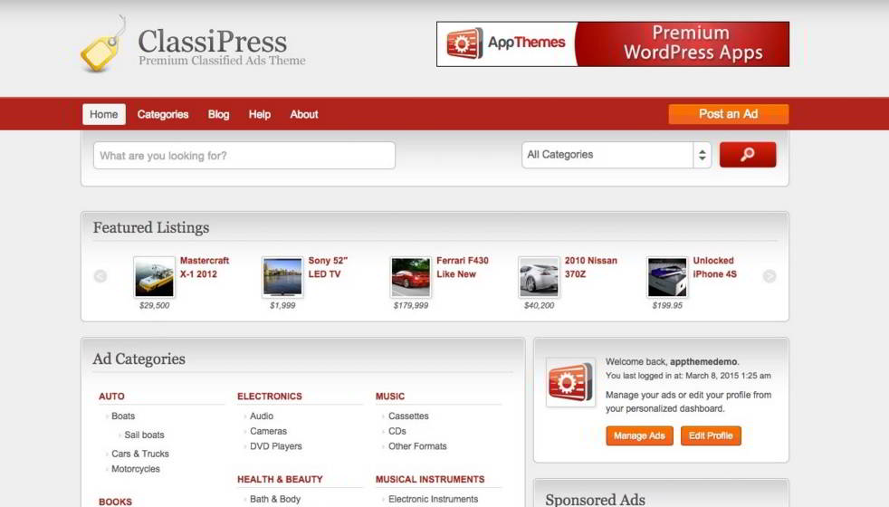
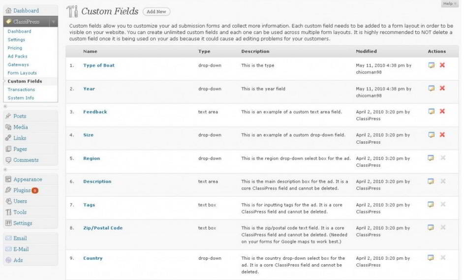
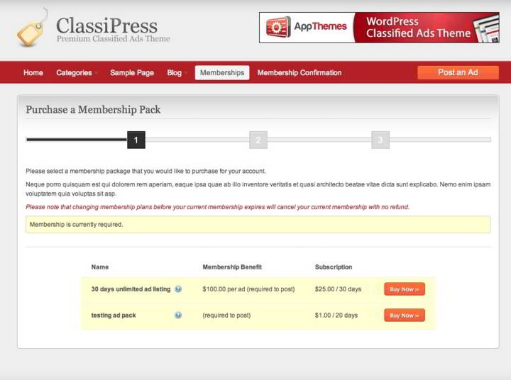
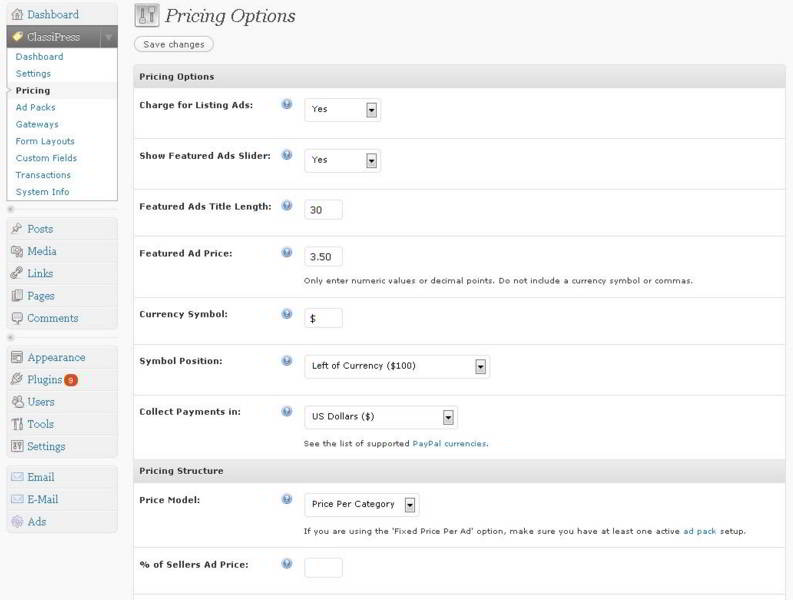

Creating a classified site manually from scratch is not an easy task. You must have exceptional website development skills with good knowledge of local SEO, server configuration, database, HTML, JavaScript, and a website scripting language like PHP, Ruby on Rails, ASP, etc.

If you don't have the skills mentioned above, there's an easy way to launch a classified website. Yes, Believe Me! You can quickly launch your own classified's portal like OLX, Quikr, Craigslist in half an hour with the world's most robust content management system named WordPress.

There are some free classifieds listing plugins for WP, but I wouldn't recommend them because their features are not up to the mark. Don't worry! Today, we'll make you aware of a robust theme that has important features and modules for creating a complete and compelling classifieds ads website.

Classipress theme has been designed to perfection. It integrates perfectly with WordPress. This theme is trusted and used by 1000s of happy WordPress users. 

 

Classipress theme allows you to configure pricing for the classified ad listings. This is a useful feature because it allows you to monetize your site and earn money from visitors. You can quickly set the price for the ad, a currency symbol, add title length in this theme. Classipress theme comes with an ad package feature with which you can easily configure your custom terms and conditions.

This WordPress classifieds theme lets users create and customize the fields. Fields are the most important element of a classified website. In ClassiPress, you can add as many fields as you want. You might be aware of the fact that a classified website has many categories. This theme allows you to create and manage multiple categories

For example, if you're creating a property listing site, you can add fields like Property age, built up area, no of rooms, built up area, space for parking, dashboard, etc.

**Check demo or download the theme here.**

Classipress has a module to enable member registration. The user will be able to register on your website if he makes a payment of n dollars. N is the value configured by the webmaster (owner). The theme will take care of registration. It will automatically close the account of the users whose subscription has expired.

When the visitor has posted an ad on your website, he'll get access to a dashboard where he can view the ad status, category, views count, publish date and many other useful details. The panel is beautiful, and it is easy to use.

Like OLX, Classipress supports social login feature. This feature will save the time for your visitors. This WordPress Classifieds ads theme uses Social Connect plugin for the same.

To make it easy for the visitors to search products, ads, and other useful data, Classipress has an advanced search feature.

**Download Classipress template.**

The theme lets you customize the appearance of the homepage. It offers multiple page layouts for the same. There are five attractive color schemes too. In Classipress, the webmaster doesn't have to enter into CPanel for uploading the website logo or favicon. The dashboard has options for the same.

If you have a Google Adsense account, this theme allows you to add banner ads.

To make sure that traffic to your Classified website is always on the rise, this theme from WordPress platform lets users publish and manage blog posts. Thus can you create and post content relevant to the categories.

This WordPress theme has an inbuilt module to check which ads are the most popular among the visitors. The module gives you detail on the top daily ads or the most trending ad for the entire year.

The Classipress WordPress theme is SEO friendly. It has been designed and built by the latest SEO standards. It is compatible with the WordPress multilingual plugin (WPML) to make translation easy.

Check demo here.

ClassiPress lets you create and use child themes. If you know coding, you can leverage the Appthemes API to extend the functionality of theme and make it more powerful.

This classified theme for WordPress has a well-designed dashboard that makes management of advertisements an easy work. Every bit of relevant data is available on the dashboard. Thus you have to concentrate on your portal rather than worrying about the inbuilt functionality of Classipress theme.

Installation of this theme is a piece of cake. When you buy and download ClassiPress, you just have to upload the theme zip file to the CPanel. When the file has been uploaded, open the WordPress dashboard and activate the theme.

**Pros**:

- Intuitive and amazing features.
- Support for custom fields.
- Optimized for the search engines.
- User and visitor friendly

**Cons**:

- none.

**Pricing**: AppThems, the developer of ClassiPress, is selling the template for a discounted rate of 69 dollars. The deal is great because you'll get access to powerful features that are not found in similar themes and plugins for creating a classified website.
