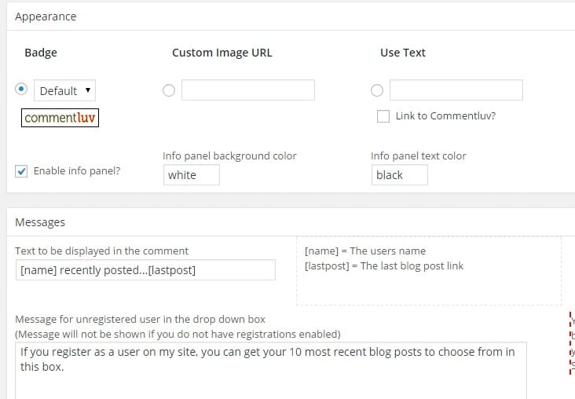

Commentluv is a powerful WordPress plugin that comes in 2 versions – free & paid. The free version can be found in WordPress.org directory, and it has limited features. The premium or paid variant of CommentLuv offers many interesting and useful utilities that help a webmaster in many ways. When paid or free version of this plugin is active on a blog, visitors will be able to add any of the ten latest posts in the comments. Commentluv premium plugin maintains the number of clicks on a link generated by it.

### Who should use CommentLuv?

If your site's rankings have been affected by Penguin or the Panda algorithm refresh, you can still get traffic by using Commentluv plugin. Just find a blog that features CommentLuv and drops a meaningful comment on any of its post. When any visitor sees your article's permalink and if he finds the title interesting, the user will visit your blog. Newbie Webmasters or blogs can use the same strategy to get referral traffic. When you activate CommentLuv on your blog, make sure that you select the no-follow option so that no link juice is passed to other blogs. 

### Webmasters who want to get more twitter followers

Commentluv's unique feature, the Twitter link will allow any visitor to add his/her twitter id to the comment. When this TwitterLink feature is active, a new text field will be automatically added to the comment form. Many blogs with CommentLuv plugin have managed to increase followers on twitter. Twitter has been the primary source of social referral traffic for 1000s of money making blogs. It has made many webmasters rich within few months.

### To get rid of blog and comment spam

Akismet is one of the best free WP plugins that discards all types of spammy comments automatically. Captcha code generator is also a useful solution to blog spam. If Akismet or Captchas system is not working for you, try out GASP (GrowMap anti-spam plugin). This plugin will automatically add a small checkbox to your WordPress comment form. Unless a user ticks this checkbox, his/her comment will not be approved. GASP is a light-weight plugin. When you use it, your hosting provider will never bother you by sending high resource usage emails. Before using Akismet, I had installed this plugin on my blog, and it worked very well.

### Increase blog comments

Many established and newbie bloggers are hungry to get more visitors to their sites. If you activate the keyword name feature of ComlLuv premium, the visitor will be able to add keywords to their name only when they drop a specific number of comments. For example, if a user drops 40 comments, he'll be eligible to add a keyword in the name field of the comment form.

**Download the plugin here (free version).**

### Increase loyal readers

Reply Me is one of the smartest features of CommentLuv Premium plugin. When you enable it, users will be notified when anyone replies to his/her comment. There are some free plugins can be used for the same. But you should avoid them as they may cause comment-subscription errors after you deactivate the plugin

Commentluv Premium comes packed with ten powerful WordPress plugins. It costs jut 97 dollars. **Buy ComLuv here and a get 10$ discount.**
