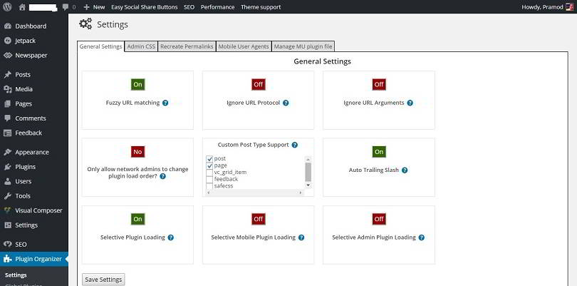
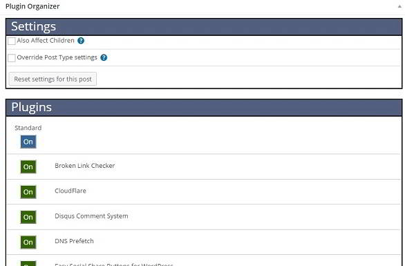

Imagine you've installed a WordPress table plugin on your site. You have 1000 blog posts, and only 10 of them has a table. The Javascript and CSS files for the same will be inserted in the header section, and it will be called on all the pages even though you have not added a table. This increases the page size, and it can affect the page loading time. To solve this problem, you can either write a PHP code that will insert CSS and JS scripts in the site header only when required or you can install WordPress plugin organizer.

The 1st solution is easy to implement if you're a programmer with good knowledge of PHP. The plugin will do the job for you when you configure it correctly. This post will teach you how to load WordPress scripts conditionally with plugin organizer (PO).

WPO is available in WordPress directory, and you can easily install it from your blog's dashboard. After its installation, open WPO settings page where you'll find five tabs, i.e., general settings, admin CSS, recreate permalinks, mobile user agents and manage the mu-plugin file. You don't have to alter many settings. Just go through the below steps:

1: Turn on selective plugin loading option in the 1st tab and click the save button.

2: Now navigate to the Global plugins page and disable the extension that you don't want to enable on all posts. As you can see in the below picture, I've disabled the loading of easy table plugin on all pages of my site.

3: Now comes the most important part of configuration. Find all posts that require the disabled plugin. Open the post and scroll down until you find the below interface.

4: Turn on the plugin that you had disabled in the 2nd step and save the post.

5: Repeat steps number 3 and 4.

The above tutorial will make sure that the selected plugin will force the content management system to load scripts conditionally only when required which in turn will improve page load time.

**Conclusion**: WPO is a useful plugin because it will prevent unnecessary loading of CSS and JavaScript files. Your server will not have to transfer additional data when WPO is installed on your server. This will save a lot of bandwidths, and it will improve your website's performance.
