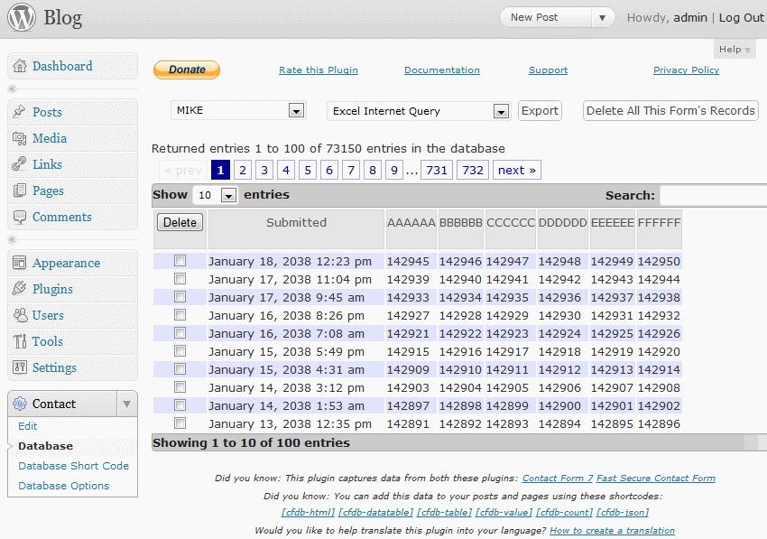
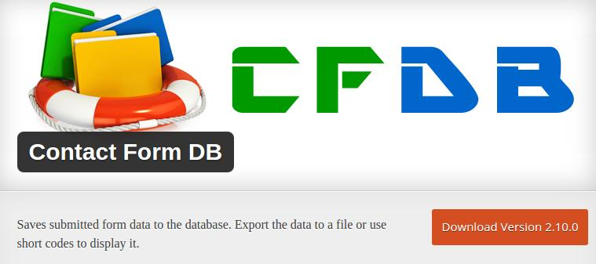

We all know how easy it is to create a contact form page in WordPress. If not, then you might be a newbie who should explore the WordPress plugins repository.

A contact form plugin will allow you to create and add a customized form to your WordPress website. The plugin will allow the user to add fields of his choice to the contact form page.

WordPress CMS has been built with PHP, the server-side scripting language. PHP includes the mail function that accepts some parameters to send a mail to an email address. The function is implement, and many WordPress plugins are powered it.

The function is fast and secure. Only the sender and receiver will know what the content of the mail is.

If you use a plugin and if someone contacts you, you’ll get an email notification. If you don’t check your inbox or if you’ve lost its login credentials, people will not be able to reach you. In such cases, you can use the Contact Form DB plugin.

When a visitor to your website uses the contact form to get in touch with you, your inbox will not be the only place where the mail will be sent. The plugin will save the entire message in your WordPress website’s database when the field data has been validated, and the visitor clicks on submit button.

The message will be saved immediately after the form has been submitted through the Client's browser.

CFDB plugin for WordPress supports shortcodes. To make the email public, you have to enter the shortcode in a page or a post. CFDB lets you export the saved database records to Excel or CSV file.

If the Database has been populated with a lot of spam email messages, there’s an option to empty the table generated by Contact Form DB.

The dashboard page of the CFDB plugin has a search field that lets you filter messages. It has an option to display 10, 20, 100 entries on the same page.

Download the plugin here from WordPress.org repository.

CFDB is compatible with a lot of free and premium plugins. You can use it along with Gravity/Ninja Forms, JetPack, CF7 as an extension.

CF DB is a lightweight plugin. It will not affect your website's performance in any way. To avoid spam emails, make sure that you install Akismet or its alternatives.

**Conclusion**: CFDB is a useful plugin to everyone using the free WordPress CMS. It saves time because you don't have to search emails or open desktop client or website of the email service provider.

The plugin's export feature gives you the option to backup all your email messages as a Microsoft Excel or a CSV document.
