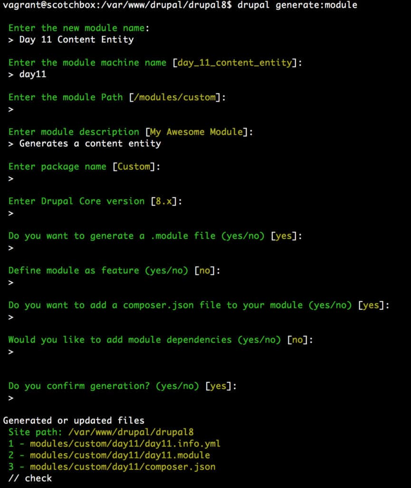
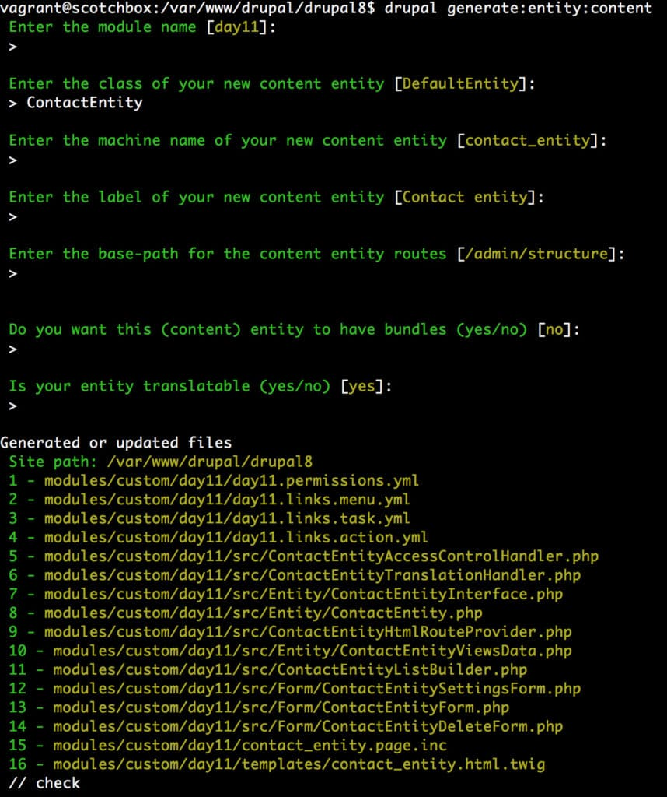

Drupal 8 has seen a lot of improvements for content entities and with the new Drupal console, setting up a content entity has been made a lot easier with the addition of boilerplate code generation. Day 11 of the Drupal 8 Activity Card set focuses on content entities, how they can be setup in Drupal 8, how we might add our own custom fields to the boilerplate code provided, and how this is managed within the Drupal 8 administration system.

## Content Entities vs Content Types

First of all it is important to understand why anyone might have a need to use content entities instead of content types, after all nodes typically give you much functionality out of the box. When I was researching content entities, I came across a really good article by Michael Prasuhn titled Knowing when to use content types and when to use custom entities. The article is an excellent read and basically breaks down some of the main factors you should consider when deciding between each:

- Data Privacy factors; if you have private data, it might be easier to manage in a content entity)
- Complex many to many relationships are easier to manage in content entities
- How large is your schema going to get. If you envision many fields of data, content entities might be worth considering

His article goes on to discuss features that come with content types that might make or break your decision. When using content types, keep in mind each new field added creates a brand new table in your database, so you can see that over time with numerous fields this might become a management nightmare. If on the other hand you rely on Drupal functionality such as revisions, then content types might be the better choice.

## Creating a Module for our Content Entity

Generating a content entity is very easy to do thanks to the Drupal Console and it only involves a couple of steps. First of all you will need a custom module to house your content entity(s) and this can be generated by issuing the following command:

```
drupal generate:module
```

You will then receive a series of prompts similar to the screenshot shown below, which will walk you through the process of generating code for your new module.



After generating your module, spend a couple of minutes and review your code. You will see that the console has essentially scaffolded out the basic components of a typical Drupal 8 module. This is a really nice feature and will no doubt come in handy for future development. Until I started working with content entities, I was not familiar with the scaffolding capabilities of the Drupal Console.

## Creating the Content Entity for our new module

Now that we have our basic module setup, the next step is to scaffold out the code needed for our content entity. We can do this easily by issuing the following:

```
drupal generate:entity:content
```

Again you will be prompted for more information needed for your content entity by the console, similar to the screenshot below. Simply complete this process and you should end up with additional code files added to your module:



## Customizing the Fields

If you have no need to add add additional fields, you could enable the module at this point and you would then be able to manage it in the administration section under admin -> structure. Since we want to add a few more fields, this can be done by editing the the file day11/src/Entity/ContactEntity.php (provided you called your content entity ContactEntity). I added the following code for the email, telephone and address fields:

```php
$fields['email'] = BaseFieldDefinition::create('email')
->setLabel(t('Email Address'))
->setDescription(t('The Email Address.'))
->setSettings(array(
'max_length' => 50,
'text_processing' => 0,
))
->setDefaultValue('')
->setDisplayOptions('view', array(
'label' => 'above',
'type' => 'string',
'weight' => -4,
))
->setDisplayOptions('form', array(
'type' => 'email_default',
'weight' => -4,
))
->setDisplayConfigurable('form', TRUE)
->setDisplayConfigurable('view', TRUE);

$fields['telephone'] = BaseFieldDefinition::create('telephone')
->setLabel(t('Telephone Number'))
->setDescription(t('The Telephone Number.'))
->setSettings(array(
'max_length' => 50,
'text_processing' => 0,
))
->setDefaultValue('')
->setDisplayOptions('view', array(
'label' => 'above',
'type' => 'string',
'weight' => -4,
))
->setDisplayOptions('form', array(
'type' => 'telephone_default',
'weight' => -4,
))
->setDisplayConfigurable('form', TRUE)
->setDisplayConfigurable('view', TRUE);

$fields['address'] = BaseFieldDefinition::create('string_long')
->setLabel(t('Address'))
->setDescription(t('The Address.'))
->setSettings(array(
'max_length' => 255,
'text_processing' => 0,
))
->setDefaultValue('')
->setDisplayOptions('view', array(
'label' => 'above',
'type' => 'string',
'weight' => -4,
))
->setDisplayOptions('form', array(
'type' => 'string_textarea',
'weight' => -4,
))
->setDisplayConfigurable('form', TRUE)
->setDisplayConfigurable('view', TRUE);
```

## Field Types and Display Types

Notice in this entity file I can define my field types as well as my display types. When I first looked at the boilerplate code I had difficulty understanding how I would define telephone, email and address. Thankfully I was able to locate field types on the Drupal.org article Defining and using Content Entity Field definitions, which lists the various field types available. I found a more complete list however via a post on Drupal StackExchange Answers. How to get the list of field-types? My next challenge was to determine the different display options available to me which I located under Field Widgets and WidgetBase. One other challenge I ran into was trying to decide to use text vs string fields, thankfully this post on StackExchange helped in that decision.

## Issues and Challenges

When I was working through this exercise, I ran into a couple of issues. First and foremost, when I installed my module I hit an error due to the telephone module (part of core) not being installed. This was because I wanted to use the new telephone field in my content entity but had not realized this module was not installed at the time. This caused a problem because I could not uninstall the module to fix this as Drupal kept complaining that the table contact\_entity did not exist. In the end I simply created a table in my database and called it contact\_entity. This allowed me to uninstall the module, which the in turn deleted my newly created table. I was then free to install the telephone module and try again which ended in success.

The other challenge I ran into was my overall lack of knowledge of Drupal 8 field and display types. I posted a number of links above as reference points, however I believe a better understanding of Field API and display plugins would have helped me greatly in this process. Overall however this was an interesting experience. My next steps will be to implement and test CRUD (Create, Read, Update, Delete) forms in order to manage data in my new content entity.
