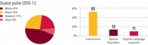
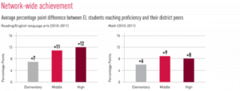

Curriculum Mapping is the process of documenting lessons, activities and assessment methods used within different grade levels and classes in an educational institution.  Expeditionary Learning (EL) is a style of teaching that involves the students in experiences and problem-solving activities.  This paper explores the intersection of these two educational theories and addresses how pedagogical goals are met/not met by designing for both. It also addresses how the research of Heidi Hayes Jacobs (2004) affect efforts to design for and support this intersection.

## Curriculum Mapping

Within the United States, Common Core Standard has been developed to define academic learning goals for K-12 students.  Common Core has effectively encouraged schools to come up with better ways to track their own curriculum in order to ensure they are meeting their own State standards.  Curriculum mapping has provided a toolset to enable schools to do this.  Curriculum mapping is a process of documenting lessons, activities and assessment methods used within different grade levels and classes within an educational institution.

### Evolution of Curriculum Mapping

Fenwick English, a well-known curriculum leader, and theoretician pioneered curriculum mapping in the late 1970s.  The first curriculum maps were developed to reveal which topics and skills were being taught and for what period of time.  Evaluators used surveys and interviews in order to gather information from teachers on how long they would spend on certain topics and what was being covered.  English (1980) described the importance of curriculum mapping in terms of revealing to staff and administration “what is actually being taught, how long it is being taught, and the match between what is being taught and the district’s testing program.”  The end result of the map provides the curriculum developer with data on how much time teachers spend on topics as well as the order these topics are covered within the classroom environment.  More importantly, the process reveals the amount of variance from teacher to teacher, providing the administration with valuable information on where curriculum changes and improvements may be needed.

This early form of curriculum mapping, while effective, was very time consuming as it required large amounts of data collection and dissemination.  Advances in computer technology in the late 1990s brought about massive improvements to the process of curriculum mapping.  Around this time, the research was broadened and popularized by the work of Dr. Heidi Hayes Jacobs, who took curriculum mapping to the next level through the use of technology and strategies that increased teacher involvement throughout the mapping process.  Hayes authored the well-known publication on the topic, “Mapping the Big Picture”, which became the foundation for many educational institutions’ curriculum mapping initiatives.  Jacobs enhanced the earlier work by a number of new features including teacher-driven curriculum mapping, horizontal and vertical alignments, cyclical reviews, and professional curricular dialog.  Udelhofen (2005).  According to Jacobs, curriculum maps have the potential to become the hub for making decisions about teaching and learning, especially through the use of the Internet, where resources can be accessed from anywhere.

### Curriculum Mapping in Action

There have been numerous cases where curriculum mapping has been effectively implemented within different school systems both in terms of the process itself and toolset used.  Implementing curriculum maps successfully involves careful planning along with buy-in and involvement from teachers and administrators throughout the school.  School District Five is a school district that Jacobs discussed in the second chapter of her book.  The district used Jacobs’ approach in implementing curriculum mapping in all of its schools, which proved to be a success.

#### School District Five

School District Five is composed of nineteen schools that serve approximately 16 thousand students, including child development through to adult education.  In the mid-1990s the district saw dramatic demographic shifts, which impacted all of the schools.  The populations became more diverse and this resulted in set of new challenges that the district had not been prepared for.  The shift was dramatic and within a short period of time had resulted in one school being moved from 15% of its student population on free and reduced-priced lunches to 50%.  Hayes (2004).   During the period before the demographic shift, the district had typically done well in terms of test scores, student performance, and graduation rates.  The new demographic shift presented challenges with students that had different needs from the traditional population.   Up until this time, there had been a lack of horizontal consistency among grade levels between the schools in the district.  What a student would learn in 3rd grade in one school, may be completely different from another school.  Much of the learning depended on what the teacher emphasized within the grade, which was loosely based on standards.  Once more strict standards were enforced, many teachers resisted using them as they felt that the new student population were not capable of the work.

District leaders turned to curriculum mapping to help them better meet the needs of the changing student population and to improve consistency between grades and schools.  The approach they adopted ultimately led to a stronger, more cohesive community.  In her book, Jacobs describes support beams (stakeholder involvement) and leadership roles within upper levels of the district being pivotal to the process.  It was necessary to involve these key stakeholders and to get their buy-in at the beginning of the project to ensure success.  Two principles selected over sixty teachers, representing various grades, subjects and schools to be recruited to work in a graduate cohort to study the feasibility of implementing curriculum mapping.  Much of the work focused on Dr. Jacobs’ research in curriculum mapping and the graduates became chief architects of a community building initiative, which led to the involvement of all schools in the district.  The architects carefully designed the process identified the tools needed and pledged a three-year commitment to the building process using Jacobs framework for more than two thousand teachers.  Eventually, content areas were mapped and processes were put in place for sustaining the process throughout the rest of the district.  The curriculum maps became the hub for highlighting continual instructional changes and refinements.  “Mapping provided a process for collegial dialogue on the alignment of content, skills, assessments, and activities across 19 schools, with its ultimate goal of improving student achievement.”  Jacobs (2004).

#### Other Curriculum Mapping Research Studies

As with any toolset or process, the question has to be asked whether or not it is worth implementing in a school or district.  There have been other studies to measure both the effectiveness of curriculum mapping, as well as the perceptions teachers and administrators have on its viability.  One such study was carried out by Lucas (2005) in his doctoral study that measured teachers’ perception of the efficacy of curriculum mapping as a tool for planning and alignment.  573 teachers from 19 schools within a district in South Carolina participated in the study whereby surveys and focus group sessions were used to determine teacher perceptions of curriculum mapping.  Descriptive statistical data was gathered regarding the overall teacher perceptions of curriculum mapping as a planning tool.  The results demonstrated that the majority of teachers saw curriculum mapping as an effective tool for curriculum alignment and long-range planning, and to a lesser degree as supportive for short-range planning.

Another study took place in Ohio where research was carried out to identify the most effective practices that resulted in substantial student achievement in 50 of the state’s school districts.  The research included online data collection, telephone interviews, and site visits with over 400 teachers, superintendents, and administrators.  It was found that curriculum alignment (defined as curriculum mapping with subsequent change in instructional practice) was the “single greatest factor in achieving improved test scores.”

## Expeditionary Learning

Expeditionary Learning (EL) is a nonprofit chartered entity of Outward Bound that promotes and supports the efforts of chartered EL schools across the United States.  Expeditionary Learning refers to both the organization that supports it as well as the type of instruction it embodies.

### History and Underpinning Research

Expeditionary Learning was born out of a collaboration between Outward Bound, USA and the Harvard Graduate School of Education. The Harvard Outward Bound project, established in 1987, sought to increase the profile of experiential education at Harvard’s school of education, while also bringing increased academic rigor to Outward Bound’s work in schools. The proposal to create EL was a marriage of the philosophies of Kurt Hahn, founder of Outward Bound, and the best of the Harvard Graduate School of Education’s theoretical and practical approach to teaching and learning.  Expeditionary Learning (2012).

Expeditionary Learning is grounded in the theory of experiential learning, which in itself was drawn from the foundational theory of experience of Dewey (1938) & Lewin (1951).  Experiential learning is defined by Kolb (1984) as the process where knowledge is created through the transformation of experience.  It emphasizes the central role that experience plays in the learning process and regards learning as a holistic process, “Grasping the experience" and "transforming the experience".  Expeditionary Learning has built on experiential learning by integrated parts of this instructional strategy into a model that provides learning opportunities through different expeditions, which typically take place several times throughout the school year within EL schools.

### The Expeditionary Learning Model

The Expeditionary Learning model consists of thirty-eight core practices in the form of a framework for learning success.  Each of the core practices addresses what EL describes as the five key dimensions of life in a school that shape student achievement.  The core practices are descriptions of tried and proven best practices that have been documented from EL schools across the United States.  They are provided as a guide, not requirements, and they provide flexibility for teachers to implement parts of them in their own unique way depending on the needs of their classrooms.  Figure 1 below lists these five dimensions, which have been summarized from the EL Core Practices publication.

| **Key Dimension** | **Description** |
| --- | --- |
| **Curriculum** | The EL approach infused in the curriculum enables standards to come to life for students by examining real-life issues and needs.  Expeditions shape the curriculum in the form of case studies, projects, fieldwork, and service. |
| **Instruction** | EL instruction involves discovery, inquiry, critical thinking, problem-solving, and collaboration. The underlying instructional theme is that teachers talk less, while students talk and think more. |
| **Assessment** | Student-engaged assessment practices help build student ownership of their learning while focusing them on reaching standards-based learning targets and drive achievement. |
| **Culture and Character** | EL schools aim to build cultures of respect, responsibility, courage, and kindness.  The learning environment fosters both students and adults to be committed to quality work and citizenship. |
| **Leadership** | Leaders build professional learning communities that focus sharply on student achievement and continuous improvement. |

**Figure 1 Expeditionary Learning Key Dimensions, Expeditionary Learning (2012)** Each of the five dimensions listed in the table above comprises several core practices which ensure the goals of EL within these areas are met.  All of the core practices are documented within the EL Core Practices publication.  Expeditionary Learning (2012).

### Expeditionary Learning in Practice

Expeditionary Learning publishes information on how well their supported EL schools perform in terms of academic achievement.  On average, EL schools have consistently outperformed traditional K-12 schools, regardless of demographic differences and income levels.  The chart below illustrates the diverse population that EL supports.

 ******Figure 2 Student Profile (2010-2011), Expeditionary Learning (2013)**

The following chart illustrates how EL schools perform against other traditional public schools within their respective districts.

 **Figure 3 Network Wide Achievement, Expeditionary Learning (2013)**

EL has sponsored several studies over the years to determine the effect this type of instruction has on participating charter schools.  Different research methods were employed including comparative studies against standard test scores, within an EL and non-EL participating school.  Regression analyses were conducted to control for gender, ethnicity and special education status.  Several studies at Rochester, New York, published on EL’s website, demonstrated that EL schools in this area performed better than their traditional school counterparts.

While the results of the studies were overwhelmingly positive, results also showed in certain situations EL revealed a negative effect on depth and understanding, especially when concerned with STEM disciplines and general mathematical concepts.  It was concluded that the EL approach provides less of the breath and repeated skill practices needed in these subject areas, which are assessed on state exams.  Studies are ongoing and EL continues to release new findings as it engages in this type of research.  The results concerning STEM disciplines however reflect on the way certain EL schools have treated these subjects within their curriculum.

## The intersection between Curriculum Mapping and Expeditionary Learning

The curriculum mapping process is very much integral to Expeditionary Learning model.  It is not only explicitly referenced throughout the core practices of the EL model, but it also complements much of vision EL brings to schools and districts.  Without the tools and processes curriculum, mapping provides, many of the documented EL practices would be greatly hindered or in some instances not possible to effectively implement.

### Expeditionary Learning Core Practices and Curriculum Mapping

Curriculum maps are addressed within the EL core practices and form a solid toolset for the framework in linking expeditions and curriculum directly to common core standards.  They are fundamental tools within the curriculum, assessment and leadership key dimensions of Expeditionary Learning, summarized in Figure 4 below.

| **Curriculum** | **Assessment** | **Leadership** |
| --- | --- | --- |
| 1: Mapping Skills and Content | 20: Using Student-Engaged Assessment to Create a Culture of Engagement and Achievement | 33: Aligning Curriculum, Instruction, and Assessment for Student Achievement |
| 2: Designing Learning Expeditions |   |   |
| 8: Teaching Global Skills and Knowledge |   |   |

**Figure 4: EL Core Practices that involve curriculum mapping, Expeditionary Learning (2012)** Curriculum maps are a key component of the first core practices listed in the Expeditionary Learning Core Practices publication.  In ‘Mapping Skills and Content’, curriculum mapping is primarily responsible for aligning standards, providing for skill and concept maps, and the development of more detailed instructional content maps for teachers.  They are referred to in later sections of the curriculum dimension under ‘Designing Learning Expeditions’ as well as ‘Teaching Global Skills and Knowledge’.  Within both of these core practices, the curriculum map is essential in order to provide information on identified key standards.  Under the ‘Teaching Global Skills and Knowledge’ practice, curriculum maps are used by teachers and school leaders to ensure global skills and content are reflected adequately.

Under assessment, teachers use curriculum maps as a tool to enable them to craft quality learning targets with common characteristics.  Expeditionary Learning (2012) describes these characteristics as being derived from national or state standards and school or district documents, including curriculum maps. 

### Jacob’s Tenants for Purposeful Debate

Jacobs (2010) in her Curriculum 21 book discusses upgrading the curriculum to meet the demands of an effective 21st-century approach to teaching.  In the book, she focuses on the selection and organization of content around central concepts supported by selected facts and information.  This is compatible with Wiggins and McTighe’s Understanding by Design methodology, whereby the central learning concepts become the focus and the content is selected accordingly, instead of the putting content first and then designing learning around it.  UbD is covered in greater depth in the Backwards Design qualifying exam paper.  This approach is also directly compatible with Expeditionary Learning.

In 2010, Clearing Magazine published an article that detailed various EL case studies around the central theme of exploring healthy forests.  The students’ expedition involved the development of an understanding of what a healthy forest is, which included several different fieldwork studies.  The expedition included many different modes of learning during the project, which was key to Heidi Hayes Jacobs’ Tenets for Purposeful Debate.  These included:

- A personal and local perspective is developed and presented in the content area, where natural and viable
- The whole child’s academic, emotional, physical and mental development is thoughtfully considered in content choices
- The possibilities for future career and work options are developed with an eye to creative and imaginative directions
- The disciplines are viewed dynamically and rigorously as growing and integrating into real-world practice
- Technology and media are used to expand possible sources of content so that active, as well as static materials, are included

**Jacobs’ Tenets for Purposeful Debate Leading to Content Upgrades, Jacobs (2010)**

The idea behind these tenets is to provide guidance when revisiting and refining curriculum maps in order to provide the best possible educational experiences for the student.  The process also involves a focus on gap analysis, eliminating redundancies, or aligning with standards.  Jacobs (2010).  Expeditionary learning is directly compatible with these tenets and the concept of mapping the curriculum for continuous improvement is very much a core part of the Expeditionary Learning approach.  McKern & Goodnight (2010).

### Challenges faced by EL and Curriculum Mapping

EL is still a relatively new model within education and the literature is limited to the challenges specific to mapping the curriculum to these types of schools. Much of Hayes 2004 recommendations from ‘Getting Results with Curriculum Mapping’ can be applied directly to the EL model for mapping core standards to expeditions.  There are however areas within EL that are fundamentally different from most other school systems, which presents a unique set of challenges when mapping the curriculum.   These differences include the nature of expeditions and general terminology, along with their dynamic characteristics, the different types of assessment methods, integration of fieldwork and experiences as a large part of the curriculum, and additional challenges addressing potential gaps in an EL curriculum.  Each of these differences presents a unique set of challenges for EL, which are addressed in more detail below.

In a typical school, once the curriculum is mapped there aren’t as many significant changes in the types of units and lessons recorded.  In an EL school, semesters are made up of expeditions instead of a predefined set of units and lessons.  These expeditions are continually evolving and updated every school year, so while the standards remain consistent, the type of instruction can vary greatly.  This often requires much coordination across grade levels with teachers and the administration team.  The nature of these changes requires a more fluid or dynamic approach to mapping the curriculum, allowing access to previous expeditions and the ability to easily update and import resources for the current school year.  In addition to this, Hayes model and other curriculum mapping approaches address the need for supplemental instructional resources, which would be available to similar units, however because of the ever-changing nature of expeditions, mapping these resources may present additional challenges.

The unique nature, or characteristics, of expeditions require careful thought and planning when mapping the curriculum.  Larger elements of instruction in case studies, fieldwork, expert visitors, web-based activities, objects and experiences are used in place of more traditional textbook materials.  Quite often a single expedition (which can cover different disciplines) will not have a single defined textbook and will instead use a number of these different instructional resources throughout the semester.  The nature of an expedition is however compatible with the ‘big ideas’ approach Hayes alludes to in her curriculum mapping books.  An expedition is based on larger ideas that span multiple content areas or disciplines.

Assessments are also different within EL.  A ‘final product’ comprises the deliverables students create at the end of an expedition. mThis type of assessment encompasses all skills the student has to learn throughout the semester within the expedition.  Scoring of assessment also differs whereby assessments rarely have one right answer and the approach is more interested in the student thought processes that enable them to reach an answer.  This is similar to Wiggins & McTighe (2005) Understanding by Design educational model that emphasizes critical thinking and creativity in assessment methods.

Teaching large expeditions throughout different grade levels provides for a margin of error of skills being missed.  Without a comprehensive curriculum mapping process in place that supports EL, skills could be overlooked or become redundant by being repeated in different grades.  The dynamic changing nature of expeditions along with their multi-discipline approach increases the chances of gaps in the curriculum.  State standards typically include a natural overlap or stair stepping progression of difficulty.  This is problematic to establish in EL, which means that a comprehensive curriculum mapping process becomes more of an importance in order to support this tiered approach.  EL doesn’t conform as well as other educational models, therefore an effective curriculum mapping process would need to allow for out of the box thinking.

## Conclusion

This paper reviewed the educational theories of curriculum mapping end Expeditionary Learning.  Curriculum mapping is an important toolset that schools and districts need to actively implement in order to map their instructional strategies to the state requirements or common core.  Much of the modern research in this field has been contributed by Dr. Heidi Hayes Jacobs, who has created curriculum mapping methodologies and templates that schools can use and adapt to their own needs.   Expeditionary Learning is a modern approach to providing experiential learning opportunities within the curriculum.  It fosters creative learning and promotes critical thinking through an approach of using semester long expeditions, which replace the traditional unit based disciplines.  This approach to instruction presents its own unique challenges in mapping the curriculum. In order for EL schools to effectively manage their curriculums while meeting state standards, a tailored approach to curriculum mapping based on the existing research will need to be established.

## References

An, H., & Wilder, H. (2010). A Bottom-Up Approach for Implementing Electronic Portfolios in a Teacher Education Program. _Journal of Digital Learning in Teacher Education_, 26(3), 84–91.

Beesley, A., Clark, T., Barker, J., Germeroth, C., Apthorp, H., & Mid-continent Research for Education and Learning (McREL). (2010). _Expeditionary Learning Schools: Theory of Action and Literature Review of Motivation, Character, and Engagement_. Mid-continent Research for Education and Learning (McREL).

_Curriculum for Excellence: transformational change or business as usual?_ (n.d.). Retrieved June 6, 2013, from http://www.academia.edu/1155947/Curriculum\_for\_Excellence\_transformational\_change\_ or\_business\_as\_usual

Delgaty, L. (2009). Curriculum Mapping: Are You Thinking What I’m Thinking? a Visual Comparison of Standardized, Prescriptive Programmes. _Annual Review of Education, Communication & Language Sciences_, 6, 35–58.

English, F., W. (1980). Curriculum Mapping. _Educational Leadership_, 37(7), 558.

Expeditionary Learning (2011).  _Expeditionary Learning Core Practices.  A Vision for Improving Schools_.  City, State: Expeditionary Learning.

Expeditionary Learning (2013).  _Academic Achievement_.  Retrieved from http://elschools.org/our-results/academic-achievement

Jacobs, H. H. (2010). _Curriculum 21 : Essential Education for a Changing World._  Alexandria, VA: ASCD.

Jacobs, H., H. (1997). _Mapping the Big Picture. Integrating Curriculum & Assessment K-12_.  Alexandria, VA: ASCD.

Jacobs, H., H. (2004). _Getting Results with Curriculum Mapping_.  Alexandria, VA: ASCD.

Kercheval, A. (2001).  A Case Study of Key Effective Practices in Ohio's Improved School Districts: Report of Results from Phase I.  Indiana Center for Evaluation.  July 27, 2001.  Retrieved from: http://www.indiana.edu/~ceep/projects/PDF/200107\_Key\_Effec\_Prac\_Interim\_Report.pdf

Knuth, D. E. (2003). Bottom-up education. _SIGCSE Bull_., 35(3), 2–2. doi:10.1145/961290.961514

Li, M., Mobley, W. H., & Kelly, A. (2013). When Do Global Leaders Learn Best to Develop Cultural Intelligence? An Investigation of the Moderating Role of Experiential Learning Style. _Academy of Management Learning & Education_, 12(1), 32–50. doi:10.5465/amle.2011.0014

Lucas, M., R. (2005).  _Teachers’ perceptions on the efficacy of curriculum mapping as a tool for planning and curriculum alignment_.  Unpublished doctoral dissertation, Seton Hall University, South Orange, New Jersey.  Retrieved from: http://scholarship.shu.edu/cgi/viewcontent.cgi?article=2485&context=dissertations

McKern, V., & Goodnight, G. (2010).  Expeditionary Learning: Exploring Healthy Forests.  _Clearing. Teaching Resources for Ecology, Sustainability and Community_.  Retrieved from: http://www.clearingmagazine.org/ExpeditionaryLearning.pdf

Shumway, S., & Berrett, J. (2004). Standards-Based Curriculum Development for Pre-Service and In-Service: A “Partnering” Approach Using Modified Backwards Design. _Technology Teacher_, 64(3), 26.

Uchiyama, K. P., & Radin, J. L. (2009). Curriculum Mapping in Higher Education: A Vehicle for Collaboration. _Innovative Higher Education_, 33(4), 271–280. doi:10.1007/s10755-008-9078-8

Udelhofen, S. (2005). Keys to curriculum mapping: Strategies and tools to make it work. Thousand Oaks, CA US: Corwin Press.

West-Christy, J. (n.d.). Roadmap to Success: A Curriculum Mapping Primer, Education Up Close, Teaching Today, Glencoe Online. Retrieved March 2, 2013, from http://www.glencoe.com/sec/teachingtoday/educationupclose.phtml/35

Wiggins, G., & McTighe, J. (2005). Understanding by Design, Expanded 2nd Edition. Association for Supervision and Curriculum Development.

Williams, J., & Bolland, K. (2011). Mapping Our Way to Success. _Journal of Baccalaureate Social Work_, 16(2), 39–114.
