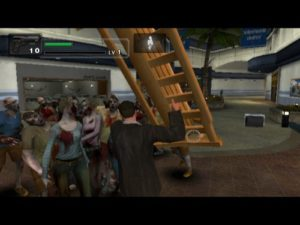
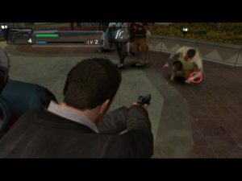

More than two years after investing the screens of Xbox 360 owners, the zombies of Dead Rising take the nice little Wii. If the game keeps the fun of his style, why ignore this new version?

Before diving further into the stinking bowels of the beast, take a few seconds to remember the context of the adventure, an identical course than the version 360 of course. The player embody Frank West, a nosy reporter, which aspires to get the scoop of the century. The shape of a boxer, a trucker Belarusian faces, replicas of the dead and a furious motivation, this is what you can expect when you see the guy. After a short trip by helicopter over a curiously American town in quarantine by the U.S. Army, Frank will finally end up trapped in a mall, a sort of giant shopping center particularly appreciated in this country. Unfortunately, this consumption temple, once so peaceful, is now infested with corpses and survivors traveling more or less helpless. Because, if the majority of them do ask to be rescued, the others seem almost more dangerous than zombies because of their fear, their folly, their unconscious motivations or their secrets. But on this particular subject, we will voluntarily silent because we don’t want to spoil the surprise.

This is also a transition to say the least clumsy that we will nonetheless address the issue of handling. Note as well that in general we will not complain too much the work done by Capcom in this particular area. Indeed, after a short period of time, you should be able to develop without too much problem in the bowels of the mall. The camera, once free like the wind, is now stuck to the back of the beautiful Frank, like in Resident Evil 4. To use your gun, this view is generally effective but for the corporal, however, it quickly becomes clutter. It is often possible to bludgeon rather than hit the vacuum bags of meat, which is still a bit frustrating. And as we talk about frustration, provided the opportunity to mention two enemies the will rot for all your games. Open your ears my good friends because it is neither more nor less than terrifying, and evil, despicable poodles and other zombie parrots. The monsters are present in numbers in each section of the mall and take a joy to run over you at the slightest opportunity. We believe that the mall was more of a giant pet shop than a real giant shopping mall.

And since it is almost impossible to get rid of these famous creatures in fighting, you must also use firearms, with all it implies: unable to move and obligation to triturate the camera while suffering the onslaught of "normal" zombies at the same time. A hit in the teeth, and poof, you lose sight of your target or stop your reloading. In short, two enemies whose curious omnipresence risk to offend the least patient players. But the time has come to conclusion and to that end we will say that Dead Rising: Chop Till You Drop will only disappoint fans of the 360 version, while novices, young innocent souls will obviously not have the same look at this game by Capcom. Much less hardcore than the original version, with a consistent backup system, the software seems able to deliver its hit’em all quota and good times for owners of Wii. For the final verdict, we hope to see you next February 27 when the zombies of Dead Rising will try again to spread their evil and their guts on our world.
