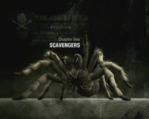
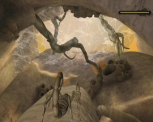

While scorpions and tarantulas are generally slaughtered by the heroes of most RPG and all other beat'em, Deadly Creatures offers us the opportunity to become one of those horrible creatures today and to explore the labyrinths infested with vermin. Brrrr!

Pertussis of casual players, Wii hosts traditionally family games party, brain coaches or public platforms games. Who would have thought therefore that developers of Deadly Creatures can choose this as a console exclusive title, it is disturbing? For once, in fact, it is not about caring for a shetland or save a princess in nice flower but to confront our fears of the most stubborn child diving head first into an universe populated by snakes, spiders and other forms of repulsive life.

You may have grown in the country and have the habit of getting face to face with all kinds of crawling insects, but the first contact with Deadly Creatures is not reassuring. Hardly ever on the menu that a huge black widow already rides in the background. Worse after a few seconds, now it flows furiously against the screen, frantically beating the air with his poisonous hooks. Needless to say, if you view this unbearable, it is strongly advised not to go further. Difficult to suppress a shudder when we discover, utter amazement, the savagery with which the real monster is able to clean around it. And yet, this is a taste of the destructive power of the scorpion, the other bug that you will embody a little later.

The adventure, principally to achieve a defined set of objectives at each level begins in a real maze of cactus and rocks. Spider forces, it is not only possible to move horizontally but also vertically climbing along the rock walls or vegetation. It takes certainly a little adjusting time to get used to it and explore 3D environments, but the help comes quickly. Contrary to what one might expect, life in the desert is anything but relaxing. Indeed, every rocky literally crevice teems of life and we must fight constantly to not finish as a chopped steak. Fortunately, our tarantula has a whole arsenal of techniques that increases as we progress. For example, we can project a silk wire on our opponent to secure a few moments before returning the enemy and jump on it. We can also load poisoned attacks or quickly rotate on ourselves. So much that the fighting usually turn in his favor. And if we were to leave feathers (well, some hair...), we can still be cured by eating some hoppers and some grasshoppers.

For a pleasant change, we can also lead a scorpion in certain levels. Slow and lumpish, which compensates for its lack of agility by the strength of its shell and its powerful claws. Thus, if it cannot use the silk wire to reach inaccessible places, it is able to dig under the ground and follow tunnels. His fighting technique is most often to counter the attacks of his opponents then to respond angrily. As long as his unfortunate victim starts dying, then he may finish with a beautiful finishing move by carrying out specific actions to the Wiimote. In short, the scorpion has a very different sensation from the tarantula and indeed, they even come to regret that no other bugs to embody. Because in one case as in the other, the Wiimote controls are responsive, architecture levels is complex with varied situations. We are already looking forward to say that Deadly Creatures is looming as one of the most original productions for the beginning year on Wii.
