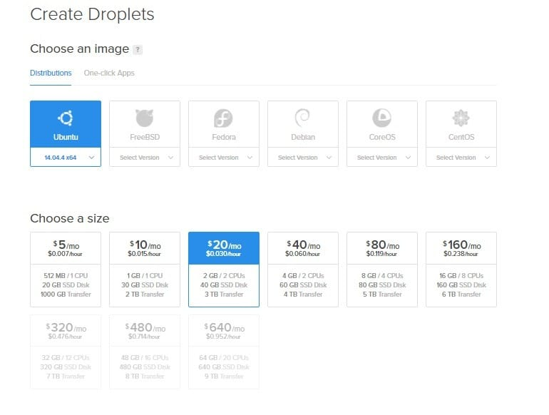
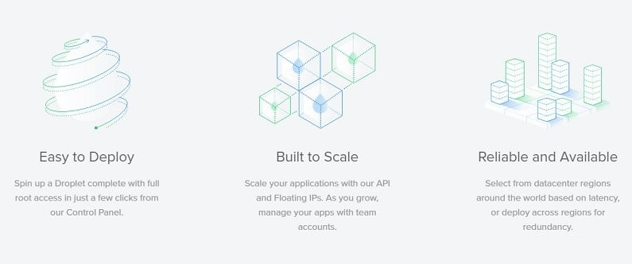
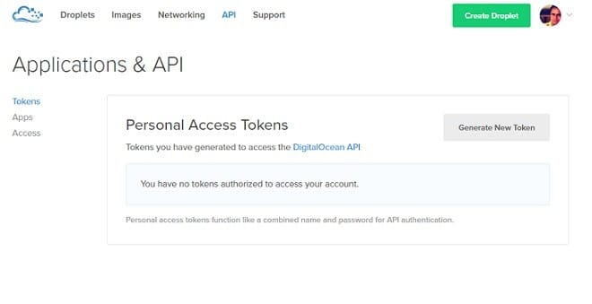
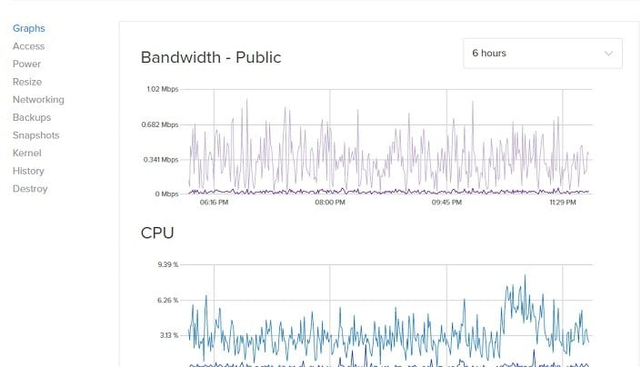

Launched in 2011, Digital Ocean has become one of the most popular cloud VPS hosting services in the world. I recently came to know that Digital Ocean has set up a data center in the country from which my websites get the maximum traffic. I immediately moved my sites from Hostgator VPS to DigitalOcean. I've been using DO for 21 days now. Here's my review of this unmanaged Linux VPS hosting service.

## Digital Ocean Review

**Getting Started**

Click on this link to create a new DO account and get $10 free Digital Ocean credit. Now login to your control panel. Unlike other hosting providers, DigitalOcean hosting offers a customized control panel to manage the billing, security, plans, DNS settings, backups, droplets, etc.

Setting up a new VPS with DO is an easy job. All you have to do is click on create droplet button. If you do so, you'll see a beautiful UI that prompts you to select one of the below 32 bits or 64 bits Unix-based operating systems:

- Ubuntu ( v 12.04 to 16.04)
- FreeBSD (v 10.1 to 10.2)
- Fedora (ver 22 to 24)
- Debian (v 7.1 to 8.5)
- CoreOS ( ver 1010 to 1081)
- Centos (ver 5.1 to 7.2)

Once you've selected the preferred OS, you'll now have to select one of the below Digital Ocean plans:

| **Costs per month** | **Memory** | **Processor** | **Disk Space (SSD)** | **Data Transfer Limit** |
| :-- | :-- | :-- | :-- | :-- |
| $5 | 512MB | Single Core | 20GB | 1000GB |
| $10 | 1GB | Single Core | 30GB | 2TB |
| $20 | 2GB | Dual Core | 40GB | 3TB |
| $40 | 4GB | Dual Core | 60GB | 4TB |
| $80 | 8GB | Quad Core | 80GB | 5TB |
| $160 | 16GB | Eight Core | 160GB | 6TB |
| $320 | 32GB | Twelve Core | 320GB | 7TB |
| $480 | 48GB | Sixteen Core | 480GB | 8TB |

**Signup for any of the above plans here**.

Now select your preferred data center location. Digital Ocean has data centers in the below countries/states:

- New York (United states of America).
- Amsterdam (Netherlands).
- San Fransisco (United States)
- Singapore.
- London (United Kingdom i.e. UK)
- Frankfurt (Germany).
- Toronto (Canada).
- Bangalore (India).

Once a data center has been selected, scroll down and click on the Create button. Your droplet will now be created.

To make deployment of a website fast and hassle free, Digital Ocean dashboard features a one-click installer tool to install the below popular frameworks:

- Cassandra, Django, Discourse, Docker.
- Dokku, Drone, Drupal, Elixir.
- ELK, Ghost, GitLab, Joomla.
- LAMP, LEMP, Magento, Mean.
- MediaWiki, MongoDB, Node.js, OwnCloud.
- Redis, Redmine, WordPress and Ruby on Rails.

Once the framework has been installed, your website is ready to go live. As you're using an unmanaged VPS hosting, you'll have to configure the configuration files of the database and web server to meet your website's requirements. To do so, use putty or terminal for the same. If you have information on Linux commands and the framework you've installed, set up will take less than half an hour.

Digital Ocean lets you restart your VPS from the web-based control panel. You can enable IPV6 support and configure DNS settings easily from the control panel.

## Digital Ocean hosting features

**Scalability**

Digital Ocean control panel has a resize option which lets you upgrade the VPS RAM, storage memory or the bandwidth in a few minutes time. There will be a small downtime during this process. You don't have to contact the support team as most of the tasks will be automated. You'll be notified when your hosting plan has been upgraded.

**Two Factor Authentication**

Digital Ocean users are allowed to activate two-factor authentication for their accounts. When you enable this feature, no one will be able to hack your hosting account. To enable two-factor authentication, users have to specify their phone number and download the Google's Two-Factor authentication app. First, the number will be verified after which the user will have to scan a QR code shown on the DO website.

Once the app scans the QR code successfully, 2F authentication will be enabled for your account. When you try to login to your Hosting account, you'll be asked to enter the token generated by the Google's 2F app. Digital Ocean users can disable multi-factor authentication anytime.

**Sign up** with Digital Ocean to enjoy top class hosting experience.

**Transparent Billing**

Digital Ocean will not bill you needlessly. This hosting company charges you on an hourly usage basis. To check your daily/monthly usage, navigate to the billing option from the settings panel. DO lets you configure email alerts for usages. If your monthly usage exceeds beyond a particular value, you'll be notified of it via an email.

**Backups**

Sometimes, backups can save your life, job and website. To make sure that your site's important files and DB are always backed up, enable the backup module of Digital Ocean from the control panel.

**API support**

Digital Ocean allows its users to manage their droplets from HTTP requests with its API. If you're creating a program to manage your VPS, log in to your dashboard and open the API page to generate the API access token.

**Uptime**

As mentioned earlier, my sites are hosted on Digital Ocean Cloud VPS platform for more than 20 days. My experience has been good so far. There has been no single downtime yet. My sites are up and running 24 x 7. Before signing up with Digital Ocean, I was in two frames of mind. Now, I'm a happy customer.

**Migration**

If you want to move your droplet to some other region, DO can automate this task for you. All you have to do is, create a snapshot and transfer it to a region of your choice from the control panel.

**Support**

As Digital Ocean offers unmanaged VPS hosting service, they don't provide live support. If you need help, login to your account and raise a ticket. The technical support executive of DO will get in touch with you soon. The support team at Digital Ocean work 24 x 7 to ensure the best support to its customers. If you are a seasoned user of Linux, you will no face any issues with the server. This VPS hosting provider offers a detailed tutorial on various frameworks. Before you deploy your site, go through it once.

Digital Ocean has a forum where people help out each other. After buying a hosting plan from them, be sure to become a member of this forum.

**Conclusion**: As far as I am concerned, Digital Ocean has the cheapest VPS hosting plans. Hostgator VPS plans cost three times higher than that of DO. The plans are cheap, but the quality of service is exceptional. Users are provided 1-click installation tools and servers with the latest hardware, high-speed network, and a very good support. What else do you want?

Get $10 credits by signing up for DigitalOcean with this link.
