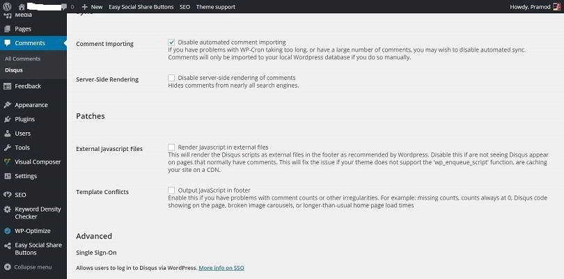
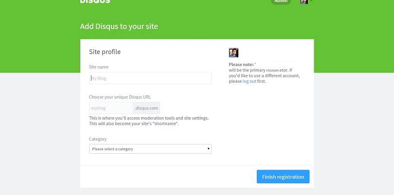
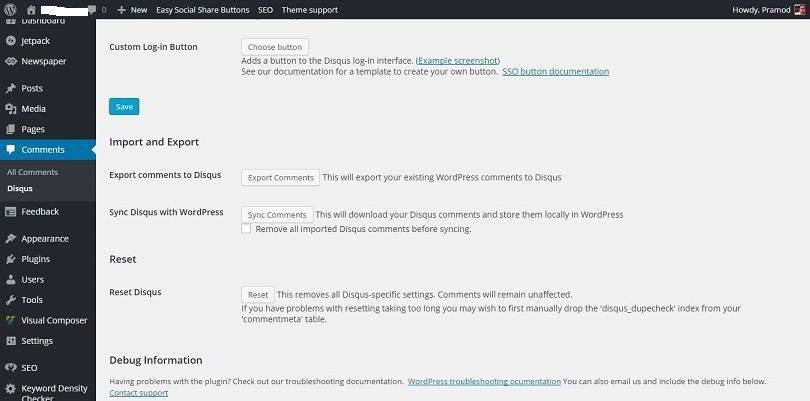

When a lot of users are commenting on your articles, you should make sure that the comments do not affect the load time of the page. If it is affecting posts load time, the user should enable pagination for the same by navigating to Settings---> discussions page or he must search for an alternative solution.

One of my tech blog' posts was having over 150 comments from visitors. The post is well written and has 1500 words in it. Due to a large number of comments, the visitor had to scroll down for more than 10 seconds to navigate to the footer section of my site. The footer is the important section for me because it has links to contact me, privacy policy, disclaimer pages, etc.

I activated pagination system for the same but after going through a few blog posts that claimed pagination causes duplicate content issues, I disabled this feature.

I know that Yoast plugin is a good solution for this problem as it adds re="canonical" tag to the header section of a WordPress site, I decided not to take the risk.

I installed Disqus for WordPress. This plugin adds a clean commenting system to your blog posts and pages automatically. By default, this plugin will display only a few comments.

The comment form is beautiful, and it supports social login feature. Disqus is fast. Some of its scripts are called from other Disqus servers.

To make installation of this comment form on WordPress an easy task, you should install the official Disqus plugin.

Before you go ahead and install this plugin, create an admin account on the disqus website (open this link) and create your unique Disqus URL.

When enabled, this plugin will automatically add Disqus to WordPress sites. It can import comments from WordPress database. It uses your hosting resources for the same. Disqus can read the WXR format WordPress file which contains all your post, page and comments data. Instead of using the import feature of the plugin, create a WXR file (navigate to Tools -->export utility). Upload this file in Disqus database by opening the import feature located in discussions page.

Many people are having doubts regarding this plugin. We'll try to clarify them for you in the below section:

### Do Google index Disqus comments?

Yes! The Disqus WordPress plugin settings page has this option: Disable server-side rendering of comments. Make sure that this option is unchecked.

### Does Disqus affect WordPress posts loading time?

It can! This plugin can load external all Disqus related files from its servers. You will have to enable this option from the settings page.

I've tested this feature with wegpagetest.org, and the results of the website speed testing tool prove that this rendering external JavaScript does affect the page load time. For faster rendering of your posts and pages, uncheck Render JavaScript in external files option from the settings page. You can also use Disqus conditional load plugin which will add a button on your WordPress posts and pages. The comments form will load only when the visitors clicks this button.

### Does it kill spam?

Disqus has a moderation section where you can manually approve or disapprove comments. In its administration page, you can enable and configure flag comments feature. It has the option to notify users when visitors add hyperlinks in their comments. Disqus is active on my main site since a few days, and it has not received spam comments yet.

**Conclusion**: Disqus WordPress plugin is a good alternative for WordPress comment form. It adds a well-designed form to your posts and pages. It has excellent spam control features.
