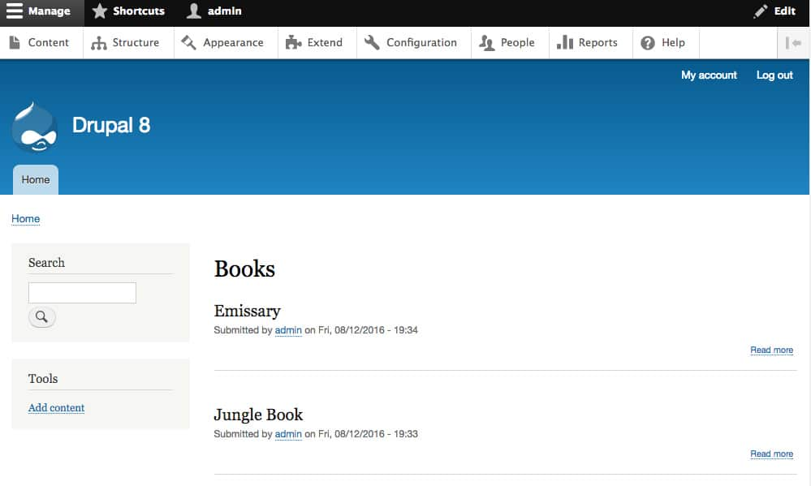

## THE 21 DAY CHALLENGE

I’ve been trying to learn Drupal 8 for the last couple of months as I was landed in the middle of a D8 project at work. Being involved on the project has taught me a lot about Drupal 8 module development and Symfony in general, however I have started questioning the way I am writing code and if in fact it is the best way or the ‘Drupal’ way. I decided I needed some additional exposure to Drupal 8, not only in terms of module development, but as a platform in its entirety including front-end, configuration as well as back-end.

I looked at some of the offerings over at Drupalize.me and Buildamodule, however I tend to learn more when presented with a set of challenges I can work through myself. Thankfully I discovered a website called Drupal 8 Activity Cards (d8cards.com), which is essentially a collection of PDFs (or cards) that include some tutorial and documentation links as well as a range of problem solving exercises. After browsing through some of the content on the various cards offered here, I decided to proceed the 21 day challenge, so here I am at Day 1!

## Configuration Management

The d8cards.com Configuration Management card begins by referring you to a tutorial on Youtube by Mustardseed Media. The video itself is rather short but to the point and gives a good overview of how the new Drupal 8 configuration management system works. Thankfully I had some previous exposure to configuration management in Drupal 8 and had some experience working with config yml files, however this exercise solidified some of this knowledge and pointed me in the right direction of the 'correct' way of doing things.

<iframe src="https://www.youtube.com/embed/-c-G53dTGy4" width="560" height="315" frameborder="0" allowfullscreen="allowfullscreen"></figure> <!-- /wp:html --> 

 <!-- wp:paragraph --> 
<a href="http://www.d8cards.com/activity-cards/day-01-configuration-management-d8.html">Day 1</a> presents you with a challenge of setting up two mirror D8 sites, making configuration changes to the first, and then exporting and applying the configuration to the second. The most important thing to remember is that Drupal 8 manages configuration via a unique UUID so for this task it was important to first create a local D8 site and then copy / dump the database and restore on a second (cloned) site. That way the UUID would be the same as what is required by Drupal. This is used in real life for configuration changes moving from dev to stage, etc. There are ways to override and change the UUID as documented in <a href="http://enzolutions.com/articles/2014/08/27/understanding-configuration-management-in-drupal-8/">Understanding Configuration Management in Drupal 8</a>.
 <!-- /wp:paragraph --> 

 <!-- wp:image {"id":4275,"linkDestination":"custom"} --> <figure class="wp-block-image"></figure> <!-- /wp:image --> 

 <!-- wp:paragraph --> 
There wasn't much to report in <a href="http://www.d8cards.com/activity-cards/day-01-configuration-management-d8.html">Day 1</a> except I completed all steps including standing two local Drupal 8 instances, setting up a content type and view on the first site, exporting configuration via the Drupal Console command <strong>drupal ce</strong> and then finally importing the changes to the mirrored site via <strong>drupal ci</strong>. The new configuration changes appeared on the second site. One thing to note, configuration management does not import content, content migration is covered later in the d8card set.
 <!-- /wp:paragraph --></x-turndown></iframe>
