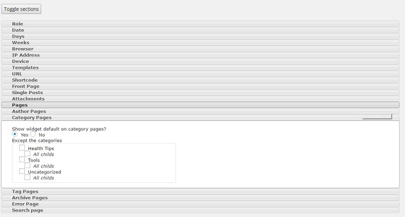
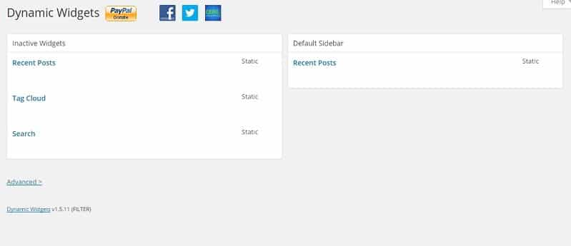

The sidebar is one of the most critical section of a website. It not only helps in improving the revenue of a site by allowing users to place adverts above the fold but also helps in decreasing the bounce rate. On WordPress blogs, you'll find banners, related/latest/popular post's widget on the sidebar.

The content you add to the sidebar will be visible on all posts. If there are 1000 posts on your website, each and every advertisement or URL you'll add as a widget will be displayed on each post. You may have grouped your posts in many categories. Suppose there are four categories on your website - phones, laptops, tablets, and desktop. Imagine you've published an article on a notebook.

If you've added recent or popular post widget, the tablets, desktop and phone category pages will display a post title (with its URL) of a laptop. The post might not be of any interest to the user if he visited your site by finding a post on desktop, phone or tablet in the search result.

If you don't want this to happen, install the free Dynamic Widgets WordPress plugin. Once you install this plugin on your website, open its configuration page which you'll find under the appearance menu of the WordPress dashboard. The page will display all inactive and active widgets of your website. When you hover the mouse over the widget name, you'll find a link to edit it.

Click on the link. Now you'll find an accordion interface which displays a list of all relevant sections on your WordPress website. Click on any of the items in the accordion UI and select the option shown in it.

The Dynamic Widgets plugin lets you configure the below sections:

- Role (widget display only to the author, subscriber, etc.)
- date, days, weeks, browser, IP Address.
- Device, templates, URL, Shortcodes.
- Front page, single post, author pages.
- Category, tag, archive pages.
- Error and search pages.

**Conclusion**: Dynamic Widgets is a powerful plugin which lets you specify conditions for WordPress widgets. You can use it wisely to display relevant posts to the visitors of your website. Download the plugin from WordPress.org.
