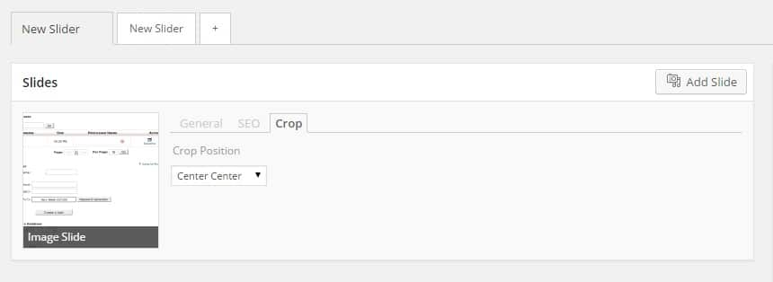
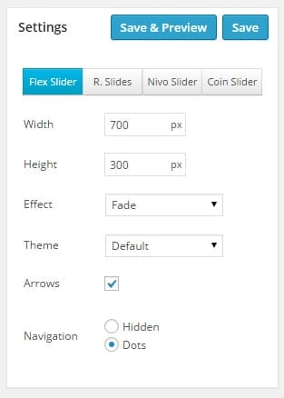
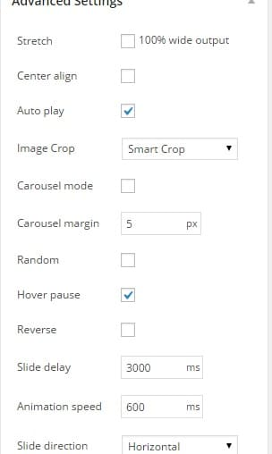

Slideshows are attractive, aren't they? Blogs with slideshows have a very less bounce rate, high level of user engagement and better conversion rate. Many webmasters embed a picture slideshow in their sites. This makes users spend more time on the sites which in turn increases its search engine rankings.

If you want to use an online tool to create slides, there's no better tool than SlideShare. This tool can generate slideshow code. Thus, you can easily embed your slideshow on any blog/website. If you use this code, you will be wasting your page rank as the code will link your site to SlideShare without adding rel="nofollow" attribute. The generated code will add an iframe to your site. Some search engines ignore the content in iframes. In such cases, you can use the best WordPress slideshow plugin, the Meta Slider. If you don't use WordPress content management system, you can use a Jquery slideshow plugin. There are two main advantages of using the WP plugin:

**Search engine friendly:** The developer of this WordPress Plugin claims that his application is SEO friendly. Thus, you can use Meta slider without worrying about indexing/crawling or search engine ranking issues.

**Fast and No link juice is passed:** As the plugin is using your hosting resources and as it has been installed on your WordPress site, page rank won't be wasted. If you're using an online service to create slideshows, you'll have to create an account on that site. If you use Meta Slider plugin, you don't have to register any online account. Thus, no time is wasted. Moreover, this plugin adds a slider button to the WordPress editor. Thus, you can create WordPress slideshows faster.

## How to use Meta Slider plugin on your WordPress blog?

Log in to your WordPress website. Open the plugin page and enter Meta slider in the text field. Now hit the return key. When you see the plugin in WordPress search results, click on the install button located below its icon. Meta slider plugin will now be installed on your blog. Open WP-admin and hit the refresh (F5) button on your keyboard. Now scroll down and click on the Meta Slider tab which is located just above the collapse menu.

 

When the main page of this plugin appears, click on the new slider tab. This will create a new slideshow. Click on the add slides button and select an image, enter the caption, SEO image title and alt text as shown below. This plugin also includes a picture cropper. If you want to resize the image, use this tool. It allows you to create flex, nivo, responsive and coin sliders. I'll recommend you to create responsive slideshows as Google will soon consider mobile friendliness as a search engine ranking signal. Google will update its algorithm for the same on 21st of April 2015. You can add arrows or navigation system to your slider. Through advanced options, you can make your slideshow responsive. You can also specify a slide animation and delay to it. To add slideshow, copy the shortcode, edit any blog post and paste the shortcode.
