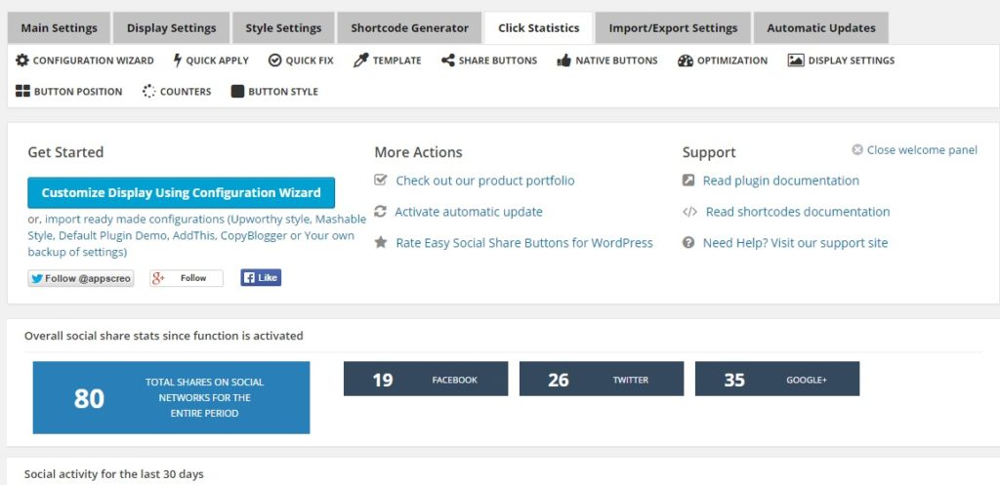

Backlinks from social networks like Facebook, Google plus, twitter, etc are nofollow. But you'll be shocked to know that Google uses data from social networks to rank websites in the search engine regardless whether the link is dofollow or nofollow.

When someone reads and article on your site and if he/she shares it in a group/page or on his public timeline, this link will be considered as a vote of trust. Thus, if your blog articles are shared 100s of time, there's no doubt that your site will rank in the 1st 2 or 3 pages of Google. Making people share content is not a piece of cake. The user will not share your blog post unless he has a reason to do so.

Ugly sharing buttons on the site will be ignored straightaway by the visitor. Thus, you should avoid them using on your site. If you need a better social share sharing plugin, go for ESSB. This plugin is awesome and unbelievably cheap. Its price is just **19 dollars on CodeCanyon**.

Monarch plugin from Elegant themes has similar features as ESSB. But to get it, you must pay 89 dollars (5500 INR). This offer is not bad as you'll get an access to plenty of Premium WordPress themes along with 2 useful plugins - bloom and monarch. If you're using a premium WP template or if you're new to the blogging world, i would recommend you to buy Easy social share buttons. I've recently bought it for my tech blog.

The first social sharing plugin i used was flare. This plugin was responsible for a lot of soft 404 errors on my site. Thus, i had to remove it, Flare has limited features and its ratings/reviews are not very good. Apart from Flare, I've used AddThis, shareThis, digg digg and many other free plugins. But now, i'm happy with ESSB.

**Key features of ESSB:**

**Sharing counters**: Easy social share button plugin be configured to maintain a count of users sharing activity. It can fetch counts with admin-ajax feature of WordPress or by calling the counter api of social networks. If you this plugin, go with the 2nd option as admin-ajax will generate a lot of soft 404 errors. Moreover, you have to allow crawling of wp-admin directory in robots.txt else you'll see tons of blocked url's/resources error in your Google webmaster tools dashboard. ESSB can display individual counters for individual sharing buttons. You can change the position where the counter appears.

**Buy ESSB plugin now on CodeCanyon**

**Display positions**: Some free WordPress plugins support just 2 positions for sharing buttons i.e. sidebar and below/above post content. With ESSB, you can display sharing buttons on various important location of your site. This plugin can display buttons at a fixed position in sidebar or on your post. You can change configuration for mobile devices as well. Easy social sharing buttons can be inserted in a WordPress page or post via a shortcode.

**Button Styles**: To make buttons look attractive, the ESSB plugin offers several attractive templates i.e. Upworthy, Addthis, Mashable style, Metro, Modern, Retina, Big, flat, etc. You are also allowed to activate cool animations and effects for buttons.

**Statistics**: To keep a track of shared content, Easy social sharing buttons allows you to activate click statistics module. You can also enable tracking with Google analytics.

**Social share optimization:** If you want to add open graph, twitter card and Google plus meta data to your blog posts, simply activate the social sharing optimization feature of ESSB.

**Caching and other useful options:** To improve the loading time of pages that flaunt Easy social share buttons, this plugin has option to enable async, deffered loading of CSS and JS files. To improve page speed score further, users should activate loading of minified/compressed resources. If your hosting provider has reported high CPU or RAM usage, turn on the inbuilt caching module of this plugin.

**Conclusion**: This plugin offers a wealth of cool features, templates and utilities for just 19 dollars. Thus, it is awesome! If you want to buy a premium WP sharing plugin, ESSB is the best option for you. Try it out!

**See ESSB live in action here (demo)**

**Update**: ESSB plugin version 3.6 was launched last week. It now comes integrated with Mailchimp ajax form which can be inserted below blog post or you can place it on the sidebar. The plugin also features many new designs. I'm still using ESSB on one of my top site.
