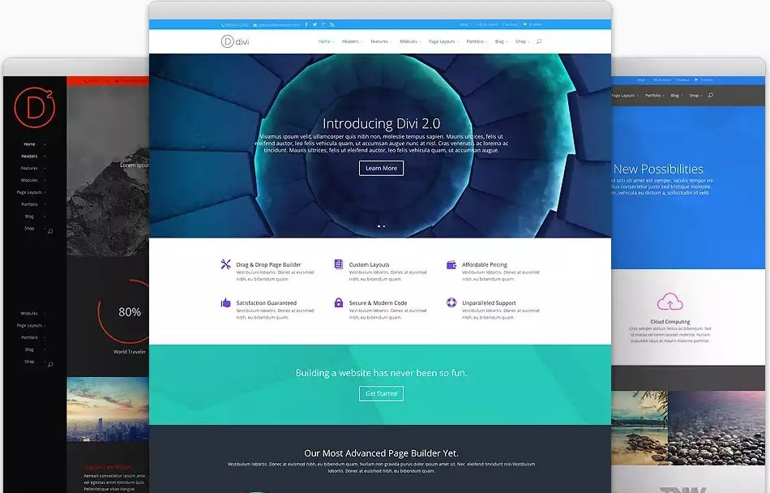
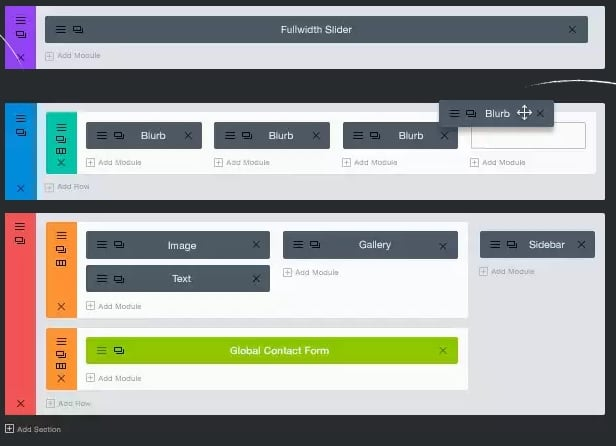
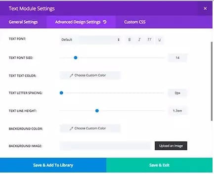
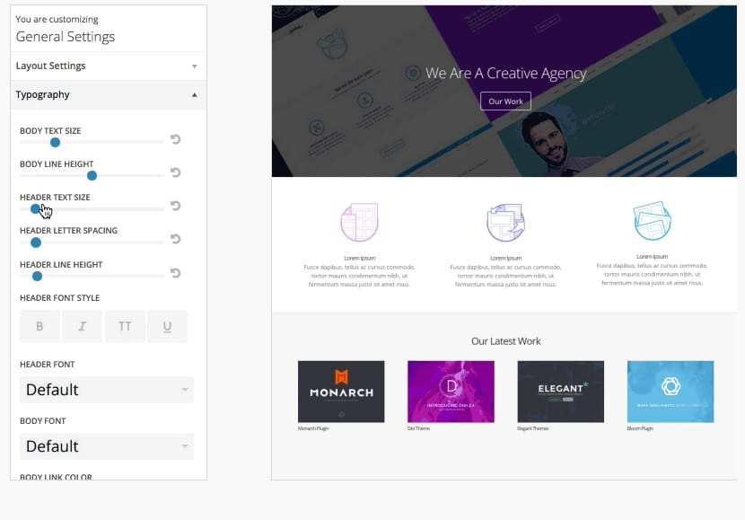
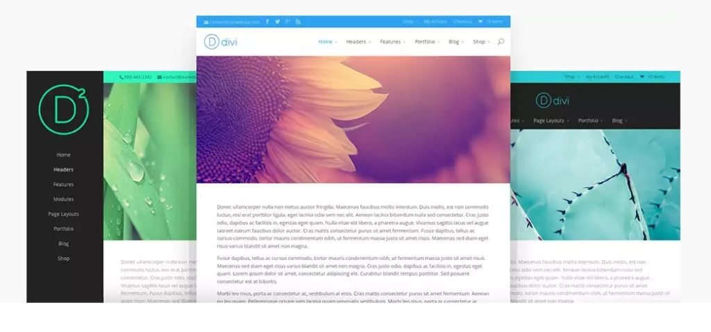
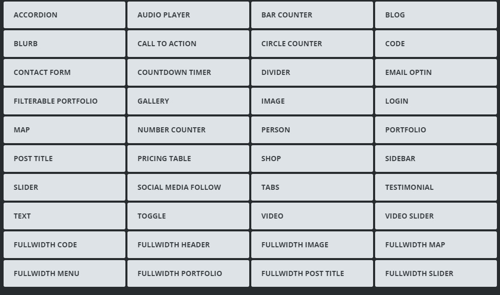
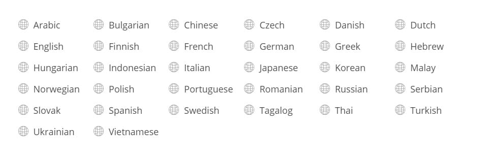

Elegant Themes is known for its blazing fast and highly responsive mobile friendly WordPress templates and plugins. It is the only developer that offers all its premium 50+ themes and plugins on a payment of 89 dollars. Others will charge you the same amount for a single theme.

The templates published by ET are updated, and they adhere to every SEO and webmaster standards that you might be aware of. They have been featured on Mashable, Smashing Magazine, and many other top blogs. I've seen ET plugins on high traffic blogs that have millions of page views every month.

Here, we've shared a full and detailed review of DIVI 3.0 - one of the best WordPress themes ever. DIVI has plenty of customization options and powerful features. Go through the below features to know why we count this template among the best.

### DIVI Builder

If a theme is not customizable, you will have to modify it manually by editing the PHP, HTML, and CSS code. If you don't know coding, hire a freelancer, and he/she will charge you over 50 dollars. Elegant Themes DIVI 3.0 comes installed with a page builder tool which can be used by website owners to create responsive full-width layouts of their choice, and you don't have to edit any code for this. You just have to drag and drop your favorite elements to the desired location on the page.

The page builder is easy to use as the user just have to drag and drop elements they want to see on their site. There are more than 40 modules (including a contact form, email opt-in, video slider, social icons, etc) that you can add. You can change the width and height of the components easily with the page builder. If you don't have time to use this utility, use any of the 18 predefined layouts for your website or blog.

The page builder offers more features than other premium plugins of the same type. It lets you change the font, highlight specific text, stylize titles, showcase work portfolio, place galleries in pages, and more.

**Download Divi theme here**

### Text Settings

This is an advanced feature that allows users to change their content's text size, color, background, spacing, etc. Thus you can say that the DIVI theme lets you make your post more readable and user-friendly. In other words, DIVI 3.0 is an SEO friendly theme. Each component supported by the theme is search engine friendly.

### Live Preview customization

This is a fantastic feature that supports full customization of the theme from the live preview tool. You can easily change the text size, font, layout type, content/header width and height with it. When you buy DIVI 3.0 and install it, open Live preview and modify the theme as per your requirements.

The theme comes with special design toggles through which users can preview the modified pages on mobile devices breakpoints. It includes undo and redo option to revert back changes you made to the page. No other page builder offers this feature.

### Safe

Many themes are suffering from security issues. Thus to make sure that DIVI is safe and its code is not vulnerable to hackers, Elegant Themes had hired Sucuri to test Divi. They found 0 issues with the theme. Code injection and other attempts to take over your site or blog will not work. You can make the site more secure by changing the WP login URL.

**Buy full Elegant Themes here for 67 dollars.**

### Robust navigation

Easy to navigate sites are search engine friendly as they make it easier for search engines to crawl and index your articles. The user will also enjoy browsing your categories, archive pages, and tags. The developers of Elegant Themes are smart as they've added different types of navigation systems to DIVI 3.0. In this theme, you can add vertical menu, top navigation, etc. Users are given the option to make the header sticky, or they can simply use the standard style.

The theme provides users the option of using page builder tool from a separate window (popup). You can also integrate the components in the page itself. When you hover your mouse on a specific block, you'll see option to customize them

### Blank pages

If users want to create landing pages for their sites, they can add a blank page. This page lacks a footer and header, and you can easily add text to it. This feature allows you to create under maintenance or coming soon page.

### Portfolios

If you've set up your personal or business site, you can make users aware of your past projects by using the portfolios feature. As the design of the portfolio template is attractive, the visitor your go through your every project.

**Check Divi 3.0 theme demo here.**

### Woocommerce support

DIVI theme 3.0 supports the WooCommerce plugin very well. You can quickly setup your online shop or deals with this theme. In fact, there's a layout that is similar to eCommerce websites.

### Roles

This theme allows webmasters and website owners to assign editing tasks to your employees or teammates. This is a useful feature as no one would be able to edit the design or layout unless you assign them permission.

**Check demo here.**

### Translation support:

You can quickly switch DIVI from English to any of the below languages. If you want to start an Arabic blog with the right to left content style, DIVI is the best option for you as this format is supported in this theme.

### Pricing

DIVI and all other Elegant Themes can be purchased here for just 69 dollars. Unfortunately, you can't buy individual templates. The deal is good as you'll have 87 high quality and premium themes (at a cost of below 1 dollars per item).

If you want to buy the plugins as well, you'll have to pay just 89 USD for the developer license after which you'll have access to Monarch social sharing, Bloom marketing, and email opt-in and many other plugins that will improve your blog traffic and income.
