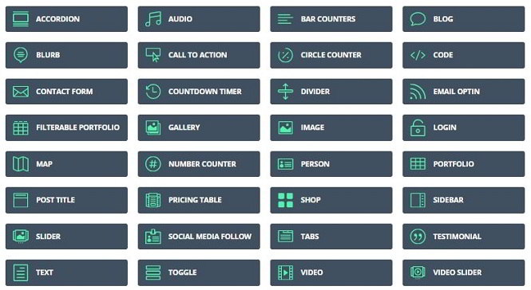
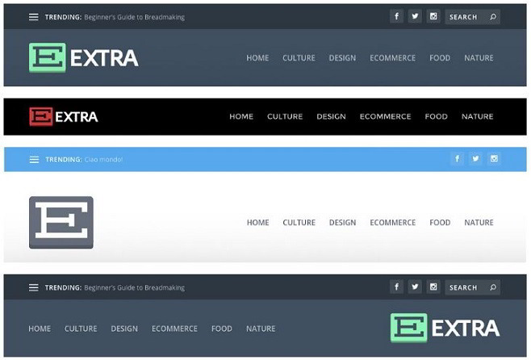
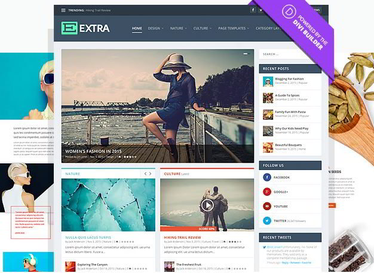

If you're a searching for a multi-purpose WordPress theme which supports customization up to a great extent, then you're at the right place. Today, I've shared a detailed review of the ET Extra Theme. Extra is one of the best selling themes from ElegantThemes. It is also one of the most beautiful templates I've come across.

As it is a multipurpose theme, you can easily create a WP based eCommerce, Portfolio, News, Magazine, Food blog with Extra. Below are the highlighting features of Xtra.

### Divi Builder with drag and drop support

The extra WP theme uses one of the most powerful WP tools today, the Divi Builder. With this tool, you can customize the look and feels of your site within few minutes. The DB makes it possible to add new elements to a page without making the user write code.

The latest version of Extra WordPress theme offers the following new modules:

- Tabbed interface, carousel, slider.
- Standard/Masonry blog option.
- Post feed, Advertisements.

Apart from the above modules, the Divi Builder comes with the below elements:

- Video slider, toggle, pricing table.
- Divider, contact form, map, bar counter.
- Call to action, filter table, email option, and more.

If you own the Extra WordPress Theme, you can customize your WP blog or site with any of the above modules.

The Divi Builder that ships with Extra Theme support page and posts too. It is compatible with the WP eCommerce plugins. Hence, you can build a beautiful eCommerce site with it.

Download the theme or see its demo

### Header options

Every blogger wants his site to have an excellent navigation system. Having a search engine and user-friendly navigation module aka menubar on a website helps in reducing bounce rate. It improves page-views as well. Unlike free Responsive WordPress themess that offer basic multi-level menubar, Extra WP template comes with headers of different styles.

The header template allows users to align the logo to the left or right. It supports trending posts feature, social network icons, and allows color customization. It supports mega menu-bar as well.

### Superb Footer navigation

Like the header, the footer is one of the most important elements of a website. It helps in making the visitor stay on a website for a longer duration. Footer section is important for a blog. Most WordPress blogs don't have a footer menu below the WP comment form. Hence, once the visitor finishes reading comments, he will leave your site.

A good method to prevent this is by adding a footer menu bar. Plenty of premium WP themes doesn't support widgetised footer but Extra Theme does. The ElegantThemes Extra template supports footer customization too.

### Inbuilt review system

Product reviews help in increasing readership and conversion rates (if you practice affiliate marketing). Many users of premium themes complain that their site doesn't have a product review feature. They are forced to buy a review plugin or install free plugin available in the WordPress directory.

The Extra Theme offers a powerful review module that lets you create Google friendly reviews. It also allows users to rate your post/pages.

### Live Customizer

Apart from the options panel, the Elegant Extra Theme comes with a live customization tool, with which you can easily change the font size, color, logo position, and more.

See the demo or download.

### Different Blog Layouts

You can use the powerful Divi builder to design new and powerful layouts for your website. No matter what your design is, the theme renders properly on all mobile devices. In other words, the Extra Theme is fully responsive.

### Support and updates

Over 100K users across the world use ElegantThemes products. I couldn't find any user who has complained about the site suffering from SEO issues. The Extra Theme has clean code. It gets regular updates from the developers.

### Pricing

The Extra WordPress Theme costs less than $1. Confused? Well, ElegantThemes has three subscription plans i.e. standard, developer, and lifetime access. The 1st plan gives users access to 88 Premium themes which includes the Extra template. Its subscription cost is $69. Click here to see full details.

**Conclusion**: I have seen plenty of WP themes, but believe me, none of them are as perfect as ET Extra. ETX provides superb features due to which you don't have to buy premium plugins. The WordPress Extra Theme is worth the money. It is one of the best magazine themes for WordPress.
