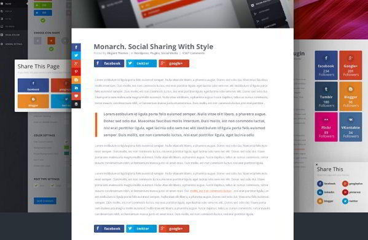
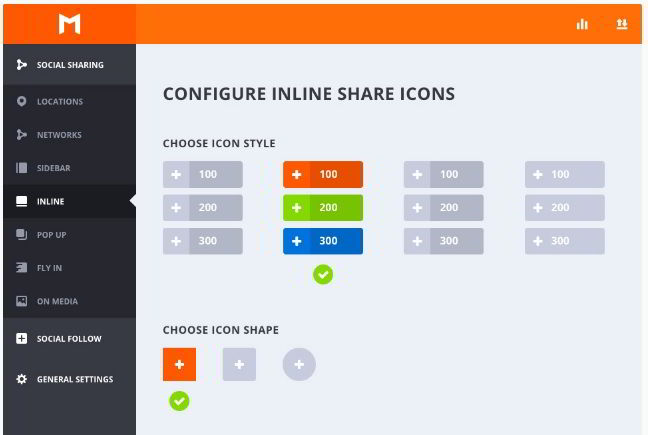
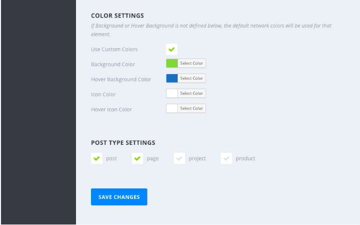
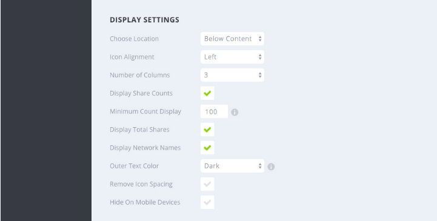
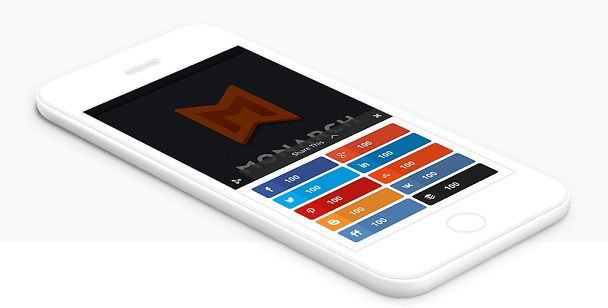

Blogging is a type of online business. If you invest money in your WordPress site, your business will benefit from it. In WP, investment is nothing but purchasing premium themes and plugins which help in improving UX.

When it comes to plugins, the most important plugin is the one that allows visitors to share blog posts on social networks. Yes! You've guessed it right! We're talking about social media sharing plugins.

There are free plugins that add sharing buttons to your blog, but they end up the blogger in frustration. I had a horrible time with the free Flare plugin which resulted in tons of soft 404 errors on my tech site with the flare\_get\_counts admin ajax parameter. After this incident, I gave up using free social sharing plugins and bought a premium plugin.

## Review of the best Social sharing WP plugin

ElegantThemes Monarch is the god of social media sharing plugins. It is one of the best premium plugins in the world. It's 100 times better than free social media plugins for WordPress. You can download it from the official Elegant Themes website by registering a developers account on a payment of USD 89.

 

Monarch is beautiful, and it scales well on a large site. I've seen it running on a large WordPress website with around 200000 visitors per day.

ElegantThemes Monarch, when placed wisely will make the user share the blog posts on social networks. Its attractive design will tempt the user to click on a social media button.

Monarch can be placed at the top and bottom of the content. If your blog has empty space to the left of the post content, Monarch allows you to add floating sharing buttons in the space.

The floating buttons will be visible to the visitor without distracting him/her.

**Check plugin demo here**

 

ET Monarch comes with support for around 20 social networks which includes Facebook, Google Plus, Pinterest, and Twitter. Users are allowed to add a social network of their choice.

This plugin allows you to remove gaps between social buttons and apply animations which will be displayed when the visitor hovers his mouse over the button. It has an option of displaying social icons, network name or both.

Monarch allows button color customization, and it includes more than five amazing animation effects.

Apart from the post sidebar, bottom, and top, the plugin has the option of display share buttons on media content, as a fly-in or in a popup.

**Check demo here**.

When you configure Monarch to display sharing buttons on pictures, the buttons will appear only when the user moves his mouse cursor onto the image. Visitors who like sharing images will find this function immensely useful.

The popup module will increase the chances of the posts getting shared to a great extent. Fly-in should be used when your blog doesn't boast too many widgets on the sidebar.

**Download the plugin**

Fly-ins and Popups can be configured to load by user activity i.e. when the user scrolls down, reaches to the end of the article, after dropping a comment, etc. Monarch has the option of displaying the popup or fly-in when the user is not interacting with your website. This will grab his attention.

ElegantThemes Monarch can be placed manually in a post or page file through a shortcode. The plugin will generate the code. Putting the code is easy. Edit the page or single-post.php file and copy/paste the code.

ET Monarch Plugin supports multiple shapes of buttons. It has a social counter function that makes visitors aware of the number of times a blog post has been shared.

The monarch plugin has a responsive design. Now matter what device the visitor is using, Monarch will function as it has been promised. This WordPres plugin is search engine friendly. You can configure it to disable the widget or top/bottom sharing button on mobile devices. You can specify icon alignment or customize the button colors.

The plugin comes with its caching system caches the counter data. As your site will not query the servers of social networks, your site's page load time will be great.

Monarch has a function to display counters only when it reaches a particular value.

**Check the plugin live in action here**.

ElegantThemes Monarch social sharing buttons can be managed through its intuitive dashboard. The panel lets you control locations, buttons, positions of sharing buttons.

The plugin logs every click on the sharing buttons. You can check this data by clicking on the Statistics icon.

Monarch lets users export and import settings. This feature will be useful or users who own multiple websites and want to use the same settings on each site.

Along with sharing buttons, Monarch ships with a social follower's widget that displays. The widget has an immaculate design, and it shows the number of followers you have on your social profiles.

The widget is easy to configure, and you can change its style to suit your theme.

Elegant themes have become a big brand in the world of WordPress. It offers one of the best customer support and regular updates for its products.

**Pricing**: To own the Monarch plugin, you should become a developers account holder on ElegantThemes website by paying 89 dollars. If you do so, you'll be to enjoy unlimited access to all ET themes and plugins. To name a few, you'll become a proud owner of the Bloom opt-in plugin, DIVI theme, Nexus theme, etc. You'll also be able to download the layered Photoshop files so that you can edit icons and pictures of the particular theme/plugin.

Once you **buy the Plugin for $89**, you can use it on any number of websites. Users will get updates, and they will be offered premium technical support.

**Conclusion**: Social sharing buttons add a lot of code to your website thereby increases its load time and affecting the page speed. Elegant Theme developers have done a great job in designing the Monarch Plugin. It is fast and makes your WordPress blog more beautiful.
