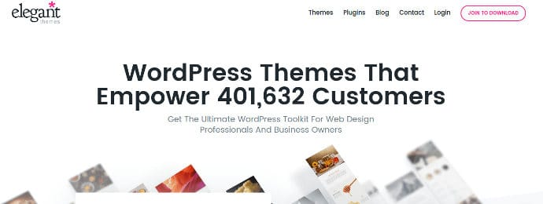

A theme is responsible for the success of a blogger. Many bloggers end up buying a theme which looks attractive but scores 0 when it comes to SEO. Despite publishing high-quality content on their sites, these bloggers don't enjoy success and they quit blogging

As a newbie blogger, I had committed a huge mistake of trusting a third class theme developer. The developer rolled out an update which created the dreaded duplicate title, meta description problem on my site.

Fortunately, the Google Search Console made me aware of this problem. If I hadn't fixed the problem by myself, my career as a blogger would have ended in 2013.

We must always be careful in choosing a WordPress theme because the theme is the most important part of a WordPress site. If the theme is poorly coded, the hosting firm will kick you out. They'll suspend your website for high server resource usage.

Frankly speaking, a site is not about a brand it's about success. If you want to be successful, then you should make wise decision i.e. choosing the right WordPress hosting company and a good WP theme.

There are 100s of hosting firms and theme developers that claim to offer world-class services to their customers. 80 to 90% of the companies are fake.

When it comes to WordPress themes, Elegant Themes is one of my favorite WordPress development companies. It is a firm that has launched 70+ responsive themes of various types.

Templates from Elegant Themes are great for app, magazine, portfolio, eCommerce and personal blog sites.

When I had first checked the website of Elegant Themes last year, I learned that the firm had about 200K customers. Today, I checked their website and found that the customer base of ET has increased by 100% to 400K.

If the company neglected suggestions of its customers or if they would have ignored support tickets raised by customers, ET would not have been a successful WP developer.

Below, I've shared various features you'll enjoy as a customer of Elegant Themes.

## Elegant Themes review

ET has introduced over 79 WordPress themes and powerful plugins. The firm is behind the powerful Extra, Divi Themes and the killer Monarch social sharing and Bloom Optin plugins.

### SEO Friendly

Each template ET has introduced till date have great features. Furthermore, they have been coded well so that your hosting provider doesn't suspend your account for high server RAM and CPU usage.

You can use Elegant Themes with the best WordPress plugins. Each theme supports the widely used Yoast and All in One SEO plugins. They also support various caching plugins.

If you don't want to use SEO plugin, you can use the inbuilt SEO framework of Elegant Themes to make your website search engine friendly.

The themes provided by ET support custom title, meta description. They allow you to set keywords for the pages/posts and have an option to enable canonical URLs to prevent duplicate content issues.

The great thing about the premium themes is that they don't have duplicate HTML elements. The CSS and JS files are small. If you enable GZIP compression for your site, the size of the files will reduce further.

**Click here to join Elegant Themes and get 10% discount.**

### Fast

The WordPress templates from Elegant Themes are fast. No matter what the browser is if the visitor has a fast internet connection and the theme is deployed on a server hosted by a reputed hosting company, the site powered by ET template will open within two seconds. Page speed is one of the 200 signals Google takes into account for ranking websites in the SERPs.

### Drag and drop support

People choose Elegant Themes over other developers because they provide a drag and drop page builder tool.

If you use this tool, you'll save 100s of dollars as you don't have to hire a freelance developer to customize your site. With the drag and drop tool, you can customize your website pages as per your requirements. You don't have to edit the code of the theme.

The themes provide shortcodes for placing buttons, author bio, pricing tables, etc.

### Adsense Optimized

Elegant Themes allow users to monetize their sites by providing pre-defined ad slots. To insert ads, you don't have to install Adsense plugins. Simple place the ad codes in the text boxes you see in Ad management interface and save settings.

**See all templates and plugins of Elegant Themes here.**

### Responsive

Each template Elegant Themes has introduced renders well on all types of mobile devices because they are based on responsive design.

### Option to add JS or CSS codes

If you're using a free WordPress theme, you must edit the header.php file of the site to place Google Analytics or any other CSS or JavaScript code. Most users will not be comfortable in editing the PHP files.

Elegant Themes provide an interface where you can place JS and CSS codes. When you place code snippets in the text areas and same the setting, the theme will automatically insert the code in the header or footer section.

### Color customization

The themes offered by ET support color customization. You can change the color of each element you find on a page. ET provides a JS based color chooser tool that generates hex code of the color you choose. Hence, you can make your blog look unique and different from sites using the same template.

### Updates

ET rolls out updates for its themes to make sure that the themes work with the newest version of the WordPress content management system.

When a new update is available for the theme, you can update the template to the latest version with a single click.

### Pricing

Elegant Themes is the only WordPress development company that sells themes for below $1. The company doesn't sell individual themes because it knows that you may change the template in future. To make sure that you don't end up buying another theme for $50 or more, ET has launched two special plans.

In the first plan, Elegant Themes gives you access to all premium themes and plugins for a yearly subscription cost of $89.

The 2nd plan gives you lifetime access to all products of Elegant Themes.

**See full details of the above two plans here.**

ET has launched 90 premium products and you get the option to download and use all products on your site.

#### Conclusion

If you're searching for the best WP theme for your site, have a look at the theme directory of Elegant Themes. ET has a great collection of SEO friendly templates. They provide good support to the customers.
