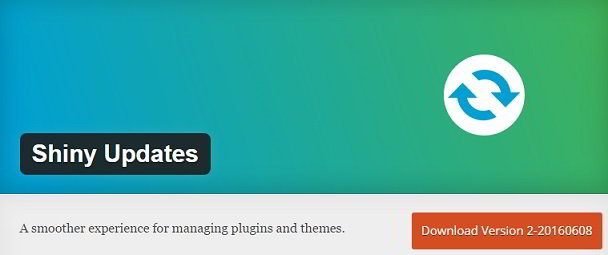
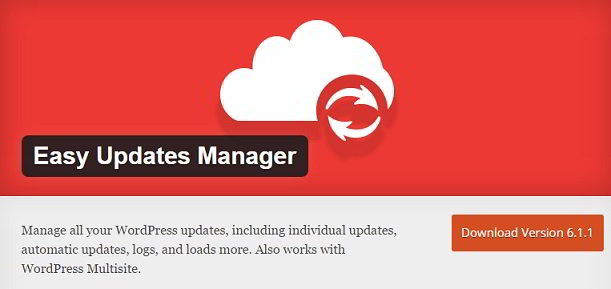
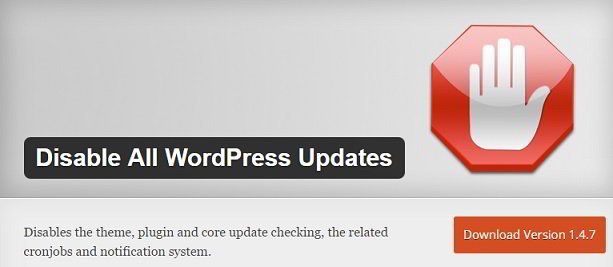

\[et\_pb\_section admin\_label="section"\] \[et\_pb\_row admin\_label="row"\] \[et\_pb\_column type="4\_4"\] \[et\_pb\_text admin\_label="Text"\] Auttomatic Inc, the developer of WordPress rolls out a new version of WP ever since the first version of this free blogging platform was first launched. It's not only the core that gets regular updates, but plugins and theme developers also publish latest versions of their products.

WP-CMS, themes, and plugins get better with every new release. Only the folks who work at Automattic INC know when WordPress update will be released. When a developer releases a newer version of his/her theme or plugin, you'll get a notification for the same in the WP dashboard. The big problem with WordPress is that users will have to update their plugins, core files, and theme manually.

If you're out on a vacation, and if a crucial update has been released, you can't afford to let your website use the old and outdated scripts. To make sure that your site is using the latest version of WP, download and use one of the below free update manager plugins for WordPress.

### Shiny updates

This plugin will add an ajax based function to your site for updating themes and plugins quickly and hassle-free. When you click on install or update button, the plugin will get the updates from the WordPress.org website asynchronously, and once the necessary files have been downloaded to the server, it will replace the install button with the activate button.

Click on this button to begin using the updated files. This free WP plugin can be configured to update WordPress related scripts on the server automatically.

\[themify\_button bgcolor="red" link="https://wordpress.org/plugins/shiny-updates/" target="\_blank"\]Download\[/themify\_button\]

### Easy Updates Manager

If you're searching for a plugin which will automatically update your themes, plugins and WP core, then you should try out the easy updates manager plugin. EUM has a nice settings panel which has toggle buttons to disable or enable automatic updates for your WP site.

Ths plugin lets you enable the auto-update feature for a particular plugin. Once a script has been updated, you'll be notified of it by an email. EUM comes with an option to prevent non-admin users access to its settings panel. It removes WordPress version and browser nag for the users who are using old and outdated web browsers.

\[themify\_button bgcolor="red" link="https://wordpress.org/plugins/stops-core-theme-and-plugin-updates/" target="\_blank"\]Download\[/themify\_button\]

### Disable all updates

Some hosting companies might update the CMS or plugins automatically without informing the webmaster. If the update has some errors, your website might be down until you roll back to the stable working version of WP or plugin. In such cases, the disable all updates plugin comes in handy. DAU will disable cronjobs that check or upgrade WordPress related files on the server. Though I've not tested this plugin, you should try it out if you don't want the cronjob on the server to check updates.

\[themify\_button bgcolor="red" link="https://wordpress.org/plugins/disable-wordpress-updates/" target="\_blank"\]Download\[/themify\_button\]

**Conclusion**: WordPress CMS is the backbone of all themes and plugins that have been developed for WP. Thus, users should upgrade it immediately after a new update is made available by Automattic Inc. If you ignore this, then your site might have some security flaws making your website an easy target for hackers. \[/et\_pb\_text\] \[/et\_pb\_column\] \[/et\_pb\_row\] \[/et\_pb\_section\]
