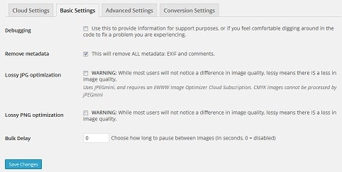
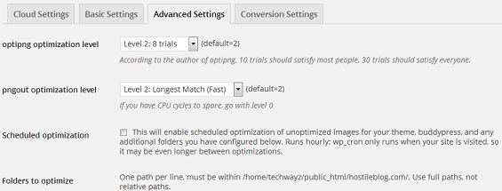
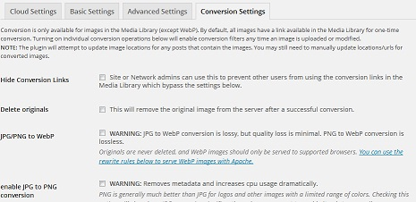

Reducing jpg, png file size on self-hosted WordPress blogs will not only improve its load time but it will also increase the search engine rankings of your post. Google considers site speed as a ranking factor. There are two ways to reduce picture size before uploading to your blog. Install a standalone Windows or Linux software that will resize images or use a WP plugin. The 2nd option is better than the 1st. Ever since I started blogging, I used the WP-SmushIt plugin for the same. Last night, after updating the WP-smushIt plugin, I saw a message that Yahoo would be stopping its free version of WP-smushIt service and to continue using the plugin, I have to upgrade to pro version. This made me search for a WP-smushIt alternative. After doing a bit of internet research, I ended up installing EWWW. Here's my review for the same.

EWWW is a free plugin that makes use of several popular image compression utilities like pngout, jpegmini, etc to reduce the size of your blog pictures. It has been installed on over 0.3 million WordPress websites. This plugin is completely free, and it can be downloaded from the WordPress repository.

## EWWW Image Optimizer review

**Basic settings:** The options in this tab allows you to strip metadata file from picture files, which in turn reduces their size. Basic settings of EWWW allows you to enable lossy jpg, png optimization. This plugin supports bulk file operations. This tab features a numeric filed with bulk delay label. Just enter a number from 0 to 10. This will force EWWW to work on image files after a delay of n seconds that you specify in the fields mentioned above. This is a useful feature for people who use shared hosting plan.

**Advanced settings:** Here, you'll find settings for optimization level for png files, scheduling optimization, etc. If you want, you can specify folders to scan and optimize. The advanced setting lets you skip compression of small sized pictures. It has options to disable gifsicle, optipng, pngout, jpegtran.

**Conversion settings:** Converting images from one format to the other is an easy task in EWWW plugin. Simply navigate to the last tab and check all options of your choice. The supported conversions are JPG to PNG, WebP, and GIF to PNG.

**Installation instructions:** If you want to go through a tutorial on installing EWWW, just click on this link. The developers of this plugin have shared a video as well as written tutorial for the same.

**Bulk Optimization:** This is the most important feature of EWWW image optimizer. If you've never used any picture optimization plugin before, you should run the Bulk optimizer at least once. This tool will automatically scan unoptimized image files, and it will give you to option to reduce their size. This utility will scan your hosting's default media folder, theme files, etc. The optimization time depends on the number of images you've uploaded.

**Cloud Optimizer:** If you don't want EWWW to use your hosting server's processor, ram you should activate the cloud optimizer. This is a paid feature that can be activated only after verifying a valid API key. The cloud tool supports PNG, JPG, and GIF file formats.

**Performance**: EWWW Image Optimizer is a bit faster when compared with WP smush it. It uses your hosting server to reduce jpg, png and gif size. Smush it has to transfer picture file from your hosting IP to Yahoo servers. Thus, it is a bit slow. EWWW is a better plugin. Try it out!
