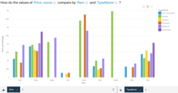
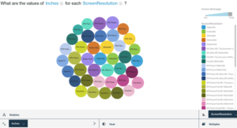
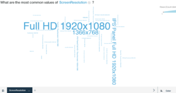
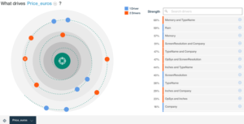
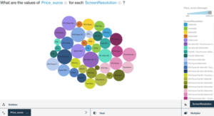
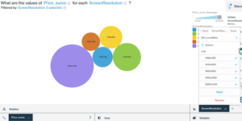
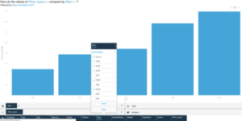
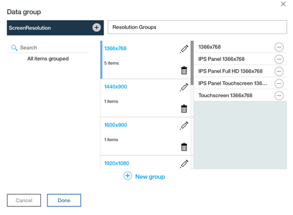
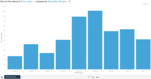
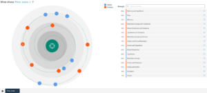

Watson Analytics provides a suite of analytics tools that are easy to use for non-technical people. The software opens the door for data preparation and exploration for managers and other personnel who would benefit from analysis but don't necessarily have the advanced analytical background. This article details the analysis of a dataset called Laptop Prices, sourced from Kaggle. The dataset comprises 1300 records of various laptop models, which was last updated six months ago from writing, adding additional laptop characteristics and prices. This analysis will begin with Watson Analytics starting points, which is helpful for exploration purposes. Watson provides pre-defined suggestions that help the user determine the best way to proceed with their own analysis. These starting points provide insight on the different facets of data available within the dataset. The Laptop Prices data consists of the following data:

| **Column Name** | **Data Type** | **Description** |
| --- | --- | --- |
| Company | String | Producer of Laptop |
| Product | String | Make and Model |
| TypeName | String | Type (Notebook, Ultrabook, Gaming, etc.) |
| Inches | Numeric | Screen Size |
| ScreenResolution | String | Screen Resolution |
| Cpu | String | Laptop CPU |
| Ram | String | Laptop RAM |
| Memory | String | Hard Disk / SSD Memory |
| GPU | String | Graphics Processing Unit |
| OpSys | String | Operating System |
| Weight | String | Laptop Weight |
| Price\_euros | Numeric | Price (In Euros) |

 

This article focuses on data exploration within this dataset using the various Watson Analytics features including its natural language capability. Natural language allows users to ask questions and focus on the problems they are trying to solve, instead of spending a large amount of time learning a new language or set of sophisticated tools. Following exploration, we will look at data refinement and how to improve the analysis using grouping, filtering and other features.

## Data Cleansing

The laptop dataset contains the following columns with their respective quality scores reported by Watson Analytics:

| **Column Name** | **Quality Score** |
| --- | --- |
| Company | Medium Quality (67) |
| Product | Unique values |
| TypeName | Medium Quality (60) |
| Inches | High Quality (74) |
| ScreenResolution | Medium Quality (61) |
| Cpu | Unique Values |
| Ram | Medium Quality (60) |
| Memory | Medium Quality (63) |
| GPU | Unique Values |
| OpSys | Medium Quality (54) |
| Weight | Unique Values |
| Price\_euros | Medium Quality |

 

The medium quality columns all had quite a diverse range of data. To perform an analysis using the raw data alone would prove challenging without further filtering or grouping (covered later in the paper). The highest quality score was assigned to screen size (inches) at 74. Some of the inherent quality issues in this dataset are systemic with the scope of the data type. For example, the screen resolution column should only provide resolution data. Instead this column also provides the type of screen, IPS panel, Full HD, etc.

These attributes could be separated into another variable providing a better means of analysis. The same issue is present with the ‘Memory’ variable, which references hard disk size. It also includes the type of hard disk (SSD, Flash, etc.). These attributes could also be separated into their own columns. The combined nature of the data yields many different values that can be challenging to discern meaning without further separation, grouping, filtering, or other cleansing techniques.

## Data Exploration

Half the battle in problem solving and decision making is framing the problem or decision in a creative way so that it can be addressed effectively. Davenport (2013). Thankfully Watson Analytics provides much of the power at our fingertips in identifying starting points for problem solving. Upon loading the Laptop Prices dataset into Watson Analytics, a series of these starting points were presented. These included sample questions to begin the journey of data exploration. The initial questions presented included the following:

- How do the values of Price\_euros compare by Ram and TypeName?
- What drives Price\_euros?
- What are the values of Inches for each ScreenResolution?
- How do the values of Inches compare by Ram and TypeName?
- What are the most common values of ScreenResolution?
- What is a predictive model for Price\_euros?
- What is the relationship between Price\_euros and Inches by Ram?
- How are the values of Price\_euros and inches associated?
- What is the breakdown of Inches by Ram?
- How do the values of Price\_euros and Inches compare by Ram?

Some of these initial questions provided some insight, however this was limited due to the type of data being analyzed. For example, the first question provided visualization price compared by RAM and type as seen below.

While this provided some insight, better grouping would have painted a cleared picture of this relationship. Another example where further filtering or grouping of the data could have helped was noticeable with the values of inches for each screen resolution question, as demonstrated below.

In both of these cases there were too many different values being compared to make a reasonable case within the visualization.

Other question suggestions yielded interesting results. ‘What are the most common values of Screen Resolution’, provided an easy to understand word graphic, displayed below.

This type of visualization provided a quick way to see the most common type of screen resolution, which is the 1920x1080 full HD and IPS displays. As noted earlier, had the display screen data been separated into type and resolution, this visualization may have painted an even better picture of resolutions. Another interesting question focused on drivers of price. It was immediately clear that the biggest driver was a combination of type of laptop and hard disk memory. Ram was a close third, which indicates that hard disk size and memory are large drivers of laptop price, which makes sense given the nature of these components and the end product. See below for this breakdown.

## Asking Watson Analytics

While the starting point questions provided some insight into the dataset, in order to better understand the data, it was necessary to write custom questions. The question ‘What is the relationship between ScreenResolution and price\_euros’ yielded a set of different results to explore. One of the first results provided a visualization for values of price compared with each screen resolution as demonstrated below.

As seen in this visualization there were many results, causing the display to be less effective in communicating results. The next step was to use a local filter to only include values that reported out on resolution alone (not including screen type). The results were displayed in Appendix B1, which gives a clearer indication that the highest resolution 2560x1440, tended to cost the most, which was not surprising. The problem with this approach was that much of the data was being omitted. Watson Analytics discoveries suggested a different visualization providing a comparison of price by screen resolution and ordered by price.

While this graphic gave a nice overview in order of price, it still wasn’t as meaningful as it could be.

Since RAM was highlighted as one of the highest drivers of price, the next step was to explore this relationship. The question ‘What is the relationship between ram and price\_euros’ yielded several suggested starting points. One visualization ‘How do the values of Price\_euros compare by Ram’ presented a nicely formatted bar chart that showed a strong correlation between price and memory (RAM). To further refine this, a global filter was added to limit RAM by 12Gb and higher.

## Data Refinement

As mentioned earlier in this paper, there were several issues with data quality noted upon analysis of the laptop dataset. The lowest quality variables or columns consisted of operating systems (OpSys), computer memory (Ram), type of computer (TypeName), and screen resolution (ScreenResolution). See Data Cleansing table for a full breakdown. These columns consisted of low-quality data that were difficult to analyze due several reasons. In some cases, there were simply too many different repeating values to gain anything meaningful from. In other instances, more than one type of data was being stored in the variable. The ScreenResolution column was a good example of this whereby both the screen type (IPS, Touch, etc.) were combined with the actual resolution.

As a driver of price, ScreenResolution was ranked lower on the list at 40%. The reason for this was due to the lower quality data contained within. To address this, the data was refined in Watson Analytics, and a new grouping set was created. The groups were created according to the actual screen resolution of the laptop, regardless of screen type and touch screen capability.

Once these new groups were created and the dataset was saved, a new column called ‘Resolution Groups’ was made available to discovery sets. A question was asked how price compares to resolution groups and a new suggested visualization was provided below.

This new visualization clearly showed the strong relationship between price and higher resolution groups. Furthermore, upon revisiting what drives price, resolution groups coupled with type (Ultrabook, Notebook, Gaming, etc.) was shown to be a high driver at 56%.

This would make sense as the resolution would vary depending on type and when combined would be a powerful driver of price overall.

Further analysis and refinement could be done with the other variables in this dataset to yield even more interesting results. Certainly, the next step would be to look into types of laptops and begin tackling some of the other lower quality areas such as operating systems, which was not explored in this report. Watson Analytics provides a lot of powerful tools that are highly accessible by both technical and non-technical users alike. This report has demonstrated the potential of this software and how it can be used to reveal insightful and meaningful data, results, and visualizations.
