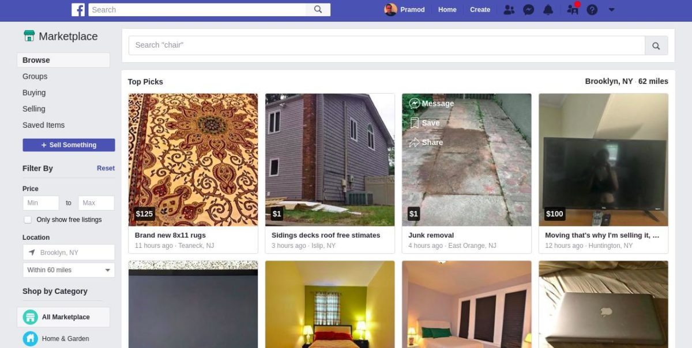

After destroying MySpace, Orkut, Flickr and several other internet companies. FB is now after Craigslist, Olx, Kijiji, and 100s of other classified listing sites.

The social networking giant opened its marketplace for everyone using FB. The new feature has not gone well with people using this site just for fun. But it has been received well by business owners using Facebook.

Is FB's new tool a great alternative to OLX, CL, and other similar websites? Go through the below comparison of the two sites to get the answer!

## Craigslist vs FB Marketplace

- 
- 

### Chatting with the buyer/seller

Users can chat with sellers/buyers in real-time on FB. They can also share pictures, videos, etc. Once you get a message from a user, your phone/tablet will display a notification CL doesn't provide a real-time chatting application. You'll have to keep an eye on the mails. Craigslist hasn't launched an Android or IOS app yet.

### Fees

Craigslist charges $5 for creating ads for some cities/categories. FB won't ask you to pay money for listing your product or service on its marketplace. FB doesn't support premium listing. However, if you have created a page or group, you can create an ad. CL enables you to create premium advertisements.

### User Friendliness

FB and CL enable you to filter posts by city, category, etc. They also provide a search tool. Both sites are easy to use and mobile-friendly.

### Users

Facebook has 5 times more active users than Craigslist. Thus, you'll get more responses, replies, etc on FB than on CL. Hence, chances of selling stuff online quickly are higher on FB than on CL.

### Categories

CL provides 100+ categories. There are just 15 to 20 categories on FB. If the category is popular among users, your post will soon be eclipsed on the FB marketplace. The posts will remain on the main page of CL category until 10 persons create an ad in the same category as yours.

### Publicity

It's hard to find a facebook marketplace post in search engines. If you post an ad on CL, it will be indexed by search engines and your business will get free publicity till it's there in Google, Bing, etc. Facebook might be the biggest social networking site on the planet, but Google gets more visitors than FB every month.

### Trust

Facebook allows buyers to rate sellers. The ratings can be harsh but it helps people in distinguishing between fake and genuine sellers. CL enables you to report abusive/fraudulent posts. It doesn't have the user rating system yet.

**Conclusion**: The number of people using the internet is larger than the number of people in your suburb, city or state. If your business isn't performing well or if you want to increase your sales, get new customers, you should promote it online on FB marketplace and Craigslist. Although FB is larger than CL, you can't ignore CL. The site has been there for more than a decade. It has helped millions of people sell their stuff online.
